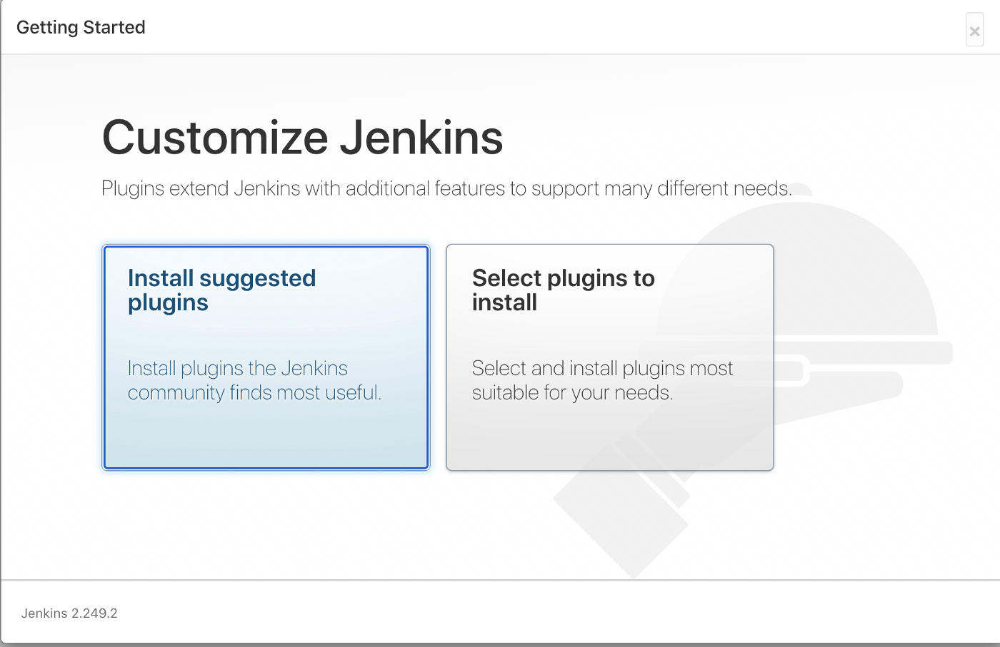
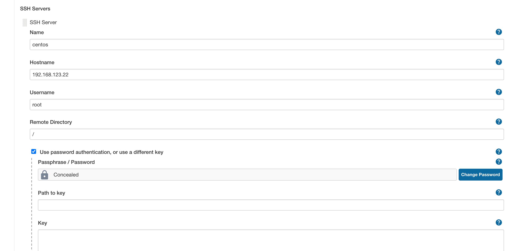
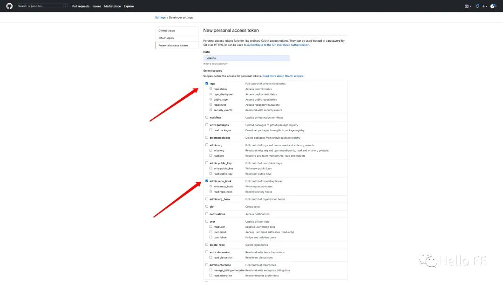
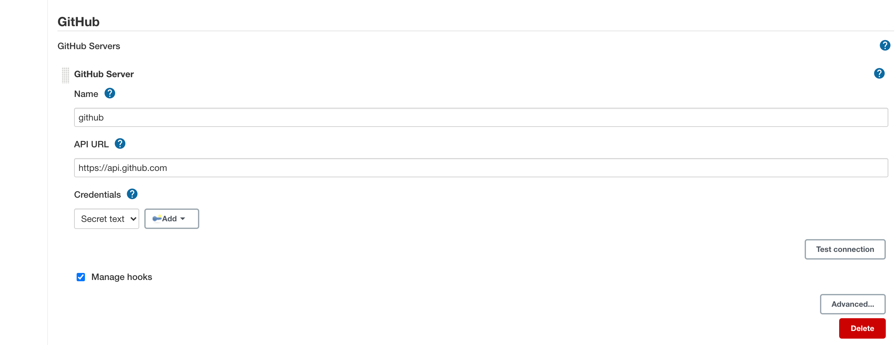
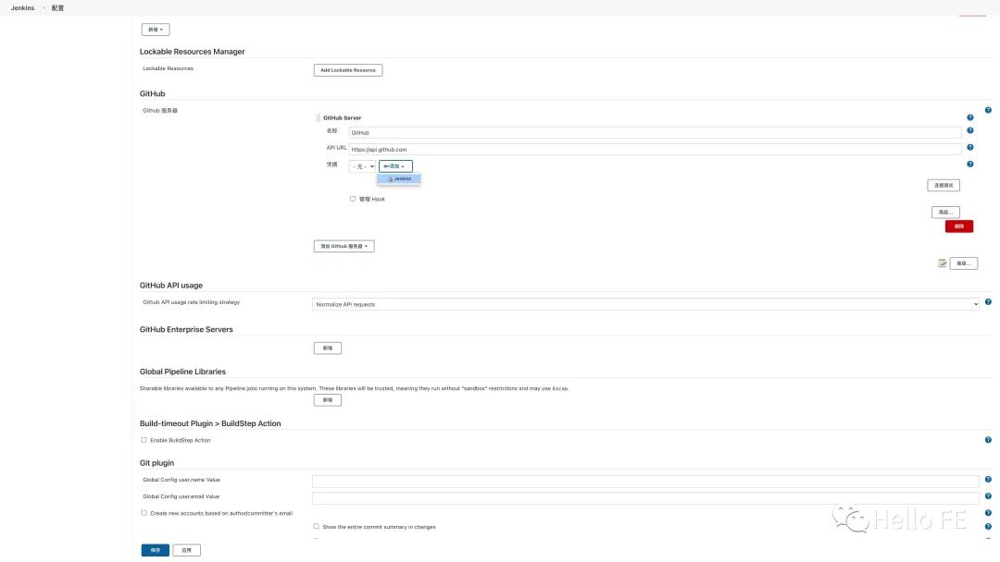
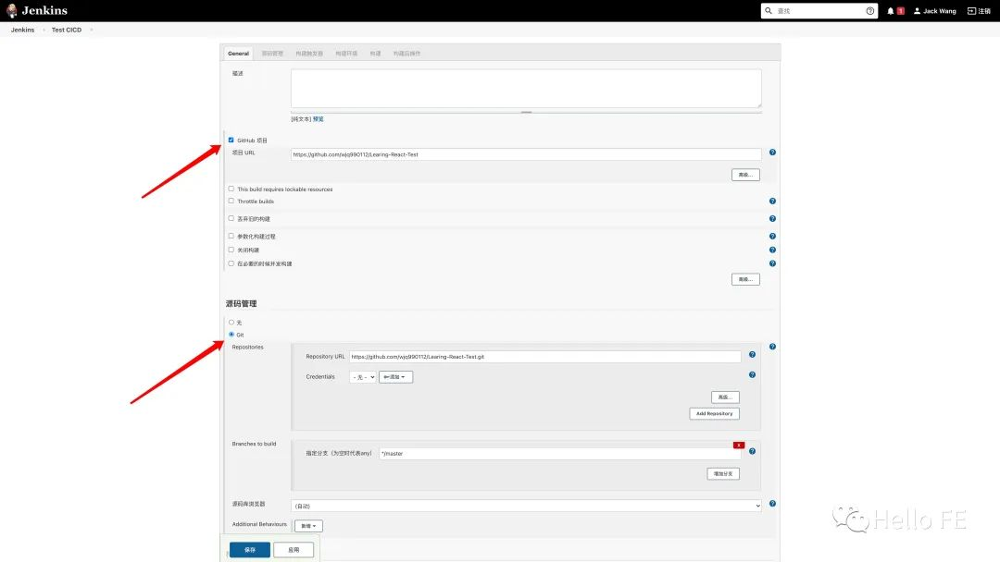
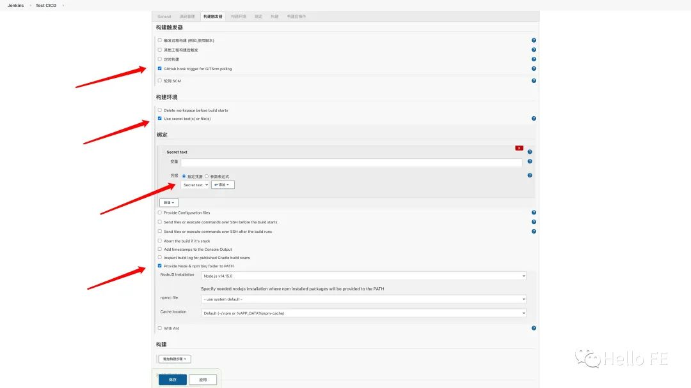
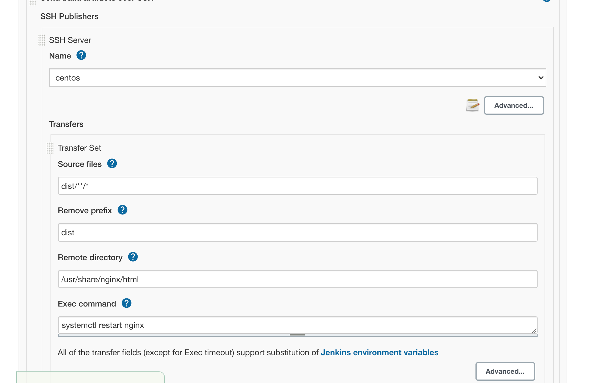
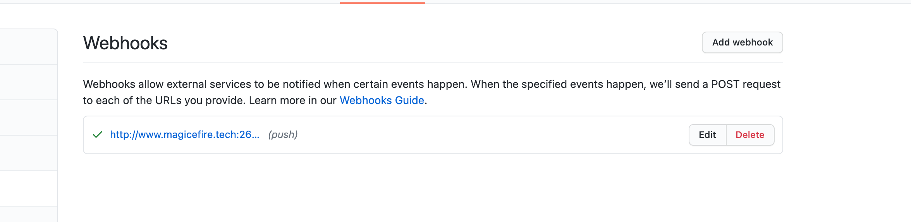

# 前端 CI/CD 流程

## XMind


## Jenkins


### 在 MacOS 上安装 Jenkins

#### 通过 Homebrew

1. 安装 jenkins

```
brew install jenkins-lts
```

2. 如果要在局域网内的其他设备访问 Jenkins，**在启动前需要修改配置**

```
~/Library/LaunchAgents/homebrew.mxcl.jenkins.plist
/usr/local/Cellar/jenkins/版本号/homebrew.mxcl.jenkins.plist
```

关键是第二个文件，每次启动会覆盖第一个文件
修改 homebrew.mxcl.jenkins.plist 的 httpListenAddress 为 0.0.0.0

3. 启动

```
brew services start jenkins-lts
```

or Restart

```
brew services restart jenkins-lts
```

4. 第一次进入，输入 admin 的 password，进入 Jenkins 后台管理页面
   在这里找到 password

```
~/.jenkins/secrets/initialAdminPassword
```

5. 安装推荐的插件，**最好全局翻墙\***
   

6. 创建一个管理员账号

** 解决jenkins 2.2版本无法关闭跨站请求伪造保护 **
修改jenkins的配置文件。vim /etc/sysconfig/jenkins
```
JENKINS_JAVA_OPTIONS="-Djava.awt.headless=true -Dhudson.security.csrf.GlobalCrumbIssuerConfiguration.DISABLE_CSRF_PROTECTION=true"
JENKINS_JAVA_OPTIONS="-Djava.awt.headless=true -Dhudson.security.csrf.GlobalCrumbIssuerConfiguration.DISABLE_CSRF_PROTECTION=true"
```
重启 jenkins

** node.js 构造 前端工程对机器资源要求较高，在阿里云上最低的配置双核8G内存 **

** 有时候 jenkins 拉去 github 的代码的时侯，会返回 128 错误，估计是超时 **

7. 安装 Node.js 插件,并配置 Node.js

8. 安装一个目标机器，选用 Centos，有 root 账号
   a. 在目标机器上安装静态资源服务器 Nginx
   [How to Install Nginx on CentOS 8](https://www.digitalocean.com/community/tutorials/how-to-install-nginx-on-centos-8)
   or b. 用 express 搭建一个静态资源服务器

```javascript
const express = require("express");
const app = express();
const port = 8080;

app.use(express.static("dist"));

app.listen(port, () => {
  console.log(`Example app listening at http://localhost:${port}`);
});
```

9. 安装并配置 Publish Over SSH 插件
   
   **Remote Directory 一定要设置为 /，因为之后任务里指定的路径是这个路径的相对路径**
   点击 Test 确认

10. 添加 Github Server, 在 Github 上 Generate token
    
    
    ** 添加 GitHub 服务器
    点击后会弹出一个添加凭据的窗口，类型 选择为 Secret text，将我们刚才生成的 Personal access token 复制到 Secret 一栏中，点击添加。 **
    
    ** 勾选 Manage hooks **
    点击 Test 确认

11. 新建任务
    我们勾选 GitHub 项目，输入 项目 URL（就是项目的浏览器地址）。将下面的 源码管理 选中为 Git，将你要构建部署的项目的 clone 地址填到 Repository URL 一栏中（就是项目的浏览器地址加上 .git 后缀名）
    

    ** 如果是公开的仓库，Credentials 一栏可以选择无；如果是私有的仓库，需要先添加一个可以访问该仓库的 GitHub 账号，方法类似配置 GitHub API 插件，只不过类型一栏选择 用户名密码，然后在下方输入 用户名 密码。 **

    紧接着我们勾选 构建触发器 一栏中的 GitHub hook trigger for GITScm polling，勾选 构建环境 一栏中的 Use secret text(s) or file(s)，在 凭据 一栏中选中我们之前添加的 Secret text，勾选 Provide Node & npm bin/ folder to PATH 为构建项目提供 Node.js 环境。
    

12. 配置任务

```
node -v
npm -v

rm -rf node_modules
npm install
npm run test
npm run build
```

13. 添加构建后步骤
    
    ** 注意 Remote Directory 是相对路径**

14. 在 Github 的仓库设置里添加 webhook，在 Push 的时候触发任务
    
    ** Jenkin 要外网可见 **

15. 如果使用 node express 作为静态服务器
用PM2来启动这个node应用
在root目录下放一下脚本 app-start.sh
```
#!/usr/bin/env bash
cd node-server
pm2 kill
pm2 start express-server.js
```
在 jenkins的配置中Post-build Actions中执行这个脚本
```
#!/usr/bin/env bash
./app-start.sh
```

## Docker

** 如果 Jenkins 在 Docker 中如何访问局域网的目标机器？ **

## Github Action

1. 在目标机器上上传 ssh 公钥

```
ssh-copy-id -i ~/.ssh/id_rsa youruser@yourhost
```

2. 在 github 的仓库里创建环境变量
   DEPLOY_KEY: Our SSH private key
   DEPLOY_HOST: The host we’re going to connect to
   DEPLOY_USER: Our user on the remote host
   DEPLOY_PORT: The port we’re using. (Not necessarily required, port 22 will be used by default)
   DEPLOY_TARGET: The target folder on the remote host we’re copying our assets to

3. 添加 Workflow

```
.github/workflows/deploy.yaml
```

```
name: SSH Deploy

on:
  push:
    branches: [ main ]

jobs:
  deploy:
    runs-on: ubuntu-latest
    steps:
      - uses: actions/checkout@v2
      - name: install Node.js
        uses: actions/setup-node@v1
        with:
          node-version: '14.16.1'
      - name: install npm dependencies
        run: npm install
      - name: build task
        run: npm run build
      - name: copy file via scp
        uses: appleboy/scp-action@master
        env:
          HOST: ${{ secrets.DEPLOY_HOST }}
          USERNAME: ${{ secrets.DEPLOY_USER }}
          PORT: ${{ secrets.DEPLOY_PORT }}
          KEY: ${{ secrets.DEPLOY_KEY }}
        with:
          source: "dist/"
          target: ${{ secrets.DEPLOY_TARGET }}
      - name: executing remote command
        uses: appleboy/ssh-action@master
        with:
          host: ${{ secrets.DEPLOY_HOST }}
          USERNAME: ${{ secrets.DEPLOY_USER }}
          PORT: ${{ secrets.DEPLOY_PORT }}
          KEY: ${{ secrets.DEPLOY_KEY }}
          script: |
            cd node-server
            pm2 kill
            pm2 start express-server.js
```

## Aliyun

## Heroku

### Deploy onto Heroku

1. create 2 apps on Hero, one is for staging, the other is for production
2. add 2 buildpacks below for each app:

```
heroku buildpacks:add heroku/nodejs
heroku buildpacks:add https://github.com/heroku/heroku-buildpack-static
```

3. add 2 corresponding remotes to your local repository

```
heroku git:remote -a vue2-gear-staging
git remote rename heroku heroku-staging
heroku git:remote -a vue2-gear-production
```

4. set VUE_APP_BASE_URL to the corresponding backends

for the staging app

```
heroku config:set VUE_APP_BASE_URL="https://node-gear-staging.herokuapp.com/"
```

for the production app

```
heroku config:set VUE_APP_BASE_URL="https://node-gear-production.herokuapp.com/"
```

5. push code to different stages
   ** does not use the .env.staging, always use the build script **

for staging

```
git push heroku-staging master
```

for production

```
git push heroku master
```

6. don't use pipeline to promote from staging to production

## Amplify@AWS
