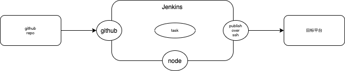

# 前端 CI/CD 流程

## XMind


## Jenkins



### 在 MacOS 上安装 Jenkins

#### 通过 Homebrew

1. 安装 jenkins

```
brew install jenkins-lts
```

2. 如果要在局域网内的其他设备访问 Jenkins，**在启动前需要修改配置**

```
~/Library/LaunchAgents/homebrew.mxcl.jenkins.plist
/usr/local/Cellar/jenkins/版本号/homebrew.mxcl.jenkins.plist
```

关键是第二个文件，每次启动会覆盖第一个文件
修改 homebrew.mxcl.jenkins.plist 的 httpListenAddress 为 0.0.0.0

3. 启动

```
brew services start jenkins-lts
```

or Restart

```
brew services restart jenkins-lts
```

4. 第一次进入，输入 admin 的 password，进入 Jenkins 后台管理页面
   在这里找到 password

```
~/.jenkins/secrets/initialAdminPassword
```

5. 安装推荐的插件，**最好全局翻墙\***
   

6. 创建一个管理员账号

** 解决 jenkins 2.2 版本无法关闭跨站请求伪造保护 **
修改 jenkins 的配置文件。vim /etc/sysconfig/jenkins

```
JENKINS_JAVA_OPTIONS="-Djava.awt.headless=true -Dhudson.security.csrf.GlobalCrumbIssuerConfiguration.DISABLE_CSRF_PROTECTION=true"
JENKINS_JAVA_OPTIONS="-Djava.awt.headless=true -Dhudson.security.csrf.GlobalCrumbIssuerConfiguration.DISABLE_CSRF_PROTECTION=true"
```

重启 jenkins

** node.js 构造 前端工程对机器资源要求较高，在阿里云上最低的配置双核 8G 内存 **

** 有时候 jenkins 拉去 github 的代码的时侯，会返回 128 错误，估计是超时 **

7. 安装 Node.js 插件,并配置 Node.js

8. 安装一个目标机器，选用 Centos，有 root 账号
   a. 在目标机器上安装静态资源服务器 Nginx
   [How to Install Nginx on CentOS 8](https://www.digitalocean.com/community/tutorials/how-to-install-nginx-on-centos-8)
   or b. 用 express 搭建一个静态资源服务器

```javascript
const express = require("express");
const app = express();
const port = 8080;

app.use(express.static("dist"));

app.listen(port, () => {
  console.log(`Example app listening at http://localhost:${port}`);
});
```

9. 安装并配置 Publish Over SSH 插件
   
   **Remote Directory 一定要设置为 /，因为之后任务里指定的路径是这个路径的相对路径**
   点击 Test 确认

10. 添加 Github Server, 在 Github 上 Generate token
    
    
    ** 添加 GitHub 服务器
    点击后会弹出一个添加凭据的窗口，类型 选择为 Secret text，将我们刚才生成的 Personal access token 复制到 Secret 一栏中，点击添加。 **
    
    ** 勾选 Manage hooks **
    点击 Test 确认

11. 新建任务
    我们勾选 GitHub 项目，输入 项目 URL（就是项目的浏览器地址）。将下面的 源码管理 选中为 Git，将你要构建部署的项目的 clone 地址填到 Repository URL 一栏中（就是项目的浏览器地址加上 .git 后缀名）
    

    ** 如果是公开的仓库，Credentials 一栏可以选择无；如果是私有的仓库，需要先添加一个可以访问该仓库的 GitHub 账号，方法类似配置 GitHub API 插件，只不过类型一栏选择 用户名密码，然后在下方输入 用户名 密码。 **

    紧接着我们勾选 构建触发器 一栏中的 GitHub hook trigger for GITScm polling，勾选 构建环境 一栏中的 Use secret text(s) or file(s)，在 凭据 一栏中选中我们之前添加的 Secret text，勾选 Provide Node & npm bin/ folder to PATH 为构建项目提供 Node.js 环境。
    

12. 配置任务

```
node -v
npm -v

rm -rf node_modules
npm install
npm run test
npm run build
```

13. 添加构建后步骤
    
    ** 注意 Remote Directory 是相对路径**

14. 在 Github 的仓库设置里添加 webhook，在 Push 的时候触发任务
    
    ** Jenkin 要外网可见 **

15. 如果使用 node express 作为静态服务器
    用 PM2 来启动这个 node 应用
    在 root 目录下放一下脚本 app-start.sh

```
#!/usr/bin/env bash
cd node-server
pm2 kill
pm2 start express-server.js
```

在 jenkins 的配置中 Post-build Actions 中执行这个脚本

```
#!/usr/bin/env bash
./app-start.sh
```

16. 使用 nginx 支持多个静态资源服务器
1. 编辑 /etc/nginx/nginx.conf, 在同一个端口 80 添加三个 server

```
  server {
      listen  80;
      server_name     test.magicefire.com;
      root            /usr/share/nginx/html/test;
      location / {}
  }

  server {
      listen  80;
      server_name     staging.magicefire.com;
      root            /usr/share/nginx/html/staging;
      location / {}
  }

  server {
      listen  80;
      server_name     production.magicefire.com;
      root            /usr/share/nginx/html/production;
      location / {}
  }
```

2. 在 /usr/share/nginx/html/ 下创建三个目录

3. 在 DNS 服务商这里配置三个二级域名都指向这台 VPS。\*\* 阿里云域名要备案，太麻烦。我现在 oray 上申请一个动态主域名，再通过 cloudflare 上添加三条 CNAME 指向我自己的 VPS

4. 因为我 jenkins 和静态资源服务器是同一台机器，在配置 jenkins ‘publish over ssh’ 时，我创建了一个 localhost 的 ssh 链接

5. 通过 node express 创建静态服务器
6. 全局安装 PM2，在 home 目录下创建一个基于 PM2 的启动脚本 app-start.sh

```
#!/usr/bin/env bash
cd node-server
pm2 kill
pm2 start express-server.js
```

## Docker

** 如果 Jenkins 在 Docker 中如何访问局域网的目标机器？ **

## Github Action

1. 在目标机器上上传 ssh 公钥

```
ssh-copy-id -i ~/.ssh/id_rsa youruser@yourhost
```

2. 在 github 的仓库里创建环境变量
   DEPLOY_KEY: Our SSH private key
   DEPLOY_HOST: The host we’re going to connect to
   DEPLOY_USER: Our user on the remote host
   DEPLOY_PORT: The port we’re using. (Not necessarily required, port 22 will be used by default)
   DEPLOY_TARGET: The target folder on the remote host we’re copying our assets to

3. 添加 Workflow

```
.github/workflows/deploy.yaml
```

```
name: SSH Deploy

on:
  push:
    branches: [ main ]

jobs:
  deploy:
    runs-on: ubuntu-latest
    steps:
      - uses: actions/checkout@v2
      - name: install Node.js
        uses: actions/setup-node@v1
        with:
          node-version: '14.16.1'
      - name: install npm dependencies
        run: npm install
      - name: build task
        run: npm run build
      - name: copy file via scp
        uses: appleboy/scp-action@master
        env:
          HOST: ${{ secrets.DEPLOY_HOST }}
          USERNAME: ${{ secrets.DEPLOY_USER }}
          PORT: ${{ secrets.DEPLOY_PORT }}
          KEY: ${{ secrets.DEPLOY_KEY }}
        with:
          source: "dist/"
          target: ${{ secrets.DEPLOY_TARGET }}
      - name: executing remote command
        uses: appleboy/ssh-action@master
        with:
          host: ${{ secrets.DEPLOY_HOST }}
          USERNAME: ${{ secrets.DEPLOY_USER }}
          PORT: ${{ secrets.DEPLOY_PORT }}
          KEY: ${{ secrets.DEPLOY_KEY }}
          script: |
            cd node-server
            pm2 kill
            pm2 start express-server.js
```

## Aliyun

## Heroku

### Deploy onto Heroku

1. create 2 apps on Hero, one is for staging, the other is for production
2. add 2 buildpacks below for each app:

```
heroku buildpacks:add heroku/nodejs
heroku buildpacks:add https://github.com/heroku/heroku-buildpack-static
```

3. add 2 corresponding remotes to your local repository

```
heroku git:remote -a vue2-gear-staging
git remote rename heroku heroku-staging
heroku git:remote -a vue2-gear-production
```

4. set VUE_APP_BASE_URL to the corresponding backends

for the staging app

```
heroku config:set VUE_APP_BASE_URL="https://node-gear-staging.herokuapp.com/"
```

for the production app

```
heroku config:set VUE_APP_BASE_URL="https://node-gear-production.herokuapp.com/"
```

5. push code to different stages
   ** does not use the .env.staging, always use the build script **

for staging

```
git push heroku-staging master
```

for production

```
git push heroku master
```

6. don't use pipeline to promote from staging to production

## Amplify@AWS

## 搭建 web 静态和 API 服务器

### 注册一个 VPS

### 安装 node 相关服务

1. [安装 NVM](https://www.liquidweb.com/kb/install-nvm-node-version-manager-node-js-centos-8/)

```shell
sudo yum update
or
sudo dnf update
```

```
curl -o- https://raw.githubusercontent.com/nvm-sh/nvm/v0.35.3/install.sh | bash
source ~/.bash_profile
nvm install v14.16.1
```

2. 安装 PM2 和 Typescript

```
npm i pm2 -g
npm i typescript -g
```

### 配置 nginx

1. [安装 nginx](https://www.digitalocean.com/community/tutorials/how-to-install-nginx-on-centos-8)

```
sudo dnf install nginx
sudo systemctl enable nginx
sudo systemctl start nginx
```

###

## 用 Gihub Actions 在 Oracle 云上搭建 Node.js 全栈 DevOps 流程

### 在 Oracle Cloud 申请一台免费的 VPS

Oracle Cloud 可以最多申请两台免费的低配置的 VPS，并赠送一个月 400 新加坡元的 Credit

1. 系统镜像最好选择 Centos，因为默认是 root 用户，但是在 Oracle 或其他云服务商提供的 VPS 上，其实是 opc 用户。要修改设置，开启 root 账号登陆，顺便开启密码方式登入

```shell
sudo -i
vi ~/.ssh/authorized_keys
```

删除 ssh-rsa 前的所有内容


```shell
vi /etc/ssh/sshd_config
```

```shell
PermitRootLogin yes
PasswordAuthentication yes
```

```shell
systemctl restart sshd
```

添加密码

```shell
passwd
```

2. 在子网的防火墙上 Ingress 的端口，我这里开启 80-82/8080/443/3001-3002/22

3. 关闭 Centos 内部的防火墙

```shell
sudo systemctl stop firewalld
sudo systemctl disable firewalld
```

### 在 VPS 上安装必要的软件

#### 安装 Nginx

1. Install the nginx package with:

```shell
dnf install nginx
```

2. After the installation is finished, run the following commands to enable and start the server:

```shell
systemctl enable nginx
systemctl start nginx
```

#### 安装 nvm 和 node.js

1. First, we will need to make sure all of our packages are up to date:

```shell
dnf update
```

2. Next, we will need to run the following NVM installation script. This will install the latest version of NVM from GitHub.

```shell
curl -o- https://raw.githubusercontent.com/nvm-sh/nvm/v0.35.3/install.sh | bash
source ~/.bash_profile
nvm list-remote
nvm install 14
```

#### 在全局安装 typescript，因为以 production 编译 api server 的时侯，npm i 只安装 dev 的依赖

```shell
npm i typescript -g
```

#### 在全局安装 pm2 用于 api server 的进程管理

```shell
npm i pm2 -g

```

### 构建 node server

1. 创建目录

```shell
mkdir -p node-server/test
mkdir -p node-server/staging
mkdir -p node-server/production
```

### running HTTPS localhost on macOS

1. 在 node-koa2-typescript 项目的 root 目录下创建 local-ssl 子目录
2. 在 local-ssl 子目录下，新建一个配置文件 req.cnf

```
[req]
distinguished_name = req_distinguished_name
x509_extensions = v3_req
prompt = no
[req_distinguished_name]
C = US
ST = California
L = Folsom
O = MyCompany
OU = Dev Department
CN = www.localhost.com
[v3_req]
keyUsage = critical, digitalSignature, keyAgreement
extendedKeyUsage = serverAuth
subjectAltName = @alt_names
[alt_names]
DNS.1 = www.localhost.com
DNS.2 = localhost.com
DNS.3 = localhost
```

3. 创建本地证书和私钥

```shell
openssl req -x509 -nodes -days 365 -newkey rsa:2048 -keyout cert.key -out cert.pem -config req.cnf -sha256
```

4. 修改 server 端代码支持本地 https

```typescript
let httpsOptions;
if (config.isDevelopment) {
  httpsOptions = {
    key: fs.readFileSync("./local-ssl/cert.key"),
    cert: fs.readFileSync("./local-ssl/cert.pem"),
  };
} else {
  httpsOptions = {
    key: fs.readFileSync(
      `/etc/letsencrypt/live/api.magicefire.com/privkey.pem`
    ),
    cert: fs.readFileSync(`/etc/letsencrypt/live/api.magicefire.com/cert.pem`),
    ca: fs.readFileSync(`/etc/letsencrypt/live/api.magicefire.com/chain.pem`),
  };
}
return https.createServer(httpsOptions, app.callback()).listen(HTTP_PORT);
```

5. 启动 https 服务后，仍然报错

```shell
curl https://localhost:3000/api/v1/users
curl: (60) SSL certificate problem: unable to get local issuer certificate
More details here: https://curl.haxx.se/docs/sslcerts.html

curl failed to verify the legitimacy of the server and therefore could not
establish a secure connection to it. To learn more about this situation and
how to fix it, please visit the web page mentioned above
```

6. 在浏览器链接该 https 服务，也报错误，下载证书，双击导入密钥管理器，手动让证书受信
   

### Let's Encrypt on CentOS 8 for backend

1. To add the CentOS 8 EPEL repository, run the following command:

```shell
dnf install epel-release
```

2. install all of the required packages

```shell
dnf install certbot python3-certbot-nginx
```

3. 正式获取

```shell
certbot certonly -w /usr/share/nginx/html -d api.magicefire.com
```


### Let's Encrypt on CentOS 8 for frontend

1. 编辑 /etc/nginx/nginx.conf 支持同一个端口，不同的静态服务器

```
server {
    listen  80;
    server_name     test.magicefire.com;
    root            /usr/share/nginx/html/test;
    location / {}
}

server {
    listen  80;
    server_name     staging.magicefire.com;
    root            /usr/share/nginx/html/staging;
    location / {}
}

server {
    listen  80;
    server_name     production.magicefire.com;
    root            /usr/share/nginx/html/production;
    location / {}
}
```

建立对应的目录，在目录下放测试 html

2. 修改 Cloudflare，添加三条 A 记录，支持 VPS 的 IP
   

3. 通过 Let's Encrypt 修改 nginx 的 https 支持

```shell
certbot -nginx
```


# Heroku

## 在 Heroku 上构建 node api server

1. 创建一条 pipeline
2. 创建两个 app
3. app 的设置分别里添加
   HEROKU = 1
   NODE_ENV = staging | production
4. 因为 node server 端是运行时读取环境变量，所以可以直接 promote staging to production. 而 github actions 是因为直接在 target 上编辑，不是将 dist 复制到 target，所以这个问题还没有解决。
5. ** Heroku 的 API 网关自己已支持 https，后端起的 node server 在内网里是 http， 所以要修改代码 换成 http server，否者会报 503 错误**

## 在 Heroku 上构建 vue 前端

1. 因为是编译的时候读取环境变量，所以不能 promote，所以建立 pipeline 没有意义，直接创建两个 app
