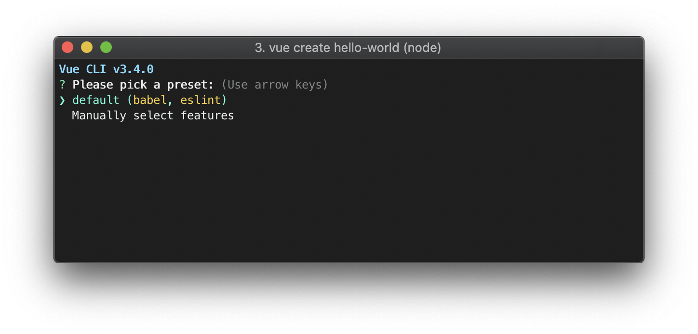

## 在Ubuntu环境下安装NVM和Node.js
### 安装NVM和Node.js
``` zsh
curl -o- https://raw.githubusercontent.com/nvm-sh/nvm/v0.37.2/install.sh | bash
```
### 安装Vue-cli
``` zsh
npm install -g @vue/cli
```
### 设置git和ssh
### 创建一个Vue3的程序
``` zsh
vue create hello-world
```

### 在VSCode下安装lint，Vetur等扩展
在项目的根目录下添加`.vscode\settings.json`文件
``` json
{ 
  "editor.formatOnSave": false,
  "editor.codeActionsOnSave": {
    "source.fixAll.eslint": true
  },
}
```
在项目的根目录下添加`.prettierrc.js`文件
``` javascript
module.exports = {
  tabWidth: 2,
  semi: false,
  singleQuote: true,
  trailingComma: 'all',
}
```