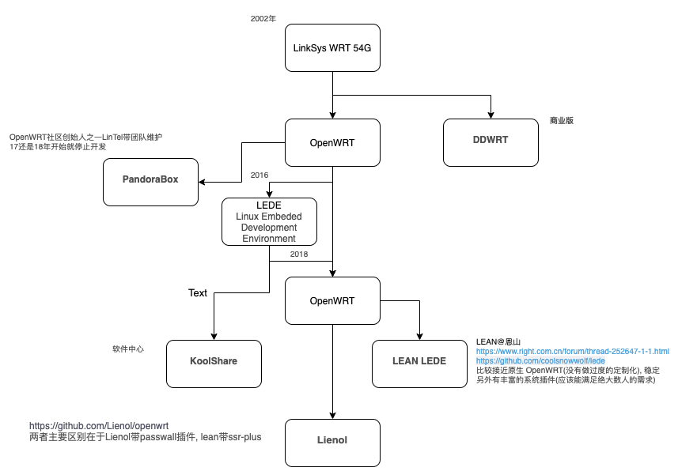

# 编译OpenWRT

## OpenWRT历史

1. 基于Linux的开源项目
2. 丰富的插件可以扩展
3. 主流的路由器厂商也都是基于OpennWRT开发的路由器固件

## OpenWRT目录结构
1. feeds.conf.default中制定扩展的软件包, 例如lean的版本中没有Passwall, 可以在这个文件中添加
```
#src-git helloworld https://github.com/fw876/helloworld
src-git lienol https://github.com/kenzok8/openwrt-packages
src-git small https://github.com/kenzok8/small.git
```
然后更新和安装添加的软件包
``` bash
./scripts/feeds update -a
./scripts/feeds install -a
```
2. .config是由make menuconfig生成的
3. bin/targets/x86/64包含了最后生成的固件
在下载openwrt系统时，经常能看到initramfs-kernel.bin，squashfs-factory.bin，squashfs-sysupgrade.bin等结尾的文件，factory适用于从原厂系统刷到openwrt，sysupgrade则是从openwrt刷到openwrt（已经是openwrt系统，在openwrt系统中更新自己），squashfs则是一种文件系统，适用于嵌入式设备。那么initramfs-kernel又是什么呢。

initramfs是放在内存RAM中的rootfs 映像文件，跟kernel放在一起。一般来说用不到initramfs-kernel.bin来刷机，因为启动后，所有的配置在路由器重启后都不能保留（毕竟ram文件系统，所有文件放在ram中，断电就没了）。但也有用到initramfs-kernel.bin的时候，就是在移植openwrt系统的时候，没有设备上的flash闪存的驱动的时候。
```
一些常见的配置文件路径：
\etc\config         #各个LUCI配置
\etc\gfwlist        #gfwlist目录
\etc\shadow         #登录密码
\etc\firewall.user  #自定义防火墙规则
\usr\share\adbyby   #adbyby里的相关规则和设置
\usr\lib\lua\luci\view\admin_status\index.htm #主页样式文件，温度显示等等
```

4. 默认配置
```
package/lean/default-settings/files/zzz-default-settings    #默认设置
package/lean/default-settings/files/bin/config_generate    #网络配置
feeds/luci/modules/luci-base/root/etc/config/luci      #修改默认语言和主题
```
也可以参考[](#使用Github Action编译OpenWRT)中的diy-part2.sh

5. 保留配置
步骤： 1.提取路由固件下的\etc\config\network 2.在编译机OpenWrt根目录下创建files目录 3.拷贝到\files\etc\config\network 这样编译完，network就是你自己配置好的network，注意提取的文件路径和权限要一致
## menuconfig的配置
一个excel维护的配置清单[OpenWRT编译make menuconfig配置及LUCI插件说明.xlsx](https://www.wil.ink/links/799)

### 配置Newifi D2
1. 设置目标平台


2. 指定image类型


3. 基本配置


4. USB和无线网络驱动


5. Luci
```
luci-app-accesscontrol 上网时间控制
luci-app-adbyby-plus 广告屏蔽大师Plus +
luci-app-amule         电驴下载
luci-app-aria2         Aria2下载
luci-app-arpbind IP/MAC绑定
luci-app-ddns         动态域名解析
luci-app-flowoffload Turbo ACC  FLOW转发加速
luci-app-frpc         内网穿透 Frp
luci-app-hd-idle 硬盘休眠
luci-app-ipsec-vpnd  IPSec服务端
luci-app-mwan3         MWAN负载均衡
luci-app-nlbwmon 网络带宽监视器
luci-app-openvpn OpenVPN客户端
uci-app-openvpn-server OpenVPN服务端
luci-app-pptp-server  PPTP服务端
luci-app-ramfree 释放内存
luci-app-samba         网络共享(samba)
luci-app-sfe         Turbo ACC网络加速(开启Fast Path转发加速)
luci-app-sqm         流量智能队列管理(QOS)
luci-app-ssr-plus SSR Plus，翻墙3合一工具
luci-app-transmission BT下载
luci-app-upnp         通用即插即用UPnP(端口自动转发)
luci-app-usb-printer USB 打印服务器
luci-app-vlmcsd         KMS服务器（WIN VLK 激活工具）
luci-app-vsftpd         FTP服务器
luci-app-webadmin Web管理
luci-app-wireguard VPN服务器 WireGuard状态
luci-app-wol         网络唤醒
luci-app-wrtbwmon 实时流量监测
```

6. 其他


## OpenWRT在本地Linux下编译

### 编译Lienol源

### 编译Lean源
``` bash
sudo apt-get update
sudo apt-get -y install build-essential asciidoc binutils bzip2 gawk gettext git libncurses5-dev libz-dev patch python3 python2.7 unzip zlib1g-dev lib32gcc1 libc6-dev-i386 subversion flex uglifyjs git-core gcc-multilib p7zip p7zip-full msmtp libssl-dev texinfo libglib2.0-dev xmlto qemu-utils upx libelf-dev autoconf automake libtool autopoint device-tree-compiler g++-multilib antlr3 gperf wget curl swig rsync
```

git clone https://github.com/coolsnowwolf/lede.git lean

编辑feeds.conf.default
```
#src-git helloworld https://github.com/fw876/helloworld
src-git lienol https://github.com/kenzok8/openwrt-packages
src-git small https://github.com/kenzok8/small.git
```

```
./scripts/feeds update -a
./scripts/feeds install -a
make defconfig            #测试编译环境
make menuconfig           #配置编译
```

```
make -j8 download V=s     #预下载
find dl -size -1024c -exec ls -l {} \;  #检查文件完整性
make -j1 V=s
```

## 使用Github Action编译OpenWRT
可以从本地的编译环境提取.config配置文件，放在[build-openwrt](git@github.com:quboqin/build-openwrt.git)
或者需要 SSH 连接则把SSH connection to Actions的值改为true
点击 Actions
### 创建多个workflow，同时编译两个平台

## 刷入固件的方法
1. DiskImage直接刷写
制作一个PE盘，把DiskImage和LEDE固件拷贝到PE盘，插到路由上，启动PE，然后和方法一差不多，打开DiskImage，选择软路由上的那块硬盘，选择OpenWrt.img，点开始，等进度条结束，然后关机，拔掉U盘，再开机就可以了
2. 用physdiskwrite刷写
刷写方法：制作一个PE盘，把physdiskwrite和LEDE固件拷贝到PE盘（同一个目录下，建议放在根目录，就是打开U盘就能看到的那个目录），插到路由上，启动PE，然后查看下存放固件的盘符（这里举例为U:盘），打开cmd（不懂的就按Win建+r键，输入cmd回车，Win键就是键盘左下方是Windows图标的那个按键）
　　输入U: （回车确定，切换到U盘的目录）
　　输入physdiskwrite -u OpenWrt.img（回车确定）
　　然后会显示目前检测到的硬盘，输入0或者1选择要刷写到哪个盘（看容量，选择硬盘的那个编号），按Y确定，之后等待刷写结束就可以了，然后关机，拔掉U盘，再开机就可以了.