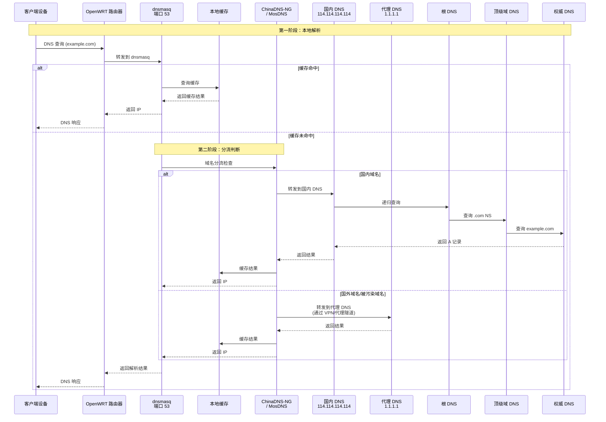
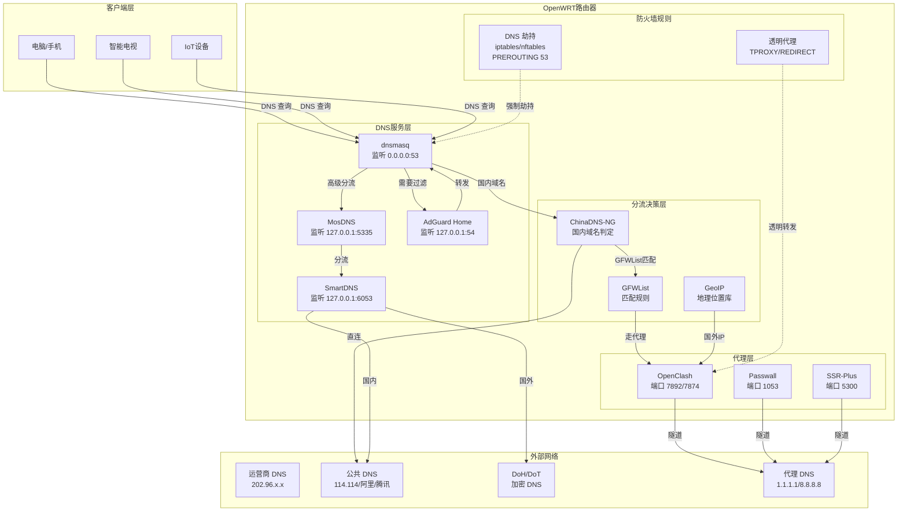
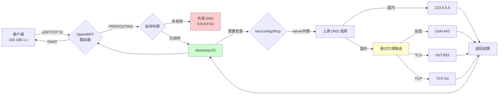
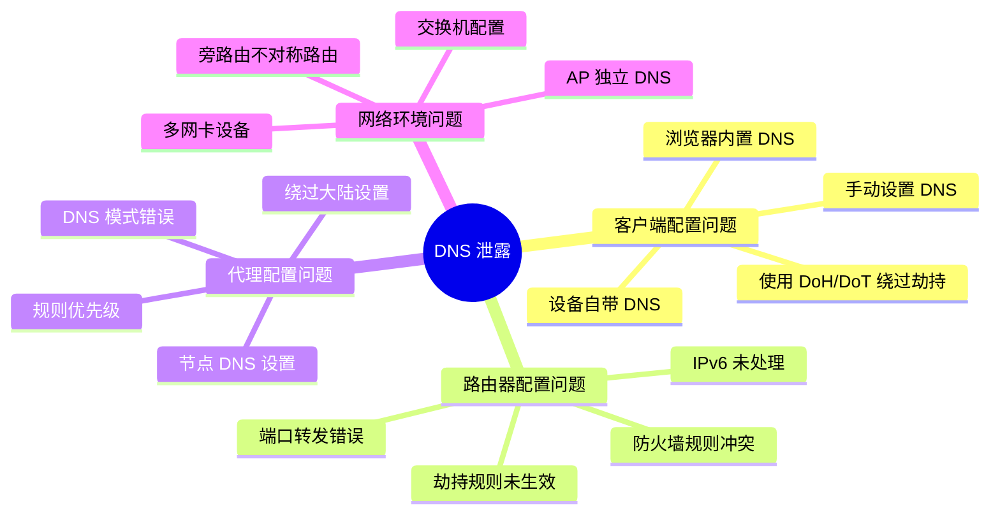
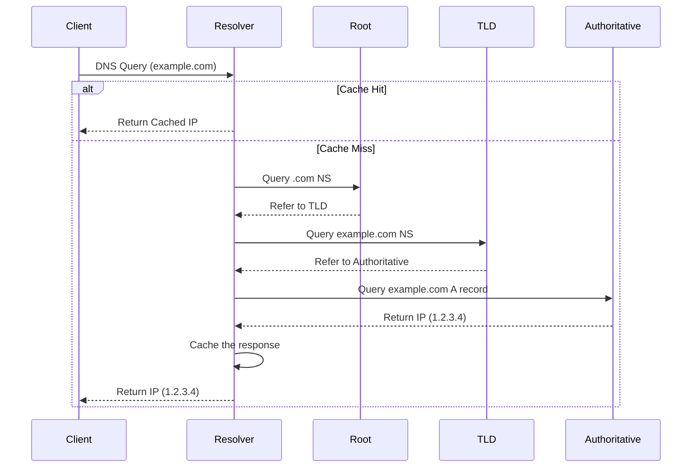
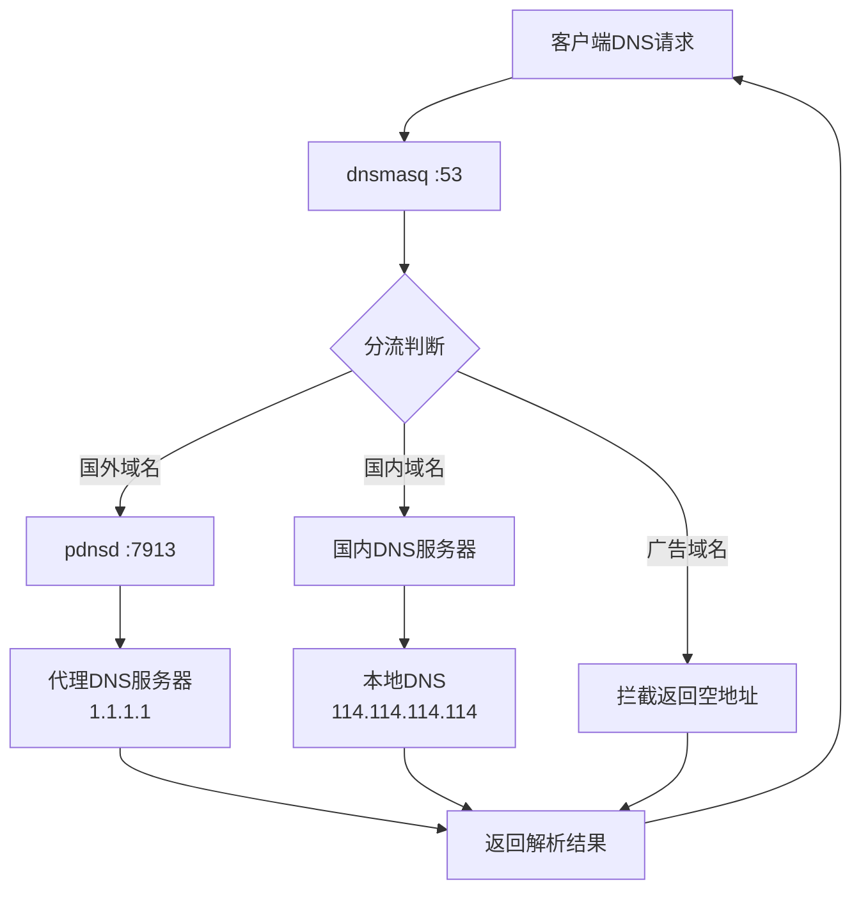
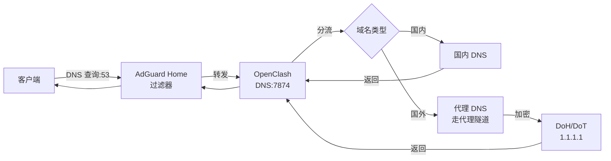

# OpenWRT DNS 配置完全指南

## 概述

DNS（Domain Name System）配置是 OpenWRT 路由器正常工作的关键环节，特别是在需要"科学上网"的环境中。正确的 DNS 配置不仅关系到域名解析的准确性，还直接影响网络访问的速度和稳定性。

本指南详细介绍 OpenWRT 中 DNS 的工作原理、配置方法和故障排除，让您能够深入理解并灵活配置各种复杂的网络环境。

---

## 📊 OpenWRT DNS 解析全流程图解

### 1. 标准 DNS 解析流程



### 2. 代理环境下的 DNS 架构图



### 3. DNS 请求数据流向图



---

## 🚨 DNS 泄露深度分析

### 什么是 DNS 泄露？

**DNS 泄露** 是指在使用 VPN 或代理服务时，DNS 请求没有通过加密隧道传输，而是直接发送到本地 ISP 的 DNS 服务器，导致：

1. **隐私暴露**: ISP 可以记录你访问的网站
2. **定位暴露**: 真实 IP 地址和地理位置被泄露
3. **审查绕过失败**: GFW 可以通过 DNS 污染继续干扰
4. **反诈提醒**: 某些省份会收到运营商的反诈短信或页面劫持

### DNS 泄露场景图解

```mermaid
flowchart TB
    subgraph 安全场景[✅ 无泄露 - 所有 DNS 走代理隧道]
        A1[客户端] -->|DNS 查询| B1[OpenWRT]
        B1 -->|劫持| C1[代理插件]
        C1 -->|加密隧道| D1[海外 DNS<br/>1.1.1.1]
        D1 -.->|ISP 只能看到加密流量| E1[ISP 网络]
        style D1 fill:#90EE90
    end
    
    subgraph 泄露场景1[❌ 泄露场景1 - 客户端自定义 DNS]
        A2[客户端<br/>设置 8.8.8.8] -->|直连 DNS| E2[ISP 网络]
        E2 -->|明文查询| D2[Google DNS<br/>8.8.8.8]
        D2 -.->|被 GFW 污染| F2[错误 IP/劫持]
        style A2 fill:#FFB6C1
        style E2 fill:#FFB6C1
    end
    
    subgraph 泄露场景2[❌ 泄露场景2 - 劫持规则失效]
        A3[客户端] -->|DNS 查询| B3[OpenWRT]
        B3 -.->|iptables 规则<br/>配置错误| C3[绕过劫持]
        C3 -->|直连| E3[ISP DNS<br/>202.96.x.x]
        style C3 fill:#FFB6C1
        style E3 fill:#FFB6C1
    end
    
    subgraph 泄露场景3[❌ 泄露场景3 - IPv6 DNS 泄露]
        A4[客户端] -->|AAAA 查询| B4[OpenWRT]
        B4 -->|IPv6 未劫持| E4[ISP IPv6 DNS]
        style B4 fill:#FFB6C1
        style E4 fill:#FFB6C1
    end
    
    subgraph 泄露场景4[❌ 泄露场景4 - 规则绕过]
        A5[客户端] -->|DoH/DoT 查询| B5[OpenWRT]
        B5 -.->|仅劫持 53 端口| C5[直接访问<br/>cloudflare-dns.com]
        C5 --> E5[ISP 网络]
        style C5 fill:#FFB6C1
    end
```



### DNS 泄露检测方法

#### 1. 在线检测工具

```bash
# 访问以下网站检测 DNS 泄露
https://browserleaks.com/dns
https://ipleak.net/
https://www.dnsleaktest.com/
```

**检测结果解读：**
- ✅ **无泄露**: 只显示代理/VPN 所在国家的 DNS 服务器
- ❌ **有泄露**: 列表中出现中国大陆的 DNS 服务器（如 202.96.x.x, 114.114.x.x 等）

#### 2. 命令行检测

```bash
# 方法1：使用 nslookup 检测当前使用的 DNS
nslookup example.com
# 观察 Server 字段显示的 IP

# 方法2：使用 dig 追踪查询路径
dig +trace www.google.com
# 检查每个查询步骤的服务器

# 方法3：检查路由器 DNS 配置
uci show dhcp.@dnsmasq[0]
cat /tmp/resolv.conf.d/resolv.conf.auto

# 方法4：抓包分析 DNS 流量
tcpdump -i any port 53 -n
# 观察是否有明文 DNS 流量绕过代理
```

#### 3. 防火墙连接追踪检测

```bash
# 检查 NAT 表中 DNS 连接状态
iptables -t nat -L PREROUTING -v -n | grep 53

# 检查 mangle 表（TPROXY 模式）
iptables -t mangle -L PREROUTING -v -n

# 查看当前建立的 DNS 连接
conntrack -L -p udp --dport 53
conntrack -L -p tcp --dport 53
```

### DNS 泄露根本原因分析



---

## DNS 基础原理

### DNS 查询过程



### DNS 记录类型

| 记录类型 | 用途 | 示例 |
|----------|------|------|
| **A** | IPv4 地址记录 | example.com → 1.2.3.4 |
| **AAAA** | IPv6 地址记录 | example.com → 2001:db8::1 |
| **CNAME** | 别名记录 | www.example.com → example.com |
| **MX** | 邮件交换记录 | example.com → mail.example.com |
| **NS** | 名称服务器记录 | example.com → ns1.example.com |
| **TXT** | 文本记录 | 用于 SPF、DKIM 等验证 |

## OpenWRT DNS 架构

### 核心组件

1. **dnsmasq** - 主要 DNS 服务器和 DHCP 服务器
2. **pdnsd** - DNS 代理和缓存服务器（可选）
3. **passwall/ssr-plus** - 科学上网插件的 DNS 分流
4. **smartdns/AdGuard Home** - 高级 DNS 解决方案（可选）

### 工作流程



## 基础 DNS 配置

### dnsmasq 基本配置

#### 通过 LuCI 界面配置

1. **DNS 转发设置**
   ```
   路径：网络 → DHCP/DNS → 基本设置

   DNS 转发：
   - 114.114.114.114
   - 8.8.8.8
   ```

2. **高级选项**
   ```
   ✓ 忽略解析文件
   ✓ 忽略 DHCP 的 DNS
   ✗ 过滤 IPv6 AAAA 记录 (按需)

   DNS 查询缓存的大小：1024
   ```

#### 命令行配置

编辑 `/etc/config/dhcp`：

```bash
config dnsmasq
    option domainneeded '1'
    option boguspriv '1'
    option filterwin2k '0'
    option localise_queries '1'
    option rebind_protection '1'
    option rebind_localhost '1'
    option local '/lan/'
    option domain 'lan'
    option expandhosts '1'
    option nonegcache '0'
    option authoritative '1'
    option readethers '1'
    option leasefile '/tmp/dhcp.leases'
    option resolvfile '/tmp/resolv.conf.d/resolv.conf.auto'
    option nohosts '0'
    option cachesize '1024'
    option dnsforwardmax '64'
    list server '114.114.114.114'
    list server '8.8.8.8'
```

### 上游 DNS 服务器选择

#### 国内 DNS 服务器

| 提供商 | 主DNS | 备用DNS | 特点 |
|--------|-------|---------|------|
| **阿里云** | 223.5.5.5 | 223.6.6.6 | 快速，支持 DoH/DoT |
| **腾讯** | 119.29.29.29 | 182.254.116.116 | 智能解析 |
| **百度** | 180.76.76.76 | - | 快速响应 |
| **114DNS** | 114.114.114.114 | 114.114.115.115 | 老牌稳定 |
| **运营商** | 自动获取 | 自动获取 | 本地优化 |

#### 国际 DNS 服务器

| 提供商 | 主DNS | 备用DNS | 特点 |
|--------|-------|---------|------|
| **Cloudflare** | 1.1.1.1 | 1.0.0.1 | 最快，隐私保护 |
| **Google** | 8.8.8.8 | 8.8.4.4 | 稳定可靠 |
| **Quad9** | 9.9.9.9 | 149.112.112.112 | 安全过滤 |
| **OpenDNS** | 208.67.222.222 | 208.67.220.220 | 内容过滤 |

## 科学上网 DNS 配置

### Passwall DNS 配置

#### DNS 分流原理

Passwall 使用 dnsmasq + pdnsd 实现智能 DNS 分流：

```bash
# 分流规则文件位置
/tmp/dnsmasq.d/passwall/
├── 99-gfwlist.conf      # 代理域名列表
├── 10-vpsiplist_host.conf   # VPS IP白名单
├── 11-direct_host.conf      # 直连域名列表
└── 97-proxy_host.conf       # 代理域名列表
```

#### 配置步骤

1. **基本 DNS 设置**
   ```
   路径：服务 → Passwall → DNS

   DNS 服务器设置：
   ✓ 启用 DNS 服务器
   远程 DNS：1.1.1.1
   本地 DNS：114.114.114.114
   ```

2. **高级选项**
   ```
   ✓ 启用 ChinaDNS-NG
   UDP DNS 服务器：116.228.111.118
   TCP DNS 服务器：119.29.29.29
   可信 DNS：1.1.1.1
   ```

3. **pdnsd 配置**
   ```bash
   # pdnsd 监听端口：7913
   # 上游服务器：1.1.1.1
   # 缓存大小：1024
   ```

#### 验证配置

```bash
# 检查 pdnsd 运行状态
netstat -nlpt | grep pdnsd

# 检查 dnsmasq 监听端口
netstat -nlpt | grep dnsmasq

# 测试代理域名解析
nslookup -port=7913 www.google.com 127.0.0.1

# 测试直连域名解析
nslookup www.baidu.com 114.114.114.114
```

### SSR Plus 配置

#### DNS 设置

```bash
路径：服务 → ShadowSocksR Plus+

DNS 设置：
- 国外 DNS 服务器：1.1.1.1
- 国内 DNS 服务器：114.114.114.114
- 启用 DNS 缓存
```

### OpenClash 配置

#### DNS 配置示例

```yaml
dns:
  enable: true
  listen: 0.0.0.0:7874
  enhanced-mode: redir-host  # fake-ip 或 redir-host
  nameserver:
    - 114.114.114.114
    - 223.5.5.5
  fallback:
    - 1.1.1.1
    - 8.8.8.8
  fallback-filter:
    geoip: true
    ipcidr:
      - 240.0.0.0/4
```

## 高级 DNS 配置

### SmartDNS 配置

#### 安装 SmartDNS

```bash
# 通过 opkg 安装
opkg update
opkg install smartdns

# 启用服务
/etc/init.d/smartdns enable
/etc/init.d/smartdns start
```

#### 配置文件

编辑 `/etc/smartdns/smartdns.conf`：

```bash
# 基本配置
bind 0.0.0.0:6053
cache-size 4096
rr-ttl-min 60
rr-ttl-max 86400

# 上游服务器组
server-tcp 223.5.5.5:53 -group china -exclude-default-group
server-tcp 114.114.114.114:53 -group china -exclude-default-group
server-tls 1.1.1.1:853 -group overseas -exclude-default-group
server-https https://cloudflare-dns.com/dns-query -group overseas -exclude-default-group

# 域名分流规则
nameserver /cn/ china
nameserver /taobao.com/ china
nameserver /google.com/ overseas
```

### AdGuard Home 部署

#### Docker 部署

```bash
# 创建配置目录
mkdir -p /opt/adguardhome

# 运行容器
docker run -d \
  --name adguardhome \
  --restart unless-stopped \
  -p 3000:3000 \
  -p 53:53/tcp \
  -p 53:53/udp \
  -v /opt/adguardhome/work:/opt/adguardhome/work \
  -v /opt/adguardhome/conf:/opt/adguardhome/conf \
  adguard/adguardhome
```

#### 配置要点

1. **上游 DNS**
   ```
   国内：223.5.5.5, 114.114.114.114
   国外：1.1.1.1, 8.8.8.8
   ```

2. **过滤规则**
   ```
   # 中文广告过滤
   https://anti-ad.net/easylist.txt

   # EasyList China
   https://easylist-downloads.adblockplus.org/easylistchina.txt
   ```

## 🔒 DNS 泄露防护完整方案

### 方案一：基础 DNS 劫持（推荐入门）

#### 1. 配置 dnsmasq

```bash
# 编辑 /etc/config/dhcp
config dnsmasq
    option domainneeded '1'
    option boguspriv '1'
    option localise_queries '1'
    option rebind_protection '1'
    option local '/lan/'
    option domain 'lan'
    option expandhosts '1'
    option authoritative '1'
    option readethers '1'
    option leasefile '/tmp/dhcp.leases'
    option resolvfile '/tmp/resolv.conf.d/resolv.conf.auto'
    option cachesize '1024'
    option dnsforwardmax '64'
    # 关闭默认 DNS 获取
    option peerdns '0'
    # 设置上游 DNS
    list server '223.5.5.5'
    list server '114.114.114.114'
```

#### 2. 配置防火墙 DNS 劫持

```bash
# 编辑 /etc/config/firewall - fw3 版本 (OpenWrt 22.03 之前)
config redirect
    option name 'DNS Hijacking'
    option src 'lan'
    option proto 'tcp udp'
    option src_dport '53'
    option dest_port '53'
    option target 'DNAT'
    option family 'ipv4'

# IPv6 劫持
config redirect
    option name 'DNS Hijacking IPv6'
    option src 'lan'
    option proto 'tcp udp'
    option src_dport '53'
    option dest_port '53'
    option target 'DNAT'
    option family 'ipv6'
```

```bash
# fw4 版本 (OpenWrt 22.03+) - nftables
# 在 /etc/config/firewall 中添加：
config redirect 'dns_hijack'
    option name 'DNS Hijacking'
    option src 'lan'
    option proto 'tcp udp'
    option src_dport '53'
    option target 'DNAT'
    option family 'ipv4'

config redirect 'dns_hijack6'
    option name 'DNS Hijacking IPv6'
    option src 'lan'
    option proto 'tcp udp'
    option src_dport '53'
    option target 'DNAT'
    option family 'ipv6'
```

#### 3. 防止 DoH/DoT 绕过

```bash
# 劫持常见 DoH/DoT 域名
# 在 /etc/config/dhcp 中添加：
config ipset
    list name 'doh_block'
    list domain 'cloudflare-dns.com'
    list domain 'dns.google'
    list domain 'dns.quad9.net'
    list domain 'dns.opendns.com'
    list domain 'doh.dns.apple.com'
    list domain 'dns.alidns.com'
    list domain 'doh.pub'

# 在防火墙中阻止这些域名
config rule
    option name 'Block DoH'
    option src 'lan'
    option dest 'wan'
    option proto 'tcp udp'
    option dest_port '443 853'
    option ipset 'doh_block dest'
    option target 'DROP'
```

### 方案二：MosDNS 防泄露配置

```yaml
# /etc/mosdns/config.yaml
log:
  level: info
  file: "/var/log/mosdns.log"

plugins:
  # 缓存
  - tag: cache
    type: cache
    args:
      size: 4096
      ttl: 3600

  # 国内 DNS 服务器
  - tag: domestic_dns
    type: forward
    args:
      upstreams:
        - addr: https://223.5.5.5/dns-query
        - addr: https://120.53.53.53/dns-query
      bootstrap: 223.5.5.5

  # 远程 DNS 服务器 (必须走代理)
  - tag: remote_dns
    type: forward
    args:
      upstreams:
        - addr: tls://1.1.1.1:853
        - addr: tls://8.8.8.8:853
      bootstrap: 1.1.1.1
      # 确保这些查询走代理

  # 域名分类
  - tag: geosite_cn
    type: domain_matcher
    args:
      files:
        - /etc/mosdns/geosite_cn.txt

  - tag: gfwlist
    type: domain_matcher
    args:
      files:
        - /etc/mosdns/gfwlist.txt

  # 分流逻辑
  - tag: main_sequence
    type: sequence
    args:
      exec:
        # 国内域名 -> 国内 DNS
        - matches: "qname $geosite_cn"
          exec: domestic_dns
          fast_return: true
        
        # GFWList 域名 -> 远程 DNS (强制走代理)
        - matches: "qname $gfwlist"
          exec: remote_dns
          fast_return: true
        
        # 默认远程 DNS
        - exec: remote_dns

  # 服务器入口
  - tag: server_udp
    type: udp_server
    args:
      entry: main_sequence
      listen: 0.0.0.0:5335

  - tag: server_tcp
    type: tcp_server
    args:
      entry: main_sequence
      listen: 0.0.0.0:5335
```

### 方案三：OpenClash + AdGuard Home 组合



#### 配置步骤：

1. **AdGuard Home 配置**
   ```yaml
   # 监听 53 端口
   dns:
     port: 53
     upstream:
       - 127.0.0.1:7874  # OpenClash DNS
     bootstrap:
       - 223.5.5.5
   ```

2. **OpenClash DNS 配置**
   ```yaml
   dns:
     enable: true
     listen: 0.0.0.0:7874
     enhanced-mode: redir-host
     nameserver:
       - 223.5.5.5
       - 114.114.114.114
     fallback:
       - https://1.1.1.1/dns-query
       - https://8.8.8.8/dns-query
     fallback-filter:
       geoip: true
       geoip-code: CN
   ```

3. **防火墙规则**
   ```bash
   # 强制重定向到 AdGuard Home
   iptables -t nat -A PREROUTING -p udp --dport 53 -j REDIRECT --to-ports 53
   iptables -t nat -A PREROUTING -p tcp --dport 53 -j REDIRECT --to-ports 53
   ```

### 方案四：SmartDNS 防泄露配置

```bash
# /etc/smartdns/smartdns.conf

# 基本配置
bind 0.0.0.0:6053
cache-size 4096
rr-ttl-min 60
rr-ttl-max 86400

# 国内 DNS 组
server-tcp 223.5.5.5:53 -group china -exclude-default-group
server-tcp 114.114.114.114:53 -group china -exclude-default-group
server-https https://223.5.5.5/dns-query -group china -exclude-default-group

# 远程 DNS 组 (确保走代理)
server-tls 1.1.1.1:853 -group overseas -exclude-default-group
server-tls 8.8.8.8:853 -group overseas -exclude-default-group
server-https https://cloudflare-dns.com/dns-query -group overseas -exclude-default-group

# 域名分流规则
nameserver /cn/ china
nameserver /taobao.com/ china
nameserver /baidu.com/ china
nameserver /google.com/ overseas
nameserver /youtube.com/ overseas
nameserver /github.com/ overseas
```

---

## 旁路由 DNS 特殊配置

### 非对称路由问题

在旁路由模式下，DNS 请求和响应可能走不同路径，导致连接问题：

#### 问题现象
```bash
# 现象：
- 可以访问国外网站
- 无法访问国内网站
- TCP 连接建立失败
```

#### 解决方案

1. **关闭"丢弃无效数据包"**
   ```
   路径：网络 → 防火墙 → 基本设置
   ✗ 丢弃无效数据包
   ```

2. **开启 IP 动态伪装**
   ```
   路径：网络 → 防火墙 → 基本设置
   ✓ IP 动态伪装 (masquerade)
   ```

3. **添加防火墙规则**
   ```bash
   # 在自定义规则中添加
   iptables -t nat -I POSTROUTING -j MASQUERADE
   ```

### WiFi 设备特殊处理

WiFi 设备在旁路由下可能遇到额外的 DNS 问题：

#### 强制 DNS 劫持

```bash
# 在防火墙自定义规则中添加
iptables -t nat -A PREROUTING -p udp --dport 53 -j REDIRECT --to-ports 53
iptables -t nat -A PREROUTING -p tcp --dport 53 -j REDIRECT --to-ports 53
[ -n "$(command -v ip6tables)" ] && ip6tables -t nat -A PREROUTING -p udp --dport 53 -j REDIRECT --to-ports 53
[ -n "$(command -v ip6tables)" ] && ip6tables -t nat -A PREROUTING -p tcp --dport 53 -j REDIRECT --to-ports 53
```

## DNS 性能优化

### 缓存优化

#### dnsmasq 缓存设置

```bash
# 编辑 /etc/config/dhcp
config dnsmasq
    option cachesize '2048'        # 增加缓存大小
    option dnsforwardmax '64'      # 并发查询数
    option localttl '60'           # 本地记录 TTL
```

#### 预加载常用域名

```bash
# 创建预加载脚本
cat > /etc/init.d/dns-preload << 'EOF'
#!/bin/sh /etc/rc.common

START=99

start() {
    # 预加载常用域名
    nslookup www.baidu.com >/dev/null 2>&1 &
    nslookup www.qq.com >/dev/null 2>&1 &
    nslookup www.weibo.com >/dev/null 2>&1 &
}
EOF

chmod +x /etc/init.d/dns-preload
/etc/init.d/dns-preload enable
```

### 多线程 DNS 查询

```bash
# 安装 parallel-dns
opkg install parallel-dns

# 配置并发查询
echo "parallel_queries=4" >> /etc/dnsmasq.conf
```

## 故障排除

### 常用诊断命令

#### 检查 DNS 服务状态

```bash
# 检查 dnsmasq 进程
ps | grep dnsmasq

# 检查监听端口
netstat -tunlp | grep :53

# 检查配置语法
dnsmasq --test

# 重启 DNS 服务
/etc/init.d/dnsmasq restart
```

#### DNS 查询测试

```bash
# 基本查询
nslookup www.baidu.com

# 指定 DNS 服务器查询
nslookup www.baidu.com 114.114.114.114

# 使用 dig 详细查询
dig www.baidu.com

# 追踪查询路径
dig +trace www.baidu.com

# 测试特定端口
dig @127.0.0.1 -p 7913 www.google.com
```

### 常见问题解决

#### 1. DNS 解析慢

**原因分析：**
- 上游 DNS 服务器响应慢
- 网络连接不稳定
- 缓存设置不合理

**解决方案：**
```bash
# 更换更快的 DNS 服务器
uci set dhcp.@dnsmasq[0].server='223.5.5.5'
uci add_list dhcp.@dnsmasq[0].server='1.1.1.1'
uci commit dhcp
/etc/init.d/dnsmasq restart

# 增加缓存大小
uci set dhcp.@dnsmasq[0].cachesize='4096'
uci commit dhcp
```

#### 2. 无法解析域名

**检查步骤：**
```bash
# 1. 检查网络连通性
ping 8.8.8.8

# 2. 检查 DNS 配置
cat /tmp/resolv.conf.d/resolv.conf.auto

# 3. 手动测试 DNS
nslookup www.baidu.com 223.5.5.5

# 4. 检查防火墙规则
iptables -t nat -L PREROUTING -n | grep :53
```

#### 3. 科学上网 DNS 分流失效

**诊断步骤：**
```bash
# 检查分流规则文件
ls -la /tmp/dnsmasq.d/passwall/

# 查看规则内容
head /tmp/dnsmasq.d/passwall/99-gfwlist.conf

# 测试代理 DNS
nslookup -port=7913 www.google.com 127.0.0.1

# 重启相关服务
/etc/init.d/passwall restart
/etc/init.d/dnsmasq restart
```

#### 4. IPv6 DNS 问题

**禁用 IPv6 DNS：**
```bash
# 方法1：LuCI 界面
网络 → DHCP/DNS → 高级设置
✓ 过滤 IPv6 AAAA 记录

# 方法2：命令行
uci set dhcp.@dnsmasq[0].filter_aaaa='1'
uci commit dhcp
/etc/init.d/dnsmasq restart
```

#### 5. DNS 泄露问题 🔒

**诊断步骤：**
```bash
# 步骤1：在线检测
curl -s https://ipleak.net/json/ | grep -E '"ip"|"country"'

# 步骤2：检查当前使用的 DNS
nslookup google.com
# 观察 Server 字段显示的 IP

# 步骤3：检查 iptables 劫持规则
iptables -t nat -L PREROUTING -v -n | grep 53
# 应该看到 REDIRECT 到 53 端口的规则

# 步骤4：抓包检查
opkg install tcpdump
tcpdump -i any port 53 -nn -c 20
# 看是否有 DNS 流量直接发往外部 DNS

# 步骤5：检查是否存在 IPv6 泄露
ip6tables -t nat -L PREROUTING -v -n | grep 53
# 如果没有规则，可能导致 IPv6 DNS 泄露
```

**常见泄露场景及修复：**

| 泄露场景 | 诊断方法 | 修复方案 |
|----------|----------|----------|
| **客户端自定义 DNS** | nslookup 显示外部 DNS IP | 在防火墙添加劫持规则 |
| **IPv6 泄露** | 在线检测显示 IPv6 DNS | 添加 ip6tables 劫持规则或禁用 IPv6 |
| **DoH/DoT 绕过** | 看到 443/853 端口的 DNS 流量 | 阻断知名 DoH/DoT 域名 |
| **规则优先级错误** | iptables 规则顺序不正确 | 调整规则顺序，劫持规则放最前面 |
| **代理插件未接管** | 国外域名仍使用国内 DNS | 检查代理插件 DNS 设置 |

**修复脚本示例：**
```bash
#!/bin/sh
# /usr/bin/fix-dns-leak.sh
# 一键修复常见 DNS 泄露问题

echo "=== DNS 泄露修复脚本 ==="

# 1. 清除现有规则
echo "清除现有 DNS 规则..."
iptables -t nat -D PREROUTING -p udp --dport 53 -j REDIRECT --to-ports 53 2>/dev/null
iptables -t nat -D PREROUTING -p tcp --dport 53 -j REDIRECT --to-ports 53 2>/dev/null
ip6tables -t nat -D PREROUTING -p udp --dport 53 -j REDIRECT --to-ports 53 2>/dev/null
ip6tables -t nat -D PREROUTING -p tcp --dport 53 -j REDIRECT --to-ports 53 2>/dev/null

# 2. 添加 IPv4 劫持规则
echo "添加 IPv4 DNS 劫持规则..."
iptables -t nat -I PREROUTING -p udp --dport 53 -j REDIRECT --to-ports 53
iptables -t nat -I PREROUTING -p tcp --dport 53 -j REDIRECT --to-ports 53

# 3. 添加 IPv6 劫持规则
if [ -n "$(command -v ip6tables)" ]; then
    echo "添加 IPv6 DNS 劫持规则..."
    ip6tables -t nat -I PREROUTING -p udp --dport 53 -j REDIRECT --to-ports 53
    ip6tables -t nat -I PREROUTING -p tcp --dport 53 -j REDIRECT --to-ports 53
fi

# 4. 禁用 AAAA 记录过滤
echo "禁用 IPv6 AAAA 记录..."
uci set dhcp.@dnsmasq[0].filter_aaaa='1'
uci commit dhcp

# 5. 重启服务
echo "重启 DNS 服务..."
/etc/init.d/dnsmasq restart
/etc/init.d/firewall restart

echo "=== 修复完成 ==="
echo "请访问 https://ipleak.net 验证是否修复成功"
```

## 监控与维护

### DNS 性能监控

#### 查询统计

```bash
# dnsmasq 查询统计
cat /tmp/dnsmasq.log | grep query | wc -l

# 缓存命中率统计
kill -USR1 $(pidof dnsmasq)
tail /var/log/messages | grep cache
```

#### 自动化监控脚本

```bash
#!/bin/sh
# DNS 健康检查脚本

LOG_FILE="/tmp/dns_health.log"
DATE=$(date '+%Y-%m-%d %H:%M:%S')

# 测试主要 DNS 服务器
test_dns() {
    local dns_server=$1
    local test_domain=$2

    result=$(nslookup $test_domain $dns_server 2>&1)
    if echo "$result" | grep -q "Address:"; then
        echo "$DATE - $dns_server OK" >> $LOG_FILE
        return 0
    else
        echo "$DATE - $dns_server FAILED" >> $LOG_FILE
        return 1
    fi
}

# 测试列表
test_dns "114.114.114.114" "www.baidu.com"
test_dns "1.1.1.1" "www.google.com"
test_dns "127.0.0.1" "www.qq.com"

# 检查 dnsmasq 进程
if ! pidof dnsmasq > /dev/null; then
    echo "$DATE - dnsmasq process not running" >> $LOG_FILE
    /etc/init.d/dnsmasq restart
fi
```

### 定期维护任务

```bash
# 添加到 crontab
cat >> /etc/crontabs/root << 'EOF'
# DNS 缓存清理 (每天凌晨2点)
0 2 * * * /etc/init.d/dnsmasq restart

# DNS 健康检查 (每10分钟)
*/10 * * * * /usr/bin/dns_health_check.sh
EOF

/etc/init.d/cron restart
```

## 参考配置文件

### 完整的 dnsmasq 配置

```bash
# /etc/dnsmasq.conf

# 基本设置
domain-needed
bogus-priv
no-resolv
strict-order
local=/lan/
domain=lan
expand-hosts
no-negcache
authoritative
read-ethers

# 监听设置
listen-address=127.0.0.1
listen-address=192.168.1.1
bind-interfaces

# 缓存设置
cache-size=4096
dns-forward-max=64
local-ttl=60

# 上游 DNS 服务器
server=223.5.5.5
server=114.114.114.114
server=1.1.1.1

# DHCP 设置
dhcp-range=192.168.1.100,192.168.1.200,24h
dhcp-option=3,192.168.1.1
dhcp-option=6,192.168.1.1

# 日志设置
log-queries
log-facility=/tmp/dnsmasq.log

# 安全设置
stop-dns-rebind
rebind-localhost-ok
```

### Passwall 完整配置示例

```bash
# /etc/config/passwall

config global
    option enabled '1'
    option tcp_node '节点名称'
    option udp_node '节点名称'
    option dns_mode 'pdnsd'
    option remote_dns '1.1.1.1'
    option local_dns '114.114.114.114'
    option chinadns_ng '1'
    option up_china_dns '116.228.111.118'

config global_dns
    option enabled '1'
    option dns_53 '1'
    option dns_redirect '1'

config global_forwarding
    option process '1'
    option tcp_no_redir_ports 'disable'
    option udp_no_redir_ports 'disable'
    option tcp_redir_ports '22,25,53,143,465,587,853,993,995'
    option udp_redir_ports '53'
```

## 总结

正确配置 OpenWRT 的 DNS 系统需要理解其工作原理和各组件的协作关系。通过本指南的详细说明，您应该能够：

1. **理解 DNS 基础原理**和查询流程
2. **配置基础 DNS 服务**满足日常需求
3. **实现智能 DNS 分流**支持科学上网
4. **解决旁路由环境**中的特殊问题
5. **优化 DNS 性能**提升网络体验
6. **诊断和排除故障**保证系统稳定

记住，DNS 配置是一个系统工程，需要根据具体网络环境和需求进行调整。建议在生产环境中部署前，先在测试环境中充分验证配置的正确性和稳定性。

---

## ✅ DNS 配置检查清单

在部署或修改 DNS 配置后，使用以下清单确保配置正确：

### 基础配置检查
- [ ] dnsmasq 监听在 0.0.0.0:53
- [ ] 上游 DNS 服务器设置正确
- [ ] 缓存大小配置合理（1024-4096）
- [ ] IPv6 AAAA 记录过滤已启用（可选）

### 安全防护检查
- [ ] **DNS 劫持规则已启用** (iptables/nftables)
- [ ] **IPv6 DNS 劫持规则已添加**
- [ ] **DoH/DoT 绕过已处理**（阻断或劫持）
- [ ] **客户端自定义 DNS 被强制重定向**

### 代理集成检查
- [ ] 代理插件 DNS 监听正确
- [ ] 分流规则生效
- [ ] 远程 DNS 走代理隧道
- [ ] 国内域名直连解析

### 泄露检测检查
- [ ] 访问 https://ipleak.net 检测无泄露
- [ ] 访问 https://browserleaks.com/dns 验证
- [ ] 命令行 `nslookup` 显示预期 DNS
- [ ] 抓包检查无未加密 DNS 流量

### 旁路由特殊检查（如适用）
- [ ] 非对称路由已处理
- [ ] IP 动态伪装已启用
- [ ] 丢弃无效数据包已禁用
- [ ] WiFi 设备 DNS 正常

---

## 🔧 快速命令参考

```bash
# 常用诊断命令速查

# 查看当前 DNS 配置
uci show dhcp.@dnsmasq[0]

# 检查 dnsmasq 进程
ps | grep dnsmasq

# 查看监听端口
netstat -tlnp | grep :53

# 检查 iptables 劫持规则
iptables -t nat -L PREROUTING -v -n | grep 53

# 测试 DNS 解析
nslookup google.com
nslookup baidu.com

# 使用 dig 详细查询
dig @127.0.0.1 www.google.com
dig +trace www.google.com

# 检查 DNS 泄露（命令行）
curl -s https://ipleak.net/json/ | jq

# 重启所有 DNS 相关服务
/etc/init.d/dnsmasq restart
/etc/init.d/firewall restart
/etc/init.d/passwall restart  # 如使用
/etc/init.d/openclash restart # 如使用

# 查看日志
tail -f /tmp/dnsmasq.log
tail -f /var/log/messages | grep dns

# 抓包分析（需要安装 tcpdump）
opkg install tcpdump
tcpdump -i any port 53 -nn -v
tcpdump -i any 'port 53 or port 443 or port 853' -nn

# 清理 DNS 缓存
kill -HUP $(pidof dnsmasq)

# 备份配置
uci export dhcp > /root/dhcp-backup.conf
uci export firewall > /root/firewall-backup.conf
```