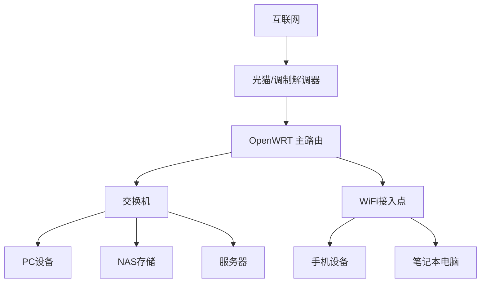
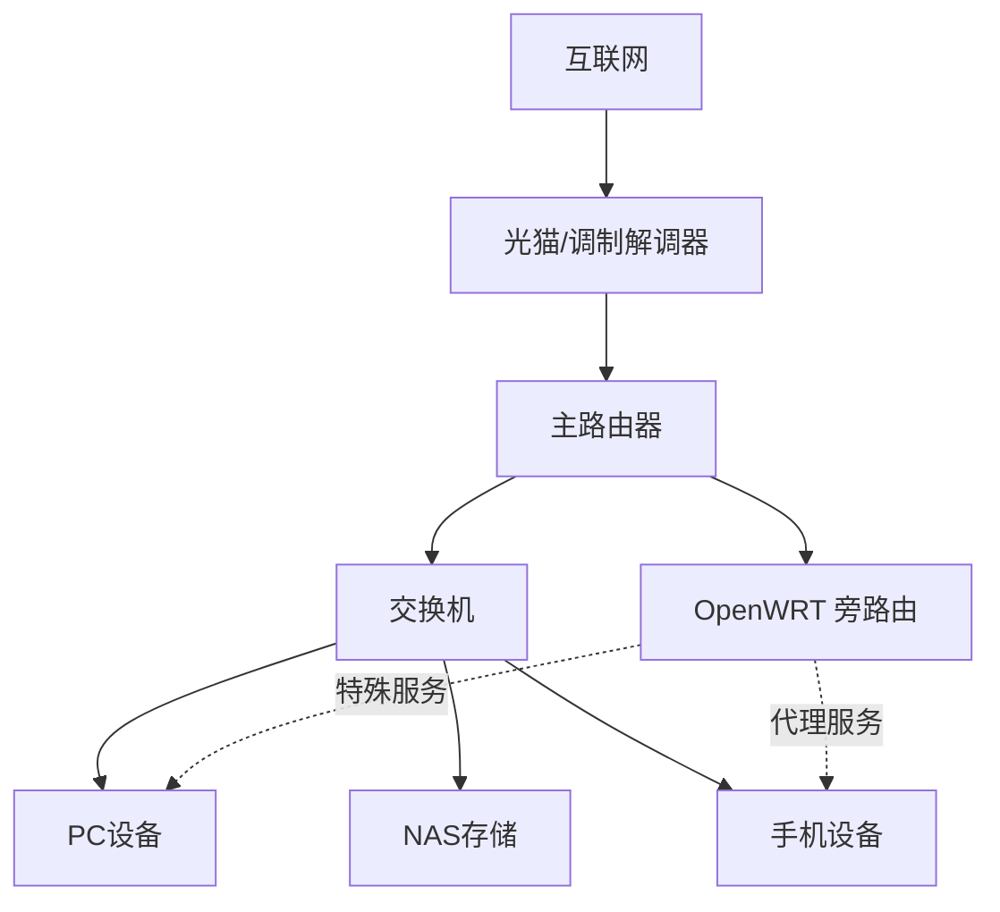
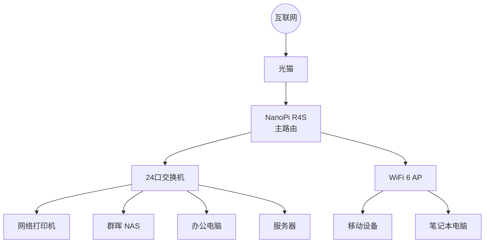
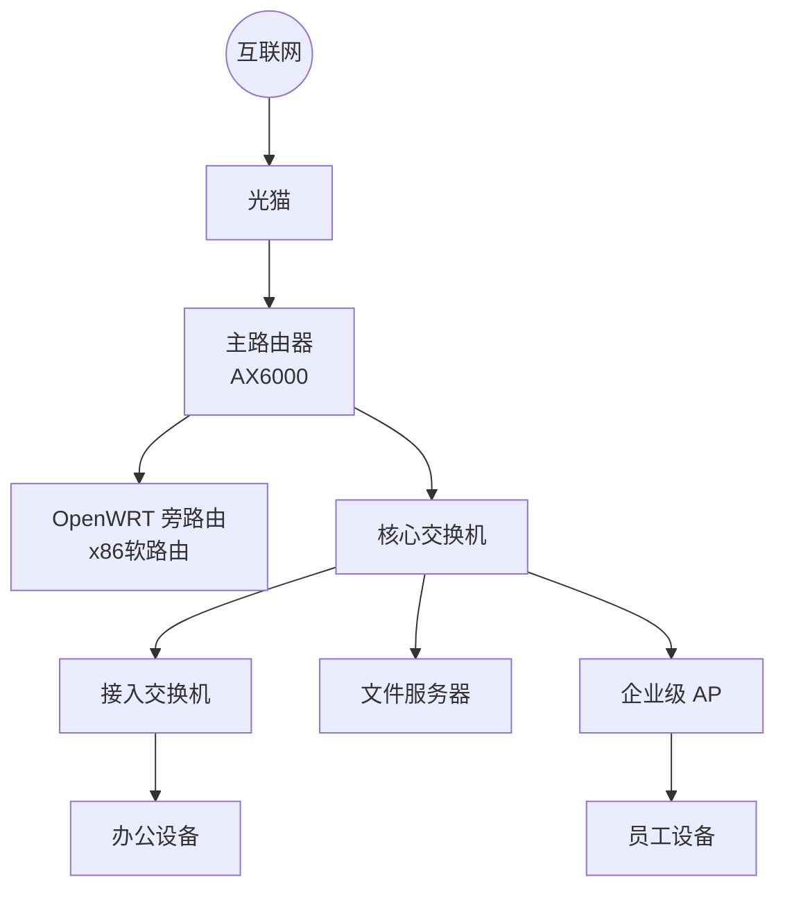
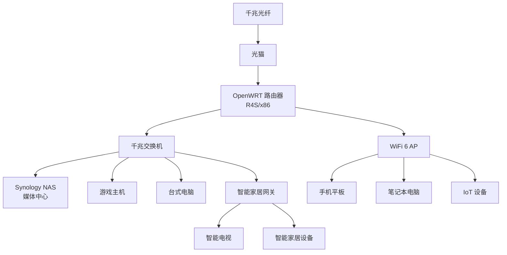
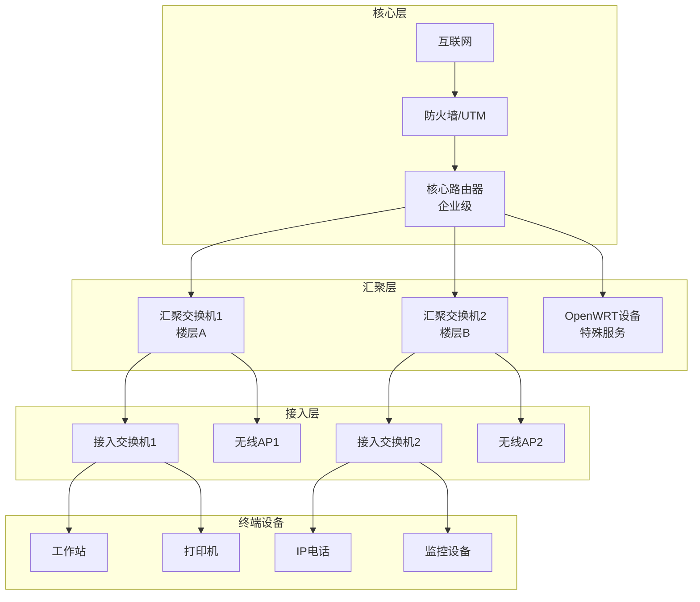
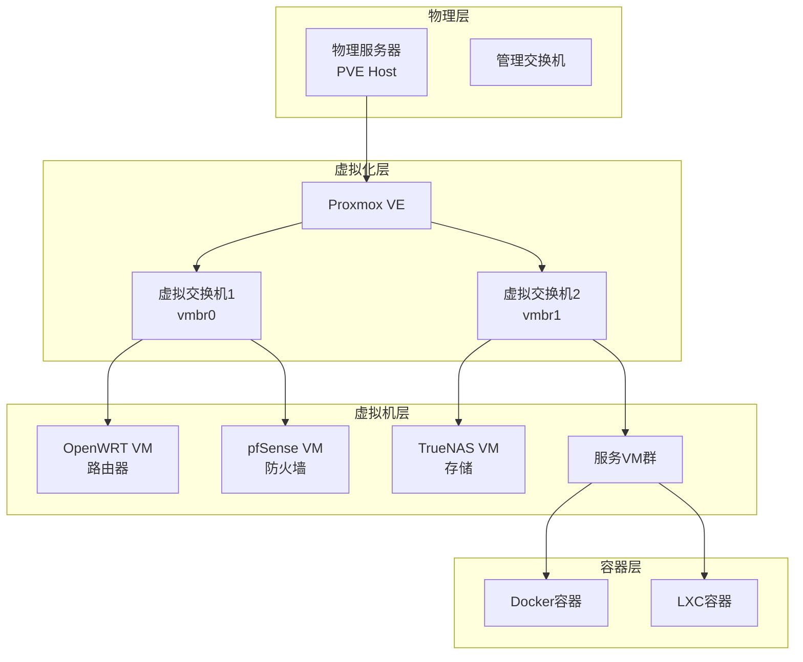

# 网络拓扑与架构设计

## 概述

合理的网络拓扑设计是构建高性能、稳定可靠网络环境的基础。本指南介绍 OpenWRT 在不同网络场景中的拓扑设计方案，包括小型办公网络、家庭网络和复杂的多层网络架构。

## 网络架构模式

### 主路由模式 (Main Router Mode)

主路由模式下，OpenWRT 设备作为网络的核心路由器，直接连接到外网。


#### 架构特点



#### 适用场景

- **小型办公网络**：设备数量适中，需要统一管理
- **家庭网络**：单一路由器满足需求
- **简单网络**：网络需求不复杂，易于维护

#### 配置要点

```bash
# 网络接口配置
config interface 'wan'
    option ifname 'eth0'
    option proto 'pppoe'  # 或 'dhcp'
    option username 'your_username'
    option password 'your_password'

config interface 'lan'
    option ifname 'eth1'
    option proto 'static'
    option ipaddr '192.168.1.1'
    option netmask '255.255.255.0'
    option ip6assign '60'
```

#### 优势与劣势

**优势：**
- 配置简单，易于管理
- 性能开销小
- 故障点少，稳定性高
- 功能完整，支持所有路由特性

**劣势：**
- 升级维护时全网断网
- 不便于逐步迁移
- 设备性能要求较高

### 旁路由模式 (Side Router Mode)

旁路由模式下，OpenWRT 设备作为辅助路由器，与主路由器并存。


#### 架构特点



#### 网络配置

##### 主路由器设置
```bash
# 主路由器 (如小米AX3600)
IP地址: 192.168.123.1
DHCP范围: 192.168.123.100-200
网关: 192.168.123.2 (指向旁路由)
DNS: 192.168.123.2 (指向旁路由)
```

##### 旁路由设置
```bash
# OpenWRT 旁路由
config interface 'lan'
    option proto 'static'
    option ipaddr '192.168.123.2'
    option netmask '255.255.255.0'
    option gateway '192.168.123.1'
    option dns '192.168.123.1'

# 关闭 DHCP
config dhcp 'lan'
    option interface 'lan'
    option ignore '1'
```

#### 适用场景

- **现有网络升级**：不想更换现有主路由
- **特殊功能需求**：仅需要部分高级功能
- **测试环境**：新功能测试不影响主网络
- **风险控制**：降低网络变更风险

#### 优势与劣势

**优势：**
- 不影响现有网络
- 可以逐步迁移设备
- 维护时不断网
- 成本投入较小

**劣势：**
- 网络架构复杂
- 可能出现路由冲突
- 性能略有损失
- 管理界面分散

## 小型办公网络设计

### 需求分析

```yaml
网络需求:
  - 设备数量: 20-50台
  - 带宽需求: 200M-1000M
  - 安全需求: 高
  - 管理需求: 集中化

功能要求:
  - 科学上网
  - 内网文件共享
  - 远程访问
  - 网络监控
  - 访问控制
```

### 推荐架构

#### 方案一：单路由架构



#### 方案二：双路由架构



### 配置示例

#### VLAN 划分

```bash
# 管理 VLAN (VLAN 10)
config interface 'management'
    option proto 'static'
    option ipaddr '192.168.10.1'
    option netmask '255.255.255.0'

# 办公 VLAN (VLAN 20)
config interface 'office'
    option proto 'static'
    option ipaddr '192.168.20.1'
    option netmask '255.255.255.0'

# 访客 VLAN (VLAN 30)
config interface 'guest'
    option proto 'static'
    option ipaddr '192.168.30.1'
    option netmask '255.255.255.0'
```

#### 防火墙规则

```bash
# 访客网络隔离
config rule
    option name 'Block Guest to LAN'
    option src 'guest'
    option dest 'lan'
    option target 'REJECT'

# 管理网络访问控制
config rule
    option name 'Management Access'
    option src 'management'
    option dest_port '22 80 443'
    option target 'ACCEPT'
```

## 家庭网络设计

### 典型场景需求

```yaml
家庭网络特点:
  - 设备多样化: 手机、电脑、IoT设备
  - 带宽需求: 100M-500M
  - 功能需求: 影音娱乐、智能家居
  - 管理复杂度: 中等

核心功能:
  - 科学上网
  - NAS 媒体中心
  - 游戏加速
  - 智能家居控制
  - 家长控制
```

### 推荐拓扑

#### 标准家庭网络



#### 网段规划

| 网段 | 用途 | IP范围 | 设备类型 |
|------|------|--------|----------|
| 192.168.1.0/24 | 主网段 | .1-.99 | 路由器、服务器 |
| 192.168.1.100/28 | 静态设备 | .100-.110 | NAS、服务器 |
| 192.168.1.120/26 | DHCP池 | .120-.180 | 电脑、手机 |
| 192.168.1.200/29 | IoT设备 | .200-.210 | 智能家居 |
| 192.168.1.220/30 | 管理网段 | .220-.223 | 网络设备管理 |

### 服务配置

#### 媒体服务

```bash
# Samba 文件共享
config samba
    option name 'OpenWrt'
    option workgroup 'WORKGROUP'
    option description 'OpenWrt Samba'

config sambashare
    option name 'media'
    option path '/mnt/media'
    option users 'family'
    option read_only 'no'
```

#### DDNS 配置

```bash
# 阿里云 DDNS
config service 'aliyun'
    option enabled '1'
    option service_name 'aliyun.com'
    option domain 'home.example.com'
    option username 'your_access_key'
    option password 'your_secret_key'
    option interface 'wan'
```

## 复杂网络架构

### 多层网络设计

适用于大型组织或复杂家庭网络环境。



### 虚拟化网络设计

使用 Proxmox VE 等虚拟化平台构建软件定义网络。



## 网络优化策略

### 带宽管理

#### QoS 配置

```bash
# 安装 SQM
opkg install luci-app-sqm

# SQM 配置
config sqm
    option enabled '1'
    option interface 'eth0'
    option download '950000'  # 下行带宽 (kbit/s)
    option upload '50000'     # 上行带宽 (kbit/s)
    option script 'piece_of_cake.qos'
```

#### 流量监控

```bash
# 安装网络带宽监控
opkg install luci-app-nlbwmon

# 配置监控
config nlbwmon
    option database_directory '/tmp/nlbw'
    option database_limit '10000'
    option refresh_interval '30'
```

### 负载均衡

#### 多WAN配置

```bash
# WAN1 配置
config interface 'wan1'
    option ifname 'eth0'
    option proto 'pppoe'
    option metric '10'

# WAN2 配置
config interface 'wan2'
    option ifname 'eth1'
    option proto 'dhcp'
    option metric '20'

# 负载均衡规则
config rule
    option src '192.168.1.0/24'
    option dest_ip '!192.168.0.0/16'
    option use_policy 'balanced'
```

### 高可用性设计

#### VRRP 配置

```bash
# 主路由器配置
config vrrp_instance 'VI_1'
    option state 'MASTER'
    option interface 'br-lan'
    option virtual_router_id '1'
    option priority '110'
    option advert_int '1'
    option authentication 'PASS mypass'
    option virtual_ipaddress '192.168.1.1'

# 备份路由器配置
config vrrp_instance 'VI_1'
    option state 'BACKUP'
    option interface 'br-lan'
    option virtual_router_id '1'
    option priority '100'
    option advert_int '1'
    option authentication 'PASS mypass'
    option virtual_ipaddress '192.168.1.1'
```

## 安全考虑

### 网络隔离

#### 访客网络

```bash
# 访客网络接口
config interface 'guest'
    option proto 'static'
    option ipaddr '192.168.100.1'
    option netmask '255.255.255.0'

# 访客网络防火墙
config zone
    option name 'guest'
    option network 'guest'
    option input 'REJECT'
    option forward 'REJECT'
    option output 'ACCEPT'

config forwarding
    option src 'guest'
    option dest 'wan'
```

#### IoT 设备隔离

```bash
# IoT 网络配置
config interface 'iot'
    option proto 'static'
    option ipaddr '192.168.50.1'
    option netmask '255.255.255.0'

# 限制 IoT 设备访问
config rule
    option name 'Block IoT to LAN'
    option src 'iot'
    option dest 'lan'
    option target 'REJECT'
```

### VPN 接入

#### WireGuard 服务器

```bash
# WireGuard 接口配置
config interface 'wg0'
    option proto 'wireguard'
    option private_key 'server_private_key'
    option listen_port '51820'
    option addresses '10.0.0.1/24'

# 客户端配置
config wireguard_wg0
    option public_key 'client_public_key'
    option allowed_ips '10.0.0.2/32'
```

## 监控与管理

### 网络监控

#### SNMP 配置

```bash
# 安装 SNMP
opkg install snmpd

# SNMP 配置
config agent
    option agentaddress '192.168.1.1:161'
    option community 'public'
    option contact 'admin@example.com'
    option location 'Network Room'
```

#### 日志监控

```bash
# 配置日志服务器
config system
    option log_ip '192.168.1.100'
    option log_port '514'
    option log_proto 'udp'

# 防火墙日志
config defaults
    option input 'ACCEPT'
    option output 'ACCEPT'
    option forward 'REJECT'
    option log '1'
    option log_limit '10/minute'
```

### 自动化管理

#### 配置备份脚本

```bash
#!/bin/sh
# 自动备份配置

BACKUP_DIR="/tmp/config_backup"
DATE=$(date +%Y%m%d_%H%M%S)

# 创建备份目录
mkdir -p $BACKUP_DIR

# 备份配置文件
sysupgrade -b $BACKUP_DIR/config_backup_$DATE.tar.gz

# 上传到远程服务器
scp $BACKUP_DIR/config_backup_$DATE.tar.gz user@backup-server:/backups/

# 清理旧备份
find $BACKUP_DIR -name "config_backup_*.tar.gz" -mtime +7 -delete
```

## 故障排除

### 网络诊断命令

```bash
# 网络连通性测试
ping -c 4 8.8.8.8

# 路由表查看
ip route show

# 网络接口状态
ip addr show

# 防火墙规则
iptables -L -n -v

# 网络连接状态
netstat -tuln

# 带宽测试
iperf3 -c iperf.example.com
```

### 常见问题解决

#### 网络环路检测

```bash
# 检测网络环路
tcpdump -i any -f "ether proto 0x88cc"

# STP 配置
config device
    option name 'br-lan'
    option type 'bridge'
    option stp '1'
```

#### IP 地址冲突

```bash
# ARP 表检查
arp -a

# IP 冲突检测
arping -D -I br-lan 192.168.1.100

# 静态 ARP 绑定
config host
    option name 'server'
    option mac '00:11:22:33:44:55'
    option ip '192.168.1.100'
```

## 总结

网络拓扑设计需要综合考虑以下因素：

1. **业务需求**：了解实际使用场景和性能要求
2. **扩展性**：设计时考虑未来增长需求
3. **可靠性**：实施冗余和故障恢复机制
4. **安全性**：实现网络隔离和访问控制
5. **可管理性**：简化运维管理流程
6. **成本效益**：平衡性能和成本投入

通过合理的网络拓扑设计和配置优化，可以构建一个稳定、高效、安全的网络环境，满足不同场景的使用需求。