# build a flexible network for a small business

## topology of my network

### main route mode

### side route mode

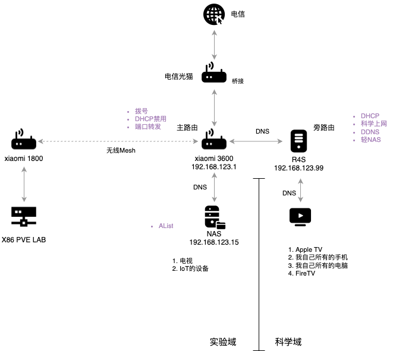

## soft route

### openwrt

#### history

- 2002年：OpenWRT的起源
    * 事件：LinkSys WRT 54G 发布
        * 描述：OpenWRT项目的历史可以追溯到2002年发布的LinkSys WRT 54G路由器
        * 影响：这款标志性的路由器为OpenWRT的诞生和发展奠定了基础

- 早期OpenWRT的衍生版本 (2016年前)
    * DDWRT (商业版本)
        * 描述：这是OpenWRT的一个早期衍生固件，通常被视为一个商业化版本
    * PandoraBox
        * 描述：PandoraBox是OpenWRT的另一个衍生项目
        * 维护者：由OpenWRT社区的创始人之一LinTel负责维护
        * 状态（约2017年或2018年）：PandoraBox的开发工作已停止

- 2016年：LEDE的分裂
    * 事件：LEDE (Linux Embedded Development Environment) 项目独立
        * 描述：由于社区发展等原因，OpenWRT项目在2016年发生分裂，其中一个主要分支独立为LEDE（Linux嵌入式开发环境）项目

- 2018年：OpenWRT的统一与现代发展
    * 事件：LEDE项目与原OpenWRT项目重新合并
        * 描述：到了2018年，LEDE项目与原OpenWRT项目决定重新合并，并统一继续使用OpenWRT的名称
        * 影响：这次合并标志着现代OpenWRT的形成，并继承了LEDE的许多改进

- 现代OpenWRT (2018年后) 的主要衍生版本
    * KoolShare (软件中心)
        * 描述：作为新OpenWRT的一个流行分支，KoolShare版本以其集成了便捷的“软件中心”功能而闻名，方便用户安装和管理各种插件
    * LEAN LEDE
        * 描述：这是新OpenWRT的另一个非常知名的分支，由Lean维护
        * 主要特点：
            * 相对更接近OpenWRT原生状态，没有进行过多的深度定制
            * 系统较为稳定
            * 通常会集成丰富的实用系统插件
            * 能够满足大多数用户的日常使用需求
    * Lienol
        * 描述：Lienol是新OpenWRT的又一个分支版本
        * 主要区别与特点：Lienol编译的固件与其他版本的一个显著区别在于其包含的插件组合。例如，文中提到Lienol版本会包含 "passwall" 插件和 "ssr-plus" 插件，这反映了其在特定功能插件集成上的侧重

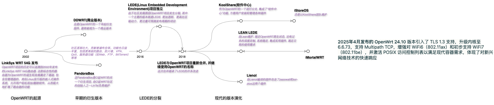

#### version

- OpenWrt 演进过程中主要版本及其差异可以梳理如下：

|    | 版本名称                 | 发布时间      | 主要特点与技术变化                                                                                                                               |
|----|--------------------------|---------------|----------------------------------------------------------------------------------------------------------------------------------------------------|
| 0  | White Russian            | 2007年        | OpenWrt 早期版本，开始采用模块化构建，基于 Linux 2.4 内核，奠定项目基础。                                                                                      |
| 1  | Kamikaze                 | 2007-2008年   | 版本号约为 7.06 到 8.90，改进了构建系统和包管理，支持更多设备。                                                                                              |
| 2  | Backfire                 | 2010-2011年   | 版本号约 10.03，内核升级，增强硬件支持和网络功能。                                                                                                       |
| 3  | Attitude Adjustment (AA) | 2013年        | 版本号 12.09，内核升级到 3.x，提升系统稳定性和性能。                                                                                                     |
| 4  | Barrier Breaker (BB)     | 2014年        | 版本号 14.07，改进无线驱动支持，增强安全特性。                                                                                                         |
| 5  | Chaos Calmer (CC)        | 2015-2016年   | 版本号 15.05，成为 MTK、高通等硬件厂商 SDK 的基础，广泛应用于商业产品。                                                                                             |
| 6  | LEDE 17.01               | 2017-2018年   | OpenWrt 分裂出的分支，注重代码质量和社区协作，后与 OpenWrt 合并。                                                                                               |
| 7  | OpenWrt 18.06            | 2018-2020年   | 版本号 18.06.x，合并 LEDE 代码，内核升级到 4.9/4.14，改进系统稳定性和硬件支持。                                                                                         |
| 8  | OpenWrt 19.07            | 2020年        | 版本号 19.07.x，增加 WPA3 支持，支持流量卸载（Flow Offloading）等新特性。                                                                                             |
| 9  | OpenWrt 21.02            | 2021年        | 版本号 21.02.x，内核升级到 5.4，默认支持 WPA3、TLS 和 HTTPS，首次引入 Distributed Switch Architecture (DSA)，支持容器技术（LXC、ujail）。                                          |
| 10 | OpenWrt 22.03            | 2022年        | 版本号 22.03.x，基于 nftables 的 Firewall4，更多设备支持，LuCI 界面新增暗黑模式，解决 2038 年问题。                                                                               |
| 11 | OpenWrt 24.10            | 2025年        | 最新稳定版，内核升级至 6.6，支持 Wi-Fi 6 和初步 Wi-Fi 7，默认启用 TLS 1.3，支持 Multipath TCP，激活 POSIX 访问控制列表。                                                                 |

- 主流版本的差异

|   | 固件/分支     | 上游版本跟进 | 内核版本 | 软件源类型   | 插件生态 | 在线定制 | 付费情况   | 适合用户         |
|---|---------------|--------------|----------|--------------|----------|----------|------------|------------------|
| 0 | ImmortalWRT   | 快速         | 6.6      | 自建         | 丰富     | 支持     | 免费       | 动手能力强、定制化 |
| 1 | Lean（QWRT+） | 快速         | 6.6      | 官方/自建    | 丰富     | 不支持   | 闭源需付费 | 高性能、插件党     |
| 2 | Lienol        | 快速         | 6.6      | 官方         | 一般     | 不支持   | 免费       | 轻量、稳定       |
| 3 | iStoreOS      | 慢           | 5.15     | 自建         | 丰富     | 不支持   | 部分闭源   | 新手、NAS需求    |
| 4 | KWRT          | 一般         | 5.15     | 自建         | 丰富     | 支持     | 部分付费   | 喜欢自定义       |

### build and deploy

#### openwrt源代码的解释

#### image格式的解释

|后缀|解释|
|----|----|
|.img.gz|`.img`表示这是一个包含完整OpenWRT系统的镜像文件；`.gz`表示这是一个压缩文件，需解压后使用或被刷机工具识别（部分工具如Rufus可直接处理.gz压缩文件）|
|ext4|一种常见的文件系统格式。使用该格式的固件，对配置文件的修改会直接写入文件系统，不提供通过抹除Overlay分区来恢复出厂设置的机制|
|squashfs|一种文件系统格式。该格式的固件会将修改的配置文件写入挂载的overlay分区，允许用户通过抹除overlay分区来恢复出厂设置|
|combined|表示固件中包含了内核（kernel）和根文件系统（root file system）的组合，整个操作系统都在这一个文件中|
|efi（或ufi）|表示固件支持EFI（统一可扩展固件接口）引导类型，近些年的主板通常都支持EFI引导|
|legacy|表示固件支持传统的Legacy引导类型，若主板不支持EFI引导或不确定支持哪种引导，可选择刷入这种固件|

#### build an image from the offical website

##### 两个官方的网站

1. openwrt
   [openwrt firmware selector](https://firmware-selector.openwrt.org/)
2. immortalwrt
   [immortal firmware selector](https://firmware-selector.immortalwrt.org/)

##### 基本步骤

1.  定制化
    1.  这是我添加的附加的软件包
        **luci-i18n-dockerman-zh-cn**没有包含在下面是因为默认编译的image size较小, 生成image后要做一次扩容, 然后在线安装
        以下是要添加的基本的Plugin
        ```
        luci-app-argon-config luci-i18n-argon-config-zh-cn luci-i18n-passwall-zh-cn luci-app-openclash luci-i18n-homeproxy-zh-cn openssh-sftp-server luci-i18n-ddns-zh-cn luci-i18n-diskman-zh-cn luci-i18n-autoreboot-zh-cn luci-i18n-upnp-zh-cn luci-i18n-package-manager-zh-cn luci-i18n-firewall-zh-cn luci-i18n-samba4-zh-cn luci-i18n-ttyd-zh-cn bind-dig curl
        ```
        添加软件包要检查对应版本的列表中是否包含, 改成对应的版本
        [luci package](https://mirror.nju.edu.cn/immortalwrt/releases/24.10.1/packages/aarch64_generic/luci/)

    2.  首次启动时运行的脚本(uci-defaults), 这里先关闭了DHCP, 并指向网关
        ```bash
        # Beware! This script will be in /rom/etc/uci-defaults/ as part of the image.
        # Uncomment lines to apply:
        #
        # wlan_name="ImmortalWrt"
        # wlan_password="12345678"
        #
        root_password="abcd1234"
        lan_ip_address="192.168.123.99"
        lan_dns_gateway="192.168.123.1"
        #
        # pppoe_username=""
        # pppoe_password=""

        # log potential errors
        exec >/tmp/setup.log 2>&1

        if [ -n "$root_password" ]; then
            (echo "$root_password"; sleep 1; echo "$root_password") | passwd > /dev/null
        fi

        # 我这里修改了LAN的配置, 启动后可以连上, 并可以访问外网
        # Configure LAN
        # More options: https://openwrt.org/docs/guide-user/base-system/basic-networking
        if [ -n "$lan_ip_address" ]; then
            uci set dhcp.lan.ignore='1'
            uci set network.lan.ipaddr="$lan_ip_address"
            uci set network.lan.gateway="$lan_dns_gateway"
            uci set network.lan.dns="$lan_dns_gateway"
            uci commit network
          fi

        # Configure WLAN
        # More options: https://openwrt.org/docs/guide-user/network/wifi/basic#wi-fi_interfaces
        if [ -n "$wlan_name" -a -n "$wlan_password" -a ${#wlan_password} -ge 8 ]; then
            uci set wireless.@wifi-device[0].disabled='0'
            uci set wireless.@wifi-iface[0].disabled='0'
            uci set wireless.@wifi-iface[0].encryption='psk2'
            uci set wireless.@wifi-iface[0].ssid="$wlan_name"
            uci set wireless.@wifi-iface[0].key="$wlan_password"
            uci commit wireless
        fi

        # Configure PPPoE
        # More options: https://openwrt.org/docs/guide-user/network/wan/wan_interface_protocols#protocol_pppoe_ppp_over_ethernet
        if [ -n "$pppoe_username" -a "$pppoe_password" ]; then
            uci set network.wan.proto=pppoe
            uci set network.wan.username="$pppoe_username"
            uci set network.wan.password="$pppoe_password"
            uci commit network
        fi

        echo "All done!"
        ```

2.  下载生成的image
    生成的image有两种格式
    - EXT4 不可以恢复出厂设置
    - Squashfs 支持Overlay分区, 可以恢复出厂设置
    **一般选择Squashfs**

3.  image的扩容
    参考[openwrt基础配置 | openwrt固件选择、扩容、docker安装扩容、网络共享samba4安装配置](https://www.qichiyu.com/183.html)
    1.  确认是否具备所需依赖, 并上传镜像文件

        ```bash
        which gzip
        which dd
        which parted
        ```
    2.  按顺序执行以下命令

        ```bash
        # 切换到上传的目录
        # cd ~
        # 解压缩镜像文件
        gzip -kd immortalwrt.img.gz
        # 解压成功后删除压缩包，方便后面选择文件
        # 扩展镜像文件的大小 (count=500 表示增加 500MB 的空间)
        dd if=/dev/zero bs=1M count=500 >> immortalwrt.img
        # 使用分区工具操作镜像
        parted immortalwrt.img
        # 查看分区情况
        print
        # 调整分区大小 (将第 2 个分区扩展至镜像文件的 100%)
        resizepart 2 100%
        # 查看是否扩展成功
        print
        # 退出分区工具
        quit
        ```
4.  烧录image到SD卡上
    
5.  配置docker
    1.  创建docker的数据分区, 磁盘要在安装Docker前配置好
        创建分区并挂载 /opt/docker 下
    2.  安装和配置Docker
        build的时候选会失败, image的size太小, 所以之前要扩容
        

        安装这个package `luci-i18n-dockerman-zh-cn`

        ```bash
        docker run hello-world
        ```
6. side route的设置
    1. 关闭主路由的DHCP
    2. 旁路由的Gateway和DNS指向主路由
    3. 开启旁路由的DHCP
    4. 连接的设备要renew连接
    5. 旁路由可以删除WAN/WAN6
    6. 关闭ipv6
        1. 在LAN的借口上禁用ipv6
        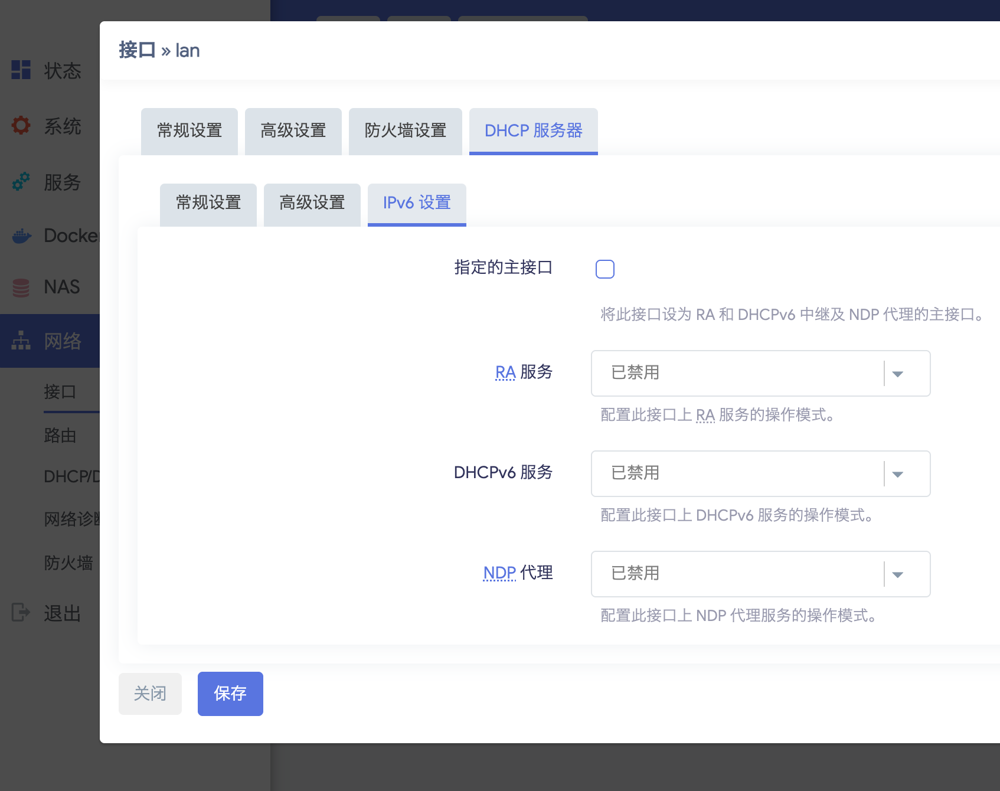
        2. 过滤 IPv6 AAAA 记录
        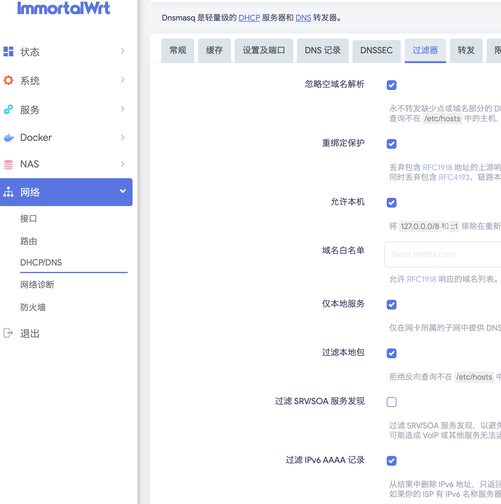
        3. WAN的上游DNS的设置
        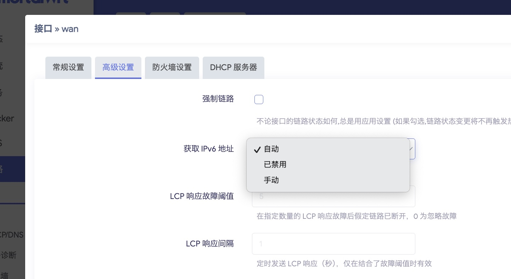
        4. 全局的设置
        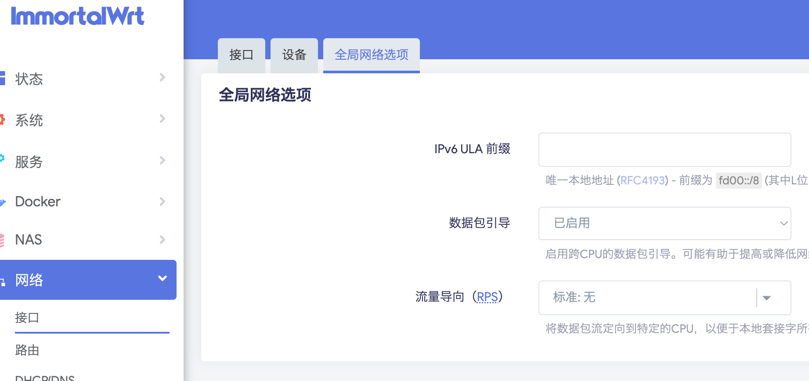
        5. 光猫上也有一个下发的ipv6设置

#### build with github action
https://github.com/quboqin/AutoBuildImmortalWrt
这个项目不是对整个OpenWrt进行完整编译，而是使用OpenWrt ImageBuilder来构建镜像。
##### 核心区别
这个AutoBuildImmortalWrt项目使用的是**ImageBuilder**方式，而不是完整的源码编译：
###### ImageBuilder方式（当前项目）
- 使用预编译的Docker镜像 `immortalwrt/imagebuilder` [1](#0-0) 
- 执行 `make image` 命令来构建固件镜像 [2](#0-1) 
- 只需要指定包列表和配置文件，不需要编译源码
###### 完整编译方式（传统方式）
- 需要下载完整的OpenWrt源码
- 执行 `make menuconfig` 配置
- 执行 `make` 编译整个系统和所有包
##### 具体实现
在构建脚本中，你可以看到核心命令是：
```bash
make image PROFILE=$PROFILE PACKAGES="$PACKAGES" FILES="/home/build/immortalwrt/files"
``` 
这个命令的参数说明：
- `PROFILE`: 目标设备型号
- `PACKAGES`: 要包含的软件包列表 [4](#0-3) 
- `FILES`: 自定义文件目录
##### 优势
ImageBuilder方式的优势：
1. **速度快**: 不需要编译源码，只是打包预编译的包
2. **资源消耗少**: GitHub Actions可以在几分钟内完成构建
3. **稳定性高**: 使用官方预编译的包，减少编译错误
只是在构建镜像，而不是完整编译OpenWrt系统。
##### Notes
这种ImageBuilder方式在OpenWrt社区中很常见，特别适合需要快速定制固件但不需要修改底层代码的场景。项目通过Docker容器化的方式进一步简化了构建过程。
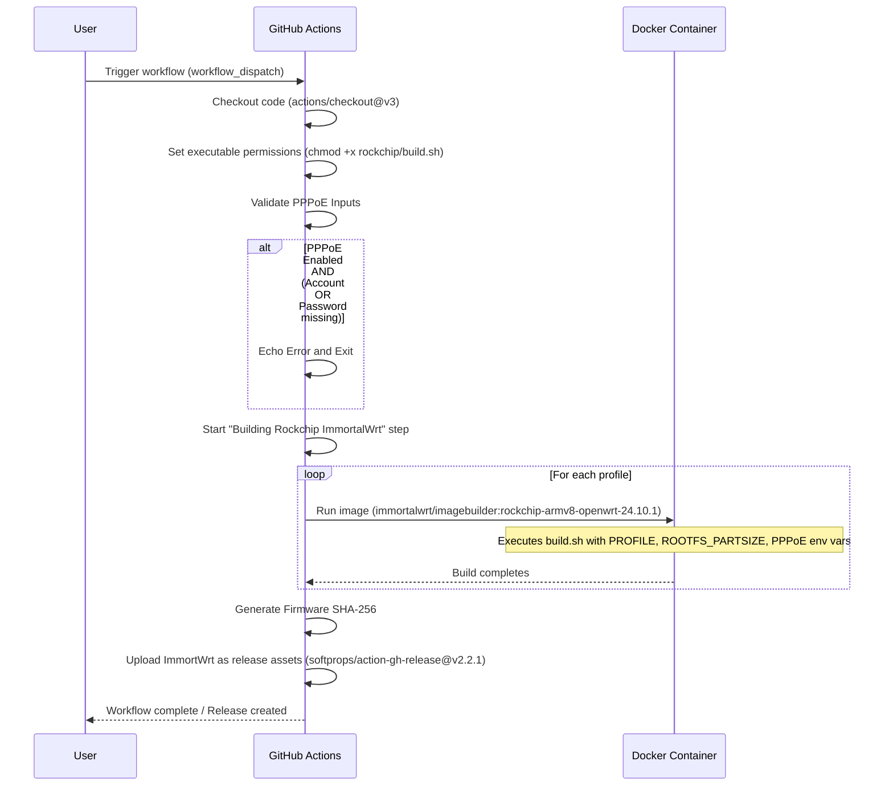

#### build on wsl

### essential network concepts

#### firewall

#### DNS

##### DNS Query Process Explained

###### DNS Basics

- DNS (Domain Name System) translates domain names to IP addresses
- Operates as a distributed database across multiple servers worldwide

###### Query Process Steps

1. **Local DNS Cache Check**
   - Browser checks its own cache first
   - Operating system checks its DNS cache

2. **Recursive Query to Resolver**
   - If not in local cache, query goes to recursive resolver (usually ISP's DNS server)
   - Resolver checks its cache before proceeding

3. **Root Nameserver Query(根域名服务器)**
   - 所有域名的起点都是根域名，它写作一个点.
   - Resolver queries root nameserver if no cache exists
   - Root server responds with appropriate TLD (Top-Level Domain) server

4. **TLD Nameserver Query(顶级域名服务器)**
   - Resolver queries the TLD server (e.g., .com, .org)
   - TLD server responds with authoritative nameserver for the domain

5. **Authoritative Nameserver Query(一级域名服务器)**
   - Resolver queries the domain's authoritative nameserver
   - Authoritative server returns the IP address

6. **Response to Client**
   - Resolver caches the result
   - Returns IP address to the client

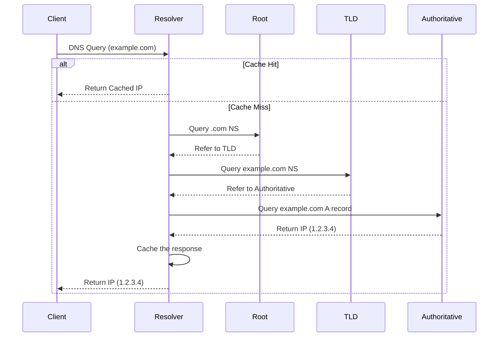

##### DNS Record Types

- `A`: IPv4 address record
- `AAAA`: IPv6 address record
- `CNAME`: Canonical name (alias) record
- `MX`: Mail exchange record
- `NS`: Nameserver record
- `TXT`: Text record

##### Query Optimization

- Caching occurs at multiple levels (browser, OS, resolver)
- TTL (Time To Live) values control cache duration

##### Common Tools

- `dig`: DNS lookup utility
- `nslookup`: Network administration tool
- `whois`: Domain information tool

##### Security Considerations

- DNS spoofing/cache poisoning attacks possible
- DNSSEC (DNS Security Extensions) provides authentication

##### DNS解析的拓扑图和流程图


1. passwall 依赖 dnsmasq 和 pdnsd 两个模块
2. dnsmasq 在 53 端口监听来自局域网的 DNS 请求，并通过分流策略选择不同的上游 DNS 服务
3. 代理的 DNS 请求走 pdnsd，pdnsd 起到缓存作用，它自身的上游 DNS 服务器是 1.1.1.1，在 passwall 选项 DNS 的‘远程DNS’中选择
   
4. 白名单的 DNS 请求，发送给 ‘/tmp/resolv.conf.d/resolv.conf.auto’ 文件中指定的 DNS 服务器
   

```shell
$ cat /tmp/resolv.conf.d/resolv.conf.auto
# Interface wan
nameserver 114.114.114.114
nameserver 114.114.115.115
# Interface wan_6
```

这里 DNS 的地址又是如何设置的呢？在 ‘网络->接口->WAN->高级设置’ 中 ‘使用对端通告的 DNS 服务器’，如果勾选就使用运营商的 DNS，我这里是上海电信的

```
116.228.111.118
180.168.255.18
```

而如果没有勾选，你可以指定 DNS


###### 流程图

整个网络请求分三步
1. 获取 DNS 服务器的 IP 地址
2. 用 DNS 服务器的 IP 地址访问DNS服务器获取目标网站的 IP 地址
3. 用目标网站的 IP 地址访问目标网站


**图中步骤 3 和 4 在DNS解析过程中也包含了 5/6/7 这三步**

为了让 1.1.1.1不被屏蔽，也走代理，可以把 1.1.1.1加入到passwall的规则列表的的代理列表中


##### 其他相关的配置文件和对应的UI的设定

1.  passwall 的 DNS 分流规则文件在 ‘/tmp/dnsmasq.d’ 下

    ```shell
    $ ls /tmp/dnsmasq.d/passwall -al
    drwxr-xr-x    2 root     root           140 Feb 12 14:32 .
    drwxr-xr-x    4 root     root           120 Feb 12 14:32 ..
    -rw-r--r--    1 root     root          1428 Feb 12 14:32 10-vpsiplist_host.conf
    -rw-r--r--    1 root     root          1732 Feb 12 14:32 11-direct_host.conf
    -rw-r--r--    1 root     root           334 Feb 12 14:32 97-proxy_host.conf
    -rw-r--r--    1 root     root        466479 Feb 12 14:32 99-gfwlist.conf
    -rw-r--r--    1 root     root        480471 Feb 12 14:32 ipset.conf
    ```

    而 ‘/tmp/dnsmasq.d’ 这个路径是由 ‘/var/etc/dnsmasq.conf.cfg01411c’ 这个文件的 ‘conf-dir’ 字段指定的

    ```shell
    # /var/etc/dnsmasq.conf.cfg01411c
    # auto-generated config file from /etc/config/dhcp
    ...
    conf-dir=/tmp/dnsmasq.d
    ...
    ```

    ```shell
    # 99-gfwlist.conf
    server=/.zoom.com/127.0.0.1#7913
    server=/.zoom.com.cn/127.0.0.1#7913
    server=/.zoom.us/127.0.0.1#7913
    server=/.zoomingin.tv/127.0.0.1#7913
    ```

    ```shell
    # 10-vpsiplist_host.conf
    server=/.amd.magicefire.com/114.114.114.114
    server=/.amd.magicefire.com/114.114.115.115
    ```

2.  在‘DHCP/DNS->基本设置->DNS转发’不需要配置
    

3.  关闭 Turbo ACC 网络加速设置的 DNS 缓存
    - DNS 缓存用的也是  pdnsd 模块，在 passwall 已使用，所以没有必要再开启
    - 如果开启了这里的 DNS 缓存，在 DHCP/DNS 的基本设置中 DNS 转发将指向 dnscache, 端口 5333，然后再由 dnscache 指向 pdnsd，而如果 这里 pdnsd 的上游 DNS 设成 114.114.114.114，就不是 1.1.1.1 了
      

    而这时候的 DHCP/DNS 的基本设置的 DNS 转发指向
    
    - 如果配置了 passwall，就按照第一张图的路径

##### 常用的命令行检查工具

1.  dnsmasq

    ```shell
    $ dnsmasq --test
    dnsmasq: syntax check OK.
    ```

2.  netstat

    ```shell
    $ netstat -nlpt|grep pdnsd
    netstat: showing only processes with your user ID
    tcp        0      0 127.0.0.1:7913          0.0.0.0:*               LISTEN      16460/pdnsd

    # root @ FusionWrt in ~ [18:22:16]
    $ netstat -nlpt|grep dnsmasq
    tcp        0      0 127.0.0.1:53            0.0.0.0:*               LISTEN      17803/dnsmasq
    tcp        0      0 192.168.123.5:53        0.0.0.0:*               LISTEN      17803/dnsmasq
    tcp        0      0 218.82.184.226:53       0.0.0.0:*               LISTEN      17803/dnsmasq
    tcp        0      0 172.17.0.1:53           0.0.0.0:*               LISTEN      17803/dnsmasq
    tcp        0      0 240e:389:8208:7000::1:53 :::*                    LISTEN      17803/dnsmasq
    tcp        0      0 240e:38f:8e17:1a7e:8234:283f:4633:f18d:53 :::*                    LISTEN      17803/dnsmasq
    tcp        0      0 ::1:53                  :::*                    LISTEN      17803/dnsmasq
    tcp        0      0 fe80::8234:28ff:fe33:f18d:53 :::*                    LISTEN      17803/dnsmasq
    tcp        0      0 fd47:78af:200e::1:53    :::*                    LISTEN      17803/dnsmasq
    tcp        0      0 fe80::8034:28ff:fe33:f18d:53 :::*                    LISTEN      17803/dnsmasq
    ```

3.  nslookup

    ```shell
    $ nslookup -port=7913 www.baidu.com
    Server:		127.0.0.1
    Address:	127.0.0.1:7913

    Non-authoritative answer:
    www.baidu.com	canonical name = www.a.shifen.com
    www.a.shifen.com	canonical name = www.wshifen.com
    Name:	www.wshifen.com
    Address: 103.235.46.39

    Non-authoritative answer:
    www.baidu.com	canonical name = www.a.shifen.com
    www.a.shifen.com	canonical name = www.wshifen.com
    ```

4.  dig

    ```shell
    $ dig @8.8.8.8 www.google.com

    ; <<>> DiG 9.17.13 <<>> @8.8.8.8 www.google.com
    ; (1 server found)
    ;; global options: +cmd
    ;; Got answer:
    ;; ->>HEADER<<- opcode: QUERY, status: NOERROR, id: 24743
    ;; flags: qr rd ra; QUERY: 1, ANSWER: 1, AUTHORITY: 0, ADDITIONAL: 1

    ;; OPT PSEUDOSECTION:
    ; EDNS: version: 0, flags:; udp: 512
    ;; QUESTION SECTION:
    ;www.google.com.			IN	A

    ;; ANSWER SECTION:
    www.google.com.		209	IN	A	172.217.163.36

    ;; Query time: 269 msec
    ;; SERVER: 8.8.8.8#53(8.8.8.8) (UDP)
    ;; WHEN: Sat Feb 12 18:26:26 CST 2022
    ;; MSG SIZE  rcvd: 59
    ```

    ```shell
    $ dig google.com +trace
    $ dig @8.8.8.8 -p 5300 google.com
    ```

#### 旁路由的副作用(TCP三次握手的时候)

在“家庭分流”的讨论中，非对称路由（非对 对称路由）的问题是旁路由设置中一个关键的挑战。这个问题的出现导致即使能够“翻墙”访问国外网站，也可能无法正常访问国内网站。

以下是导致非对称路由问题的过程总结：


1.  **初始请求**：
    *   当一台电脑（其网关指向旁路由）尝试访问一个国内网站（例如百度）时，它会向目标IP发起连接请求。
    *   由于目标IP不在本地网段，数据包会被发送到电脑的网关，也就是**旁路由**。
    *   旁路由会记录下电脑发起的这个连接请求。
    *   旁路由根据其分流规则判断，这是一个国内IP，不需要走代理，因此它会将数据包直接转发给它自己的网关，也就是**主路由**。
    *   主路由对数据包进行NAT（网络地址转换）处理，然后将其转发到互联网，到达目标服务器（例如百度服务器）。

2.  **响应数据包的回传**：
    *   目标服务器（百度）收到请求后，会回复同意连接的响应数据包。
    *   这个响应数据包会直接回到**主路由**。
    *   主路由会进行反向NAT处理，将数据包替换回电脑的内网IP，并**直接将数据包转发给电脑**，而**不会经过旁路由**。这是问题的核心所在——数据包的回传路径与去程路径不同。

3.  **问题发生**：
    *   当电脑收到百度服务器的响应后，会发送确认数据包（例如TCP握手的第三次确认）给百度服务器。
    *   这个确认数据包再次被发送到电脑的网关，即**旁路由**。
    *   此时，**旁路由会发现一个问题**：它记录了电脑向百度发起连接的请求，但它**从未收到百度服务器返回的同意连接的响应**（因为该响应被主路由直接转发给了电脑，绕过了旁路由）。
    *   因此，旁路由会认为电脑现在发送的这个确认数据包是**“无效数据包”**。
    *   如果旁路由的防火墙设置中勾选了**“丢弃无效数据包”**（默认情况下可能未开启此功能），旁路由就会直接丢弃这些被判定为无效的数据包。

4.  **最终结果**：
    *   由于关键的连接确认数据包被旁路由丢弃，电脑与国内网站的TCP连接无法正常建立。
    *   这导致电脑无法正常访问那些不需要代理的国内网站，但却可能可以正常访问需要代理的国外网站。

5.  **解决方案（暂时性）**：
    *   在旁路由的防火墙设置中，**取消勾选“丢弃无效数据包”**，可以解决由于非对称路由导致的国内网站无法访问的问题。
        或
    *   在旁路由的防火墙设置中，开启“IP动态伪装”（或称masquerade/NAT）功能

**潜在影响和争议**：
*   尽管取消勾选该选项可以解决即时问题，但非对称路由本身仍有可能导致“其他连接状态追踪问题”。
*   这也是旁路由这种非标准网络拓扑结构存在争议的主要原因之一。

#### wifi连接在旁路由下的问题

在“家庭分流”的旁路由模式下，通过WiFi连接的设备确实可能遇到无法正常访问国内网站的问题 [对话历史]。您的问题“旁路由去了哪里”非常关键，因为它揭示了这种情况下流量处理的复杂性。
根据来源，导致该问题的过程如下，并通过Mermaid序列图进行了总结：

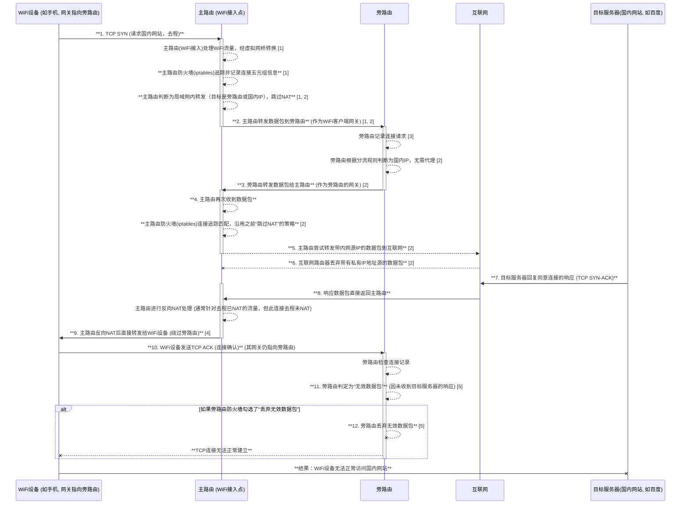

导致问题的过程总结：
1.  WiFi设备请求与主路由的初步处理：
    *   当WiFi设备（其网关被设置为旁路由）尝试访问国内网站时，请求数据包会先到达主路由（作为WiFi接入点）。
    *   主路由的WiFi流量会经过其操作系统内部的虚拟网桥处理，然后交给主路由的防火墙（iptables）。
    *   主路由的iptables会记录下此连接的“五元组”信息，并判断流量目标在局域网内（或者流量将被转发到旁路由），因此在此时跳过对数据包进行NAT处理**。
    *   主路由随后将数据包转发给旁路由。
2.  旁路由的转发与主路由的再次处理：
    *   旁路由收到数据包后，根据其分流规则判断这是一个国内IP，无需代理，因此会将其转发给它自己的网关，即主路由。
    *   此时，数据包再次回到主路由。主路由的iptables再次检查此数据包时，会根据之前记录的五元组信息（在第一次处理时已决定跳过NAT），沿用“跳过NAT”的策略。
    *   因此，主路由尝试将带有WiFi设备内网IP作为源IP的数据包直接转发到互联网。
3.  数据包被互联网丢弃：
    *   互联网上的路由器会丢弃任何带有私有IP地址作为源IP的数据包，导致连接失败。这是主要的访问问题。
4.  响应回传（非对称）与旁路由的误判：
    *   目标服务器的响应数据包会直接返回主路由，主路由进行反向NAT（尽管去程未NAT）后直接转发给WiFi设备，从而绕过了旁路由。
    *   当WiFi设备收到响应并发送连接确认数据包（如TCP ACK）时，该数据包会再次发送到其网关——旁路由。
    *   旁路由会发现它记录了去程请求，但从未收到目标服务器的响应（因为响应直接返回给了WiFi设备）。因此，它会将这些确认数据包判定为**“无效数据包”**。
    *   如果旁路由的防火墙设置中勾选了**“丢弃无效数据包”**，这些数据包就会被旁路由丢弃，导致TCP连接无法正常建立。

总结来说，旁路由在流量的去程中扮演了网关的角色，但在流量到达主路由时，主路由的连接追踪和iptables的默认行为是导致NAT被跳过的根本原因。即便旁路由转发了流量，主路由的后续处理仍旧导致了问题。同时，响应流量绕过旁路由，也可能导致旁路由将后续确认包识别为“无效”而丢弃。

5.  解决方案：
    *   在旁路由的防火墙设置中，开启“IP动态伪装”（或称masquerade/NAT）功能 [对话历史, 151]。
    *   启用此功能后，旁路由在转发数据包到主路由之前，会强制将数据包的源IP替换为旁路由自己的内网IP（例如192.168.2.2）。这样，当数据包到达主路由时，它是一个“干净”的内网IP，主路由会对其进行正常的NAT处理并发送到互联网，从而解决WiFi连接下的国内网站访问问题

#### DDNS
以下是 OpenWrt 配置阿里云 DDNS 服务的全流程说明，并附上 Mermaid 的 `sequenceDiagram` 交互图。

---

##### OpenWrt 配置阿里云 DDNS 全流程

###### 步骤 1：阿里云准备

1.  **创建 AccessKey**
    - 登录阿里云控制台 → 访问 RAM 访问控制 → 创建子用户（如 `ddns-user`）。
    - 为子用户授予 `AliyunDNSFullAccess` 权限。
    - 生成 AccessKey ID 和 Secret，保存备用。
2.  **添加域名解析记录**
    - 进入阿里云域名解析控制台 → 为域名添加一条 A 记录（如 `home.example.com`），IP 可临时设为 `1.1.1.1`。

---

###### 步骤 2：OpenWrt 配置

1.  **安装动态 DNS 插件**
    - 登录 OpenWrt → 系统 → 软件包 → 搜索 `luci-app-ddns` 并安装。
2.  **配置 DDNS 服务**
    - 进入 **服务 → 动态 DNS** → 删除默认配置 → 添加新配置。
    - 填写以下参数：
        - **服务提供商**：`aliyun.com`
        - **查询域名**：`home.example.com`
        - **域名**：`home@example.com`（格式：`主机名@主域名`）
        - **Access Key** 和 **Secret Key**：填写阿里云生成的密钥。
        - **接口**：选择 WAN 口（或通过 URL 获取公网 IP）。
3.  **保存并应用**
    - 勾选 **启用** → 点击 **保存 \& 应用** → 查看日志确认更新成功。

---

###### 步骤 3：验证配置

1.  **检查解析记录**
    - 等待 5-10 分钟，在阿里云控制台查看域名解析 IP 是否更新为当前公网 IP。
2.  **测试访问**
    - 使用 `ping home.example.com` 或浏览器访问域名，确认解析正确。

---


如果是旁路由, source可以用url
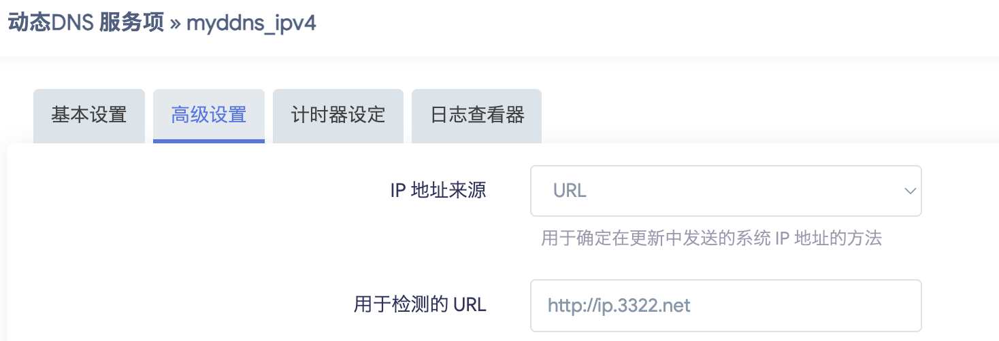

##### Mermaid 交互流程图

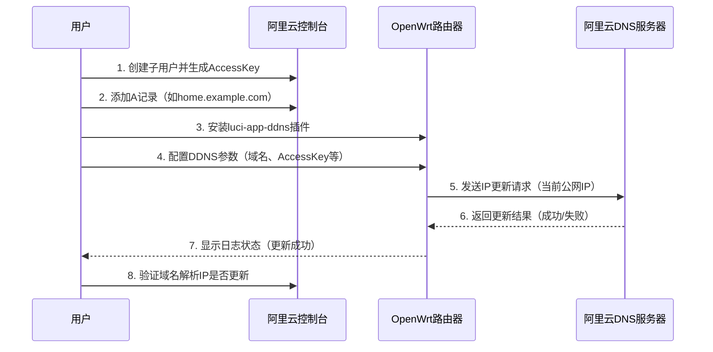

---

##### 关键参数说明

| 配置项 | 示例值 | 说明 |
| :-- | :-- | :-- |
| 服务提供商 | `aliyun.com` | 选择阿里云作为 DDNS 服务商 |
| 查询域名 | `home.example.com` | 需要动态更新的完整域名 |
| 域名格式 | `home@example.com` | `主机名@主域名` 格式 |
| Access Key | `LTAI5t******` | 阿里云生成的 Access Key ID |
| Secret Key | `nqR3******` | 阿里云生成的 Secret Key |
| 接口 | `wan` 或 URL 获取 | 选择 WAN 口或通过 URL 检测公网 IP |

---

##### 常见问题处理

- **IP 未更新**：检查防火墙是否放行 `ddns` 服务，或尝试切换为 URL 方式获取 IP。
- **权限错误**：确认子用户已授予 `AliyunDNSFullAccess` 权限。
- **日志查看**：在 OpenWrt 的 DDNS 界面点击 **日志查看器** 排查具体错误。

通过以上步骤，即可实现 OpenWrt 路由器的公网 IP 动态绑定到阿里云域名。

###### openclash

###### port mapping

## installation of PVE

### network diagram

### install PVE

### install openwrt vm

## airport

### buy

### setup server on cloud

## VPN

### tailscale

## application

### smb

### alist

### infuse

### torrent download

### 安装Tailscale
路由器上设置Tailscale是一个非常强大且实用的操作。这能让您的路由器成为整个家庭/办公室网络的“瑞士军刀”，实现安全远程访问内网（子网路由）和作为流量出口（出口节点）两大核心功能。

以下是在路由器上设置Tailscale的详细步骤，主要以最常见、最灵活的**OpenWrt**系统为例。

#### Tailscale在路由器上的两大核心用途

1.  **子网路由器 (Subnet Router)**：让您在外的设备（手机、笔记本电脑）通过Tailscale安全地访问整个家庭局域网。就像您在家一样，可以直接访问NAS、打印机、智能家居设备等所有内网设备，而无需为每个设备都安装Tailscale。
2.  **出口节点 (Exit Node)**：让您在外的设备将所有互联网流量都通过家里的路由器转发。这样，无论您身在何处（例如使用公共Wi-Fi），您的网络流量看起来都像是从家里发出的，极大地提高了安全性，并且可以访问家里的网络资源或有地区限制的服务。

-----

#### 前提条件

1.  **一台兼容的路由器**：您需要一台可以安装Tailscale的路由器。这通常意味着：
      * 运行**OpenWrt**、LEDE等开源固件的路由器。
      * GL.iNet系列路由器（其固件基于OpenWrt，通常预装或易于安装）。
      * 运行pfSense、OPNsense的软路由。
      * **注意**：绝大多数普通家用路由器（如TP-Link, Netgear, ASUS等）的原厂固件**不支持**直接安装Tailscale。本指南以OpenWrt为例。
2.  **一个Tailscale账号**：您可以在[Tailscale官网](https://login.tailscale.com/)使用Google、Microsoft、GitHub等账号免费注册。
3.  **SSH访问权限**：您需要能够通过SSH登录到您的路由器后台。

-----

#### 第一步：在OpenWrt上安装Tailscale

1.  使用SSH工具（如PuTTY, Termius, 或系统自带的终端）登录到您的OpenWrt路由器。`your_router_ip`通常是`192.168.123.1`或您自定义的地址。

    ```bash
    ssh root@192.168.123.1
    ```

2.  更新软件包列表，确保能找到最新的Tailscale包。

    ```bash
    opkg update
    ```

3.  安装Tailscale软件包。

    ```bash
    opkg install tailscale
    ```

-----

#### 第二步：首次登录与认证

1.  安装完成后，执行以下命令来启动Tailscale并将其连接到您的账号。

    ```bash
    tailscale up
    ```

2.  执行后，终端会输出一段信息，其中包含一个**认证链接**，看起来像这样：

    ```
    To authenticate, visit:

        https://login.tailscale.com/a/xxxxxxxxxxxx
    ```

3.  在您的**任何一台设备**（电脑、手机）的浏览器中打开这个链接，登录您的Tailscale账号，然后授权这台新的“路由器”设备加入您的私有网络。

4.  授权成功后，回到SSH终端，您应该会看到成功连接的提示。您可以在路由器上执行以下命令来验证状态，它会列出您网络中的其他设备。

    ```bash
    tailscale status
    ```

    同时，登录Tailscale官网的管理后台，您应该能在设备列表（Machines）中看到您的路由器。

-----

#### 第三步：配置核心功能 (子网路由 / 出口节点)

现在，您的路由器已经成为Tailscale网络中的一个普通节点了。接下来，我们要赋予它“路由器”的特殊能力。

##### 场景一：配置为子网路由器 (Subnet Router)

假设您的家庭局域网网段是 `192.168.123.0/24`。执行以下命令，让路由器“宣告”它可以路由这个网段：

```bash
# 将 192.168.123.0/24 替换为您自己的局域网网段
tailscale up --advertise-routes=192.168.123.0/24
```

如果您同时使用IPv6，可以一并宣告：

```bash
tailscale up --advertise-routes=192.168.123.0/24,fdxx:xxxx:xxxx::/64
```

**极其重要的一步**：

1.  回到**Tailscale官网的管理后台**。
2.  在设备列表（Machines）中找到您的路由器，点击右侧的 `...` 菜单，选择 **"Edit route settings..."**。
3.  在弹出的侧边栏中，**勾选并批准**您刚刚宣告的子网路由（`192.168.123.0/24`）。
4.  完成这一步后，您的其他Tailscale设备就能通过路由器的Tailscale IP访问到`192.168.123.x`的任何设备了。

##### 场景二：配置为出口节点 (Exit Node)

如果您想把路由器作为流量出口，执行以下命令：

```bash
tailscale up --advertise-exit-node
```

**同样，必须在管理后台批准**：

1.  回到**Tailscale官网的管理后台**。
2.  找到您的路由器，点击 `...` 菜单，选择 **"Edit route settings..."**。
3.  在侧边栏中，**打开 "Use as exit node"** 的开关。

**如何使用出口节点**：
在您需要使用此功能的客户端设备上（如手机、笔记本电脑），打开Tailscale应用，找到“Use exit node...”选项，然后选择您的路由器作为出口节点。之后，该设备的所有流量都会经由您家中的路由器转发。

> **提示**：您可以同时宣告子网路由和出口节点，只需将参数组合即可：
> `tailscale up --advertise-routes=192.168.1.0/24 --advertise-exit-node`

-----

#### 第四步：设置开机自启

为了确保路由器重启后Tailscale服务能自动运行，执行以下命令：

```bash
/etc/init.d/tailscale enable
/etc/init.d/tailscale start
```

这会将Tailscale服务添加到OpenWrt的启动项中。

-----

#### 第五步：防火墙配置 (非常重要)

为了让Tailscale的流量能与您的局域网互通，需要正确配置OpenWrt的防火墙。

1.  登录OpenWrt的**LuCI网页管理界面**（通常是`http://192.168.123.1`）。
2.  导航到 **网络 (Network) -\> 防火墙 (Firewall)**。
3.  在 **区域 (Zones)** 设置中，找到 `lan` 区域（或者您自定义的局域网区域），点击“修改 (Edit)”。
4.  在 **“覆盖的网络 (Covered networks)”** 列表中，点击“添加”，然后选择 `tailscale0` 这个接口。
5.  在 **“允许转发到目标区域 (Allow forward to destination zones)”** 中，确保 `lan` 自身被勾选（即`lan` -\> `lan` 的转发是允许的）。
6.  点击“保存并应用 (Save & Apply)”。

这个设置的目的是告诉防火墙，`tailscale0` 接口（Tailscale虚拟网卡）和 `lan` 区域（您的物理局域网）是互相信任的，允许它们之间自由通信。

完成以上所有步骤后，您的路由器就成功变身为一台功能强大的Tailscale网络枢纽了。

### install dig

```
opkg update
opkg install bind-dig
```

### 设置samba4

[安装samba](https://doc.embedfire.com/openwrt/user_manal/zh/latest/User_Manual/openwrt/samba.html)

1.  安装shadow-useradd

    ```
    opkg update
    opkg install shadow-useradd
    ```

2.  添加用户

    ```
    useradd quboqin
    ```

3.  设置该用户的samba password

    ```
    smbpasswd -a quboqin
    ```

4.  修改分享的目录owner

    ```
    chown -R quboqin:quboqin /mnt/nas
    ```

    
