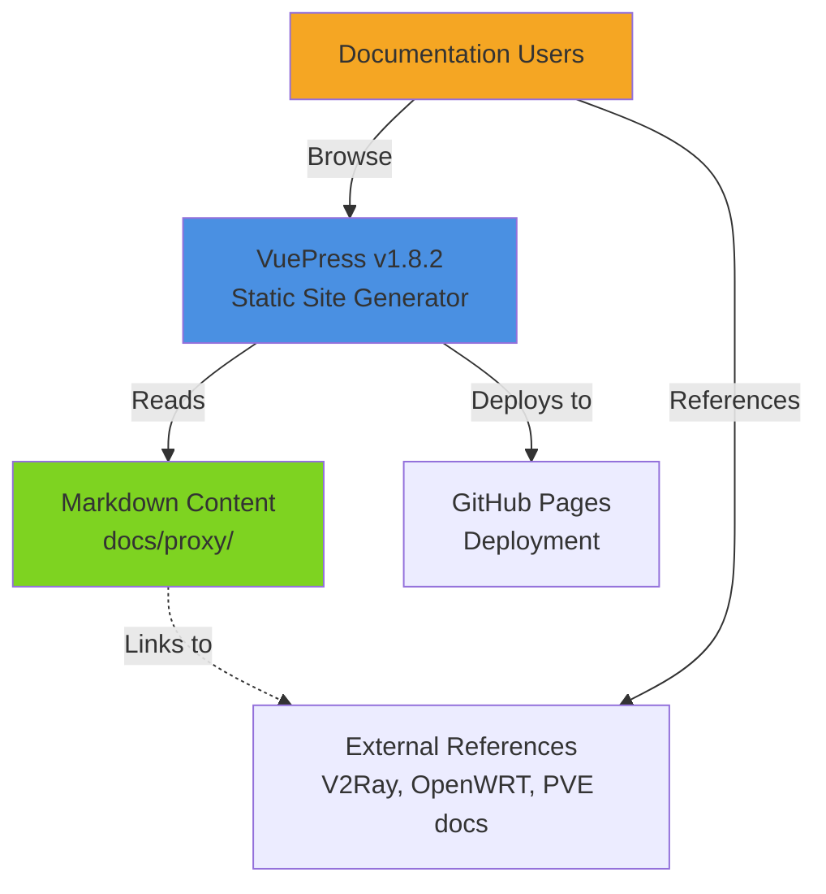
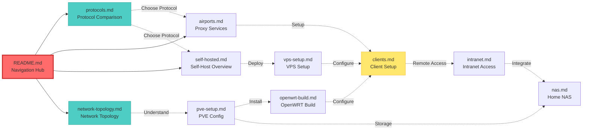
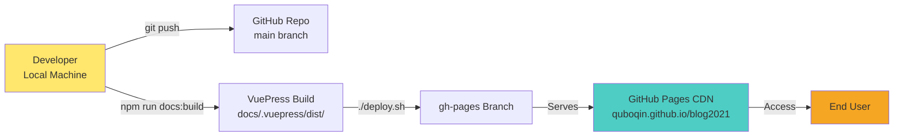

# Architecture Design: Network Circumvention Guide Reorganization

**Document ID**: arch-2026-001
**Story**: story-2026-001
**PRD**: [prd-2026-001.md](../../discover/master-prd/prd-2026-001.md)
**Created**: 2026-02-16
**Author**: architect
**Status**: Draft
**Complexity**: L (Large)

---

## 1. Overview

### 1.1 Purpose

This architecture design defines the information architecture, content structure, and reorganization strategy for the network circumvention documentation in the VuePress blog. The goal is to transform 13 loosely organized markdown files into a cohesive, discoverable, and maintainable documentation system covering 9 core topics.

### 1.2 Background

**Current State**:
- 13 markdown files in `docs/proxy/`
- ~45,000 words of content
- Inconsistent organization and navigation
- Some redundant content (nas.md vs nas-guide.md)
- Missing cross-links between related topics

**Target State**:
- 10 well-organized markdown files (after consolidation)
- Comprehensive navigation hub (README.md)
- Clear information hierarchy
- Bidirectional cross-linking
- Updated with 2026 technical specifications

### 1.3 Goals

1. **Discoverability**: Users find any topic within 2 clicks
2. **Technical Accuracy**: All content reflects 2026 best practices
3. **User Experience**: Clear navigation, consistent formatting, actionable guides

---

## 2. System Context

### 2.1 Documentation System Overview



### 2.2 User Types

| User Type | Technical Level | Primary Need | Entry Point |
|-----------|----------------|--------------|-------------|
| **Beginner** | 2/10 | Clear explanations, step-by-step guides | README.md → protocols.md |
| **Home Lab Enthusiast** | 7/10 | Architecture diagrams, advanced config | network-topology.md → pve-setup.md |
| **Network Admin** | 9/10 | Protocol specs, security practices | protocols.md → self-hosted.md |

### 2.3 External Dependencies

- **VuePress v1.8.2**: Static site generator (constraint: must maintain compatibility)
- **GitHub Pages**: Hosting platform
- **Official Documentation**:
  - V2Ray: https://www.v2fly.org/
  - OpenWRT: https://openwrt.org/docs/
  - Proxmox VE: https://pve.proxmox.com/wiki/
  - Hysteria: https://v2.hysteria.network/

---

## 3. Information Architecture

### 3.1 Content Structure (Before → After)

#### Before (13 Files)

```
docs/proxy/
├── README.md              [Minimal index]
├── protocols.md
├── airports.md
├── self-hosted.md
├── vps-setup.md
├── openwrt-build.md
├── pve-setup.md
├── network-topology.md
├── clients.md
├── intranet.md
├── nat-traversal.md       [Redundant with intranet.md]
├── nas.md                 [Partial content]
└── nas-guide.md           [Redundant with nas.md]
```

#### After (10 Files)

```
docs/proxy/
├── README.md              [★ Navigation Hub - Enhanced]
├── protocols.md           [Updated: Hysteria2, VLESS+Reality]
├── airports.md            [Enhanced: Comparison matrix]
├── self-hosted.md         [Overview/decision guide]
├── vps-setup.md          [Detailed procedures]
├── openwrt-build.md      [Compilation & config]
├── pve-setup.md          [PVE configuration]
├── network-topology.md    [Validated diagrams]
├── clients.md            [Client setup + basic troubleshooting]
├── intranet.md           [Unified: merged nat-traversal.md]
└── nas.md                [Unified: merged nas-guide.md]
```

**Changes**:
- ✅ Consolidated: nat-traversal.md → intranet.md
- ✅ Consolidated: nas-guide.md → nas.md
- ✅ Enhanced: README.md becomes navigation hub
- ✅ Updated: protocols.md with 2026 specs

### 3.2 Content Hierarchy (Information Layers)

```
Layer 0: Navigation Hub
    │
    └─── README.md (Entry Point)
         ├── Quick Introduction
         ├── 9-Topic Navigation Grid
         ├── Reading Pathways (Beginner/Advanced)
         └── Legal Disclaimers

Layer 1: Core Topics (9 Chapters)
    │
    ├─── 1. Protocol Comparison (protocols.md)
    ├─── 2. Proxy Services (airports.md)
    ├─── 3. Self-Hosted Servers (self-hosted.md + vps-setup.md)
    ├─── 4. OpenWRT (openwrt-build.md)
    ├─── 5. PVE Virtualization (pve-setup.md)
    ├─── 6. Network Topology (network-topology.md)
    ├─── 7. Client Configuration (clients.md)
    ├─── 8. Intranet Penetration (intranet.md)
    └─── 9. Home NAS (nas.md)

Layer 2: Cross-References
    │
    ├─── Prerequisites sections (point upward in hierarchy)
    ├─── Related Topics sections (lateral connections)
    └─── Next Steps sections (point downward in hierarchy)

Layer 3: External References
    │
    └─── Official documentation links
```

### 3.3 Content Relationship Map



---

## 4. Component Design (Content Modules)

### 4.1 Navigation Hub (README.md)

**Purpose**: Single entry point for all proxy documentation

**Structure**:
```markdown
# 科学上网完整指南

## Introduction (150-200 words)
- What is network circumvention
- Why this guide exists
- What you'll learn

## Navigation Grid (9 Topics)
┌─────────────┬─────────────┬─────────────┐
│ 协议对比     │ 机场推荐     │ 自建服务器   │
│ Protocols   │ Services    │ Self-Host   │
├─────────────┼─────────────┼─────────────┤
│ OpenWRT     │ PVE配置     │ 网络拓扑     │
│             │             │ Topology    │
├─────────────┼─────────────┼─────────────┤
│ 客户端设置   │ 内网穿透     │ 家庭NAS     │
│ Clients     │ Intranet    │ NAS         │
└─────────────┴─────────────┴─────────────┘

## Reading Pathways
### Beginner Path (新手路径)
1. protocols.md → airports.md → clients.md

### Advanced Path (进阶路径)
1. network-topology.md → pve-setup.md → openwrt-build.md → clients.md

### Self-Hosting Path (自建路径)
1. protocols.md → self-hosted.md → vps-setup.md → clients.md

## Legal Disclaimer
- Educational purpose statement
- User responsibility
```

**Cross-Links**:
- Links to all 9 topic files
- Links to quick start vs comprehensive guides

---

### 4.2 Protocol Comparison (protocols.md)

**Purpose**: Technical comparison of proxy protocols vs VPN

**Structure**:
```markdown
# 协议对比 (Protocol Comparison)

## 1. Overview
- What are proxy protocols
- How they differ from VPNs

## 2. Protocol Comparison Matrix (2026)
| Protocol | Stealth | Speed | Complexity | Best For |
|----------|---------|-------|------------|----------|
| VLESS+Reality | ⭐⭐⭐⭐⭐ | ⭐⭐⭐⭐ | ⭐⭐⭐⭐ | Max concealment |
| Trojan-Go | ⭐⭐⭐⭐ | ⭐⭐⭐⭐ | ⭐⭐⭐ | Balanced |
| **Hysteria2** [NEW] | ⭐⭐⭐ | ⭐⭐⭐⭐⭐ | ⭐⭐⭐ | Gaming/Streaming |
| Shadowsocks-2022 | ⭐⭐ | ⭐⭐⭐⭐⭐ | ⭐⭐ | Legacy |

## 3. Detailed Protocol Specs
### 3.1 VLESS+Reality (2026 Update)
- Vision flow control
- Configuration examples

### 3.2 Trojan-Go
...

### 3.3 Hysteria2 [NEW SECTION]
- UDP-based protocol
- Optimized for gaming and 4K streaming
- Configuration examples
- Performance benchmarks (110-150ms latency)

### 3.4 Shadowsocks-2022
...

## 4. VPN vs Proxy Comparison (OSI Layer)
| Protocol | OSI Layer | Detection Difficulty |
|----------|-----------|---------------------|
| Shadowsocks | Session (L5) | Medium |
| VLESS+Reality | Application (L7) | Very High |
| Traditional VPN | Network (L3) | Low (blocked) |

## 5. Protocol Selection Decision Tree
[ASCII diagram or Mermaid flowchart]

## Cross-Links
**Prerequisites**: Basic networking knowledge
**Related Topics**:
- [Self-Hosted Servers](./self-hosted.md) - Deploy your own
- [Proxy Services](./airports.md) - Managed services
**Next Steps**: Choose deployment approach
```

**Updates Required**:
- ✅ Add Hysteria2 section
- ✅ Update VLESS+Reality with Vision specs
- ✅ Update comparison tables with 2026 benchmarks
- ✅ Add OSI layer comparison
- ✅ Add protocol selection decision tree

---

### 4.3 Proxy Services (airports.md)

**Purpose**: Evaluation framework for managed proxy services

**Structure**:
```markdown
# 机场推荐 (Proxy Service Recommendations)

## ⚠️ Disclaimer
- Educational purpose only
- User responsibility for compliance
- No endorsements

## 1. How to Choose a Service
Decision criteria:
- Price range
- Protocol support
- Server locations
- Bandwidth/speed
- Reliability/uptime
- Privacy policy

## 2. Evaluation Matrix (2026)
| Service | Price | Protocols | Locations | Speed Tier | Notes |
|---------|-------|-----------|-----------|-----------|-------|
| [Generic examples] | ... | ... | ... | ... | ... |

## 3. Red Flags to Avoid
- No privacy policy
- Too-good-to-be-true pricing
- No customer support
- Data logging concerns

## Cross-Links
**Prerequisites**: [Protocol Comparison](./protocols.md)
**Related Topics**: [Client Configuration](./clients.md)
**Next Steps**: Set up clients
```

**Updates Required**:
- ✅ Add evaluation criteria matrix
- ✅ Add "How to Choose" guide
- ✅ Add red flags section
- ✅ Enhance disclaimer

---

### 4.4 Self-Hosted Infrastructure (self-hosted.md + vps-setup.md)

**Two-file approach**:

**self-hosted.md** (Overview/Decision Guide):
```markdown
# 自建服务器 (Self-Hosted Server Overview)

## 1. Why Self-Host?
Pros/cons comparison

## 2. Deployment Approaches
- Cloud VPS ($5-15/mo, high flexibility)
- Home Server + OpenWRT (hardware investment, max control)

## 3. Protocol Selection for Self-Hosting
Which to choose based on use case

## 4. Security Considerations
⚠️ Server hardening warnings
⚠️ Firewall importance
⚠️ Key management

## Cross-Links
**Prerequisites**: [Protocol Comparison](./protocols.md)
**Related Topics**:
- [VPS Setup Guide](./vps-setup.md) - Detailed steps
- [OpenWRT Build](./openwrt-build.md) - Home server
**Next Steps**: Choose deployment method
```

**vps-setup.md** (Detailed Procedures):
```markdown
# VPS服务器搭建详细教程 (VPS Setup Guide)

## 1. VPS Provider Selection
Comparison table

## 2. Server Provisioning
Step-by-step instructions

## 3. Protocol Installation
### 3.1 Install VLESS+Reality
```bash
# Commands with inline comments
```

### 3.2 Install Trojan-Go
...

### 3.3 Install Hysteria2 [NEW]
...

## 4. Firewall Configuration
...

## 5. Testing and Verification
...

## Cross-Links
**Prerequisites**: [Self-Hosted Overview](./self-hosted.md)
**Related Topics**: [Client Configuration](./clients.md)
**Next Steps**: Configure clients
```

---

### 4.5 OpenWRT & PVE (openwrt-build.md + pve-setup.md)

**Relationship**: PVE is the virtualization platform; OpenWRT runs as VM on PVE

**openwrt-build.md**:
```markdown
# OpenWRT编译与配置 (OpenWRT Build & Configuration)

## 1. OpenWRT Overview
What is OpenWRT, why use it

## 2. Firmware Selection (2026)
- ImmortalWrt (recommended for beginners)
- Lean LEDE (stability)
- Official OpenWrt (standard)

## 3. Local Compilation Guide
### 3.1 Prerequisites
### 3.2 Clone source code
### 3.3 Configure (make menuconfig)
### 3.4 Compile (make -j)

## 4. Plugin Management [NEW SECTION]
Installing and configuring proxy plugins

## 5. Network Configuration
- Main router mode vs Bypass router mode

## Cross-Links
**Prerequisites**:
- [Network Topology](./network-topology.md) - Understand setup
- [PVE Setup](./pve-setup.md) - If using VM
**Related Topics**: [Client Configuration](./clients.md)
**Next Steps**: Configure network topology
```

**pve-setup.md**:
```markdown
# PVE虚拟化配置 (Proxmox VE Configuration)

## 1. PVE Overview
What is Proxmox VE, use cases

## 2. PVE Installation
Step-by-step on bare metal

## 3. Network Configuration
Bridge setup for VM networking

## 4. OpenWRT VM Creation
### 4.1 Download OpenWRT image
### 4.2 Create VM
### 4.3 Network adapter configuration

## 5. Backup and Restore Procedures [NEW SECTION]
Disaster recovery strategies

## Cross-Links
**Prerequisites**: [Network Topology](./network-topology.md)
**Related Topics**: [OpenWRT Build](./openwrt-build.md)
**Next Steps**: Install OpenWRT on PVE
```

---

### 4.6 Network Topology (network-topology.md)

**Purpose**: Visual guide to home network architectures

**Structure**:
```markdown
# 家庭网络拓扑 (Home Network Topology)

## 1. Topology Options

### Option 1: Bypass Router (旁路由) [RECOMMENDED]
```
[ASCII diagram with IP addressing]
Internet → ISP Router (192.168.1.1) → PVE (192.168.1.100) → OpenWRT VM (192.168.1.2)
                 ↓
         Regular devices (gateway: 192.168.1.1)
         Proxied devices (gateway: 192.168.1.2)
```

### Option 2: Main Router (主路由)
[ASCII diagram]

### Option 3: Hardware OpenWRT Router
[ASCII diagram]

## 2. Comparison Matrix
| Topology | Pros | Cons | Complexity |
|----------|------|------|-----------|
| Bypass Router | Non-invasive, easy disable | Manual device config | Medium |
| Main Router | Transparent to devices | Invasive, harder rollback | High |
| Hardware Router | Dedicated, stable | Limited flexibility | Medium |

## 3. Choosing Your Topology
Decision guide based on use case

## Cross-Links
**Prerequisites**: Basic networking (IP, DHCP, DNS)
**Related Topics**:
- [PVE Setup](./pve-setup.md)
- [OpenWRT Build](./openwrt-build.md)
**Next Steps**: Implement chosen topology
```

**Updates Required**:
- ✅ Validate diagram accuracy
- ✅ Ensure IP addressing consistency
- ✅ Add legends for symbols

---

### 4.7 Client Configuration (clients.md)

**Purpose**: Platform-specific proxy client setup

**Structure**:
```markdown
# 客户端配置 (Client Configuration)

## 1. Client Selection by Platform

### 1.1 Windows Clients
| Client | Features | Protocols |
|--------|----------|-----------|
| v2rayN | Comprehensive | VMess/VLESS/Trojan/SS |
| Clash Verge Rev | Beautiful UI | Clash config |

### 1.2 macOS Clients
...

### 1.3 iOS Clients
| Client | Price | Features |
|--------|-------|----------|
| Shadowrocket | $2.99 | Recommended |
| Quantumult X | $7.99 | Advanced rules |

### 1.4 Android Clients
...

## 2. Configuration Guides
### 2.1 v2rayN (Windows)
[Step-by-step with screenshots if possible]

### 2.2 Shadowrocket (iOS)
...

### 2.3 Clash Meta (Android)
...

## 3. Common Issues [NEW SECTION - P1]
### 3.1 Windows
- Connection failures
- DNS leaks
- Diagnostic commands

### 3.2 macOS
...

### 3.3 iOS/Android
...

## Cross-Links
**Prerequisites**:
- [Protocol Comparison](./protocols.md) - Understand protocols
- [VPS Setup](./vps-setup.md) OR [Proxy Services](./airports.md)
**Related Topics**: [Intranet Penetration](./intranet.md) - Remote access
**Next Steps**: Test and verify connection
```

**Updates Required**:
- ✅ Add troubleshooting section (P1)
- ✅ Update client recommendations for 2026

---

### 4.8 Intranet Penetration (intranet.md)

**Purpose**: Unified guide for remote access solutions

**Structure**:
```markdown
# 内网穿透 (Intranet Penetration Solutions)

## 1. Solution Comparison (2026)
| Solution | Type | Difficulty | Speed | Cost | Best For |
|----------|------|-----------|-------|------|----------|
| FRP | Reverse Proxy | ⭐⭐⭐⭐ | Fast | VPS fees | Tech users with server |
| Cloudflare Tunnel | Cloud Proxy | ⭐⭐⭐ | Medium | Free | Web services |
| ZeroTier | P2P VPN | ⭐⭐⭐ | Fast | Free (25 dev) | Cross-border networking |
| Tailscale | P2P + Relay | ⭐⭐ | Fast | Free (100 dev) | Most users |
| Netbird | P2P Open Source | ⭐⭐ | Fast | Free | Privacy-focused |

## 2. Detailed Guides
### 2.1 FRP Setup
...

### 2.2 Cloudflare Tunnel
...

### 2.3 ZeroTier
...

### 2.4 Tailscale
...

## 3. Use Case Recommendations
- Have a VPS → FRP
- Have a domain → Cloudflare Tunnel
- Most users → ZeroTier or Tailscale
- Privacy-focused → Netbird

## Cross-Links
**Prerequisites**: [Client Configuration](./clients.md)
**Related Topics**: [Home NAS](./nas.md) - Integrate with storage
**Next Steps**: Configure chosen solution
```

**Updates Required**:
- ✅ Content is already excellent (2026 comparison matrix exists)
- ✅ Merged nat-traversal.md content if applicable

---

### 4.9 Home NAS (nas.md)

**Purpose**: Unified NAS solution guide (merged from nas.md + nas-guide.md)

**Structure**:
```markdown
# 家庭NAS方案 (Home NAS Solutions)

## 1. NAS System Comparison (2026)
| System | Type | Difficulty | Best For |
|--------|------|-----------|----------|
| Synology DSM | Commercial | ⭐⭐ | Beginners, best ecosystem |
| TrueNAS CORE | Open Source | ⭐⭐⭐⭐ | ZFS, data security |
| TrueNAS SCALE | Open Source | ⭐⭐⭐ | Docker support |
| OpenMediaVault | Open Source | ⭐⭐⭐ | Older hardware |

## 2. DIY NAS Build Guide
### 2.1 Hardware Selection
Entry-level (¥1500-2500)
Advanced (¥3000-5000)

### 2.2 OS Installation
TrueNAS / OMV installation steps

### 2.3 Integration with PVE
Running NAS as VM on Proxmox

## 3. Network Integration
Cross-reference to network topology

## Cross-Links
**Prerequisites**:
- [PVE Setup](./pve-setup.md) - If using VM
- [Network Topology](./network-topology.md) - Understand network
**Related Topics**: [Intranet Penetration](./intranet.md) - Remote access
**Next Steps**: Deploy and configure NAS
```

**Updates Required**:
- ✅ Merge nas-guide.md content into nas.md
- ✅ Eliminate redundancy
- ✅ Add cross-references to PVE setup

---

## 5. Content Flow & User Journeys

### 5.1 Beginner Journey

```mermaid
flowchart TD
    Start([User: "I want to access blocked sites"])
    README[README.md<br/>Orientation]
    Protocols[protocols.md<br/>Learn Options]
    Decision{Choose Approach}
    Airports[airports.md<br/>Use Service]
    SelfHost[self-hosted.md<br/>Self-Host]
    Clients[clients.md<br/>Configure Device]
    Success([Successfully Connected])

    Start --> README
    README --> Protocols
    Protocols --> Decision
    Decision -->|Easy| Airports
    Decision -->|Control| SelfHost
    Airports --> Clients
    SelfHost --> Clients
    Clients --> Success

    style Start fill:#FFE66D
    style Success fill:#7ED321
    style README fill:#FF6B6B
```

### 5.2 Advanced Home Network Journey

```mermaid
flowchart TD
    Start([User: "Build home proxy router"])
    Topology[network-topology.md<br/>Understand Architecture]
    Decision{Choose Topology}
    Bypass[Bypass Router Mode]
    Main[Main Router Mode]
    PVE[pve-setup.md<br/>Install PVE]
    OpenWRT[openwrt-build.md<br/>Build OpenWRT]
    Clients[clients.md<br/>Configure Devices]
    Success([Network Operational])

    Start --> Topology
    Topology --> Decision
    Decision -->|Recommended| Bypass
    Decision -->|Advanced| Main
    Bypass --> PVE
    Main --> PVE
    PVE --> OpenWRT
    OpenWRT --> Clients
    Clients --> Success

    style Start fill:#FFE66D
    style Success fill:#7ED321
    style Topology fill:#FF6B6B
```

---

## 6. Tech Stack

### 6.1 Documentation Platform

| Component | Technology | Version | Rationale |
|-----------|-----------|---------|-----------|
| **Static Site Generator** | VuePress | v1.8.2 | ✅ Existing platform<br/>⚠️ Legacy version (v1 maintenance mode) |
| **Markup Language** | Markdown | CommonMark | ✅ Simple, widely supported<br/>✅ VuePress compatible |
| **Diagram Format** | ASCII Art | N/A | ✅ Render-independent<br/>✅ Copy-paste friendly<br/>🔄 Consider Mermaid in Phase 2 |
| **Code Highlighting** | Prism.js | (bundled with VuePress) | ✅ Supports bash, yaml, json, etc. |
| **Hosting** | GitHub Pages | N/A | ✅ Free<br/>✅ Integrated with repo |
| **Build Tool** | npm | v8+ | ✅ VuePress requirement |

### 6.2 Documentation Tools

| Tool | Purpose | Status |
|------|---------|--------|
| **markdown-link-check** | Validate internal/external links | 🔧 To be configured |
| **markdownlint** | Enforce formatting standards | 🔧 To be configured |
| **VuePress config.js** | Site navigation, theme config | ✅ Existing (needs update) |

### 6.3 Deployment Pipeline

```
Local Development
    ↓
npm run docs:dev (hot reload)
    ↓
Edit markdown files
    ↓
npm run docs:build (generates static HTML)
    ↓
./deploy.sh (force-push to gh-pages branch)
    ↓
GitHub Pages (serves quboqin.github.io/blog2021)
```

---

## 7. Non-Functional Design

### 7.1 Maintainability

**Version Tracking**:
- Add `lastUpdated` to VuePress frontmatter:
  ```yaml
  ---
  lastUpdated: 2026-02-16
  ---
  ```
- Display "Last Updated" date at bottom of each page

**Content Modularization**:
- Each topic is a separate file (easier to update independently)
- Cross-links use relative paths (resilient to URL changes)

**Style Consistency**:
- Use markdownlint configuration (`.markdownlint.json`)
- Standardize code block language tags
- Consistent emoji usage for callouts (⚠️💡📝)

### 7.2 Discoverability

**Information Scent**:
- Clear topic titles (no ambiguous names)
- Brief descriptions in navigation grid
- "Prerequisites" sections set expectations

**Multiple Access Paths**:
- Top-down: README → Topic
- Cross-links: Topic → Related Topic
- Bottom-up: Search (if VuePress search enabled)

**Reduced Cognitive Load**:
- Maximum 2 clicks to any content
- Reading pathways guide users
- Decision trees simplify choices

### 7.3 Accessibility

**Semantic HTML**:
- Proper heading hierarchy (H1 → H2 → H3, no skips)
- Descriptive link text (no "click here")

**Visual Clarity**:
- Tables for comparison matrices
- ASCII diagrams with legends
- Code blocks with language tags

**Multi-Level Content**:
- Beginners get overviews and step-by-step
- Experts get technical specs and advanced config

### 7.4 Performance

**Build Time**:
- Target: < 2 minutes for full build
- Strategy: Keep individual files < 1000 lines

**Page Load**:
- ASCII diagrams (no image loading delay)
- Minimal external dependencies
- Static HTML (fast serving)

### 7.5 Compatibility

**VuePress v1.8.2 Constraints**:
- ✅ Use supported markdown extensions only
- ✅ Avoid Vue components (unless necessary)
- ✅ Test all markdown features in VuePress build

**Browser Compatibility**:
- Target: Modern browsers (Chrome, Firefox, Safari, Edge)
- No IE11 support needed

---

## 8. Deployment Architecture

### 8.1 Build & Deploy Flow



### 8.2 Environments

| Environment | Purpose | URL | Update Frequency |
|-------------|---------|-----|-----------------|
| **Local Dev** | Development, hot reload | http://localhost:8080 | Continuous (during dev) |
| **Production** | Public documentation | https://quboqin.github.io/blog2021 | On-demand (after changes) |

**Note**: No staging environment (documentation project, low risk)

### 8.3 Rollback Strategy

**Git-Based Rollback**:
```bash
# Revert to previous commit
git revert HEAD
git push origin main

# Re-deploy
./deploy.sh
```

**Time to Rollback**: < 5 minutes

---

## 9. File Modification Plan

### 9.1 Files to Modify

| File | Modification Type | Priority | Estimated Effort |
|------|------------------|----------|-----------------|
| **README.md** | Major Update | P0 | 2 hours |
| **protocols.md** | Content Addition | P0 | 3 hours |
| **airports.md** | Enhancement | P1 | 1.5 hours |
| **self-hosted.md** | Minor Update | P0 | 1 hour |
| **vps-setup.md** | Minor Update | P0 | 1 hour |
| **openwrt-build.md** | Minor Addition | P0 | 1 hour |
| **pve-setup.md** | Minor Addition | P0 | 1 hour |
| **network-topology.md** | Validation | P0 | 1.5 hours |
| **clients.md** | Minor Addition | P1 | 1.5 hours |
| **intranet.md** | Merge Content | P0 | 1.5 hours |
| **nas.md** | Merge Content | P0 | 2 hours |

**Total Estimated Effort**: ~17 hours → ~2 days (accounting for overhead)

### 9.2 Files to Delete

- ❌ `nat-traversal.md` (content merged into intranet.md)
- ❌ `nas-guide.md` (content merged into nas.md)

### 9.3 Files to Create

**None** (all work is updates/consolidation)

### 9.4 Configuration Updates

**File**: `docs/.vuepress/config.js`

**Changes**:
```javascript
// Ensure proxy section is prominent in nav
nav: [
  { text: 'Home', link: '/' },
  { text: 'Guide', link: '/guide/' },
  { text: '科学上网', link: '/proxy/' },  // ← Ensure this exists
  // ...
]
```

**Validation**: Build must succeed with `npm run docs:build`

---

## 10. Risks & Mitigation

### 10.1 Technical Risks

| Risk | Impact | Probability | Mitigation |
|------|--------|-------------|------------|
| **VuePress v1 incompatibility with markdown** | High | Low | Test all markdown features during QA; use vanilla markdown |
| **Broken links after reorganization** | Medium | Medium | Use markdown-link-check tool; manual verification |
| **Merge conflicts during consolidation** | Low | Low | Use feature branches; careful diff review |
| **Content becomes outdated quickly** | Medium | High | Add "Last Updated" dates; plan quarterly reviews |

### 10.2 Content Risks

| Risk | Impact | Probability | Mitigation |
|------|--------|-------------|------------|
| **Technical inaccuracies** | High | Medium | Peer review by network SME; reference official docs |
| **Legal issues from recommendations** | High | Low | Use disclaimers; focus on education, not endorsement |
| **User security misconfigurations** | High | Medium | Add warning callouts; security checklists |

### 10.3 Schedule Risks

| Risk | Impact | Probability | Mitigation |
|------|--------|-------------|------------|
| **Underestimated effort for content updates** | Medium | Medium | Prioritize P0 features; defer P1/P2 if needed |
| **Scope creep (adding Phase 2 features)** | Medium | Medium | Strict adherence to PRD scope; defer enhancements |

---

## 11. Quality Gates

### 11.1 Design Phase Gate (Current)

- [ ] Architecture design document approved
- [ ] File reorganization plan clear
- [ ] Cross-linking strategy defined
- [ ] Technical SME review complete

### 11.2 Build Phase Gate

- [ ] All P0 acceptance criteria met (AC001-AC014, AC017)
- [ ] VuePress build succeeds without errors
- [ ] Zero broken internal links (verified by tool)
- [ ] All network diagrams validated for accuracy
- [ ] Formatting consistency check passes

### 11.3 Ship Phase Gate

- [ ] Production deployment successful
- [ ] Site accessible at https://quboqin.github.io/blog2021/proxy/
- [ ] Cross-browser testing passed
- [ ] Peer review sign-off obtained

---

## 12. Success Metrics

### 12.1 Quantitative Metrics

| Metric | Baseline | Target | Measurement |
|--------|---------|--------|-------------|
| **Files count** | 13 | 10 | File system count |
| **Broken links** | Unknown | 0 | markdown-link-check |
| **Heading hierarchy violations** | Unknown | 0 | markdownlint |
| **Content with cross-links** | ~30% | 100% | Manual audit |
| **Build time** | Unknown | < 2 min | `time npm run docs:build` |

### 12.2 Qualitative Metrics

- [ ] Navigation is intuitive (user feedback)
- [ ] Content is technically accurate (SME review)
- [ ] Diagrams are clear and consistent (visual review)
- [ ] Reading pathways are helpful (user testing, future)

---

## 13. Next Steps

### Phase 2: Design → Phase 3: Build

1. **Task Breakdown** (`/task-breakdown`)
   - Decompose file modifications into 2-8 hour tasks
   - Assign task dependencies
   - Create implementation checklist

2. **Begin Build Phase**
   - Start with README.md navigation hub
   - Update protocols.md with Hysteria2
   - Consolidate NAS files
   - Add cross-links across all files
   - Validate diagrams
   - QA and polish

3. **Ship Phase**
   - Build and deploy to GitHub Pages
   - Verify deployment
   - Obtain final sign-off

---

## Appendix A: Cross-Reference Matrix

| Document | Prerequisites | Related Topics | Next Steps |
|----------|--------------|----------------|------------|
| README.md | None | All topics | Choose path |
| protocols.md | Networking basics | self-hosted.md, airports.md | Choose deployment |
| airports.md | protocols.md | clients.md | Configure clients |
| self-hosted.md | protocols.md | vps-setup.md | Deploy server |
| vps-setup.md | self-hosted.md | clients.md | Configure clients |
| openwrt-build.md | network-topology.md, pve-setup.md | clients.md | Configure network |
| pve-setup.md | network-topology.md | openwrt-build.md | Install OpenWRT |
| network-topology.md | Networking basics | pve-setup.md, openwrt-build.md | Choose topology |
| clients.md | protocols.md, (vps-setup.md OR airports.md) | intranet.md | Test connection |
| intranet.md | clients.md, network-topology.md | nas.md | Remote access |
| nas.md | pve-setup.md, network-topology.md | intranet.md | Deploy NAS |

---

## Appendix B: Glossary

- **Information Architecture**: Structure and organization of content
- **Cross-Linking**: Bidirectional hyperlinks between related topics
- **Content Consolidation**: Merging redundant files into unified guides
- **Navigation Hub**: Single entry point (README.md) with links to all topics
- **VuePress**: Vue-powered static site generator for documentation
- **ASCII Diagram**: Text-based network topology visualization
- **OSI Layer**: Open Systems Interconnection model (networking layers)

---

## Document Control

| Version | Date | Author | Changes |
|---------|------|--------|---------|
| 0.1 | 2026-02-16 | architect | Initial draft |
| 1.0 | [Pending] | architect | Approved version |

**Status**: ✅ Draft Complete - Awaiting Review
**Next Action**: Submit for technical review and approval
**Reviewer**: developer (implementation feasibility)
**Approver**: spec-analyst (alignment with PRD)

---

**End of Architecture Design Document**
