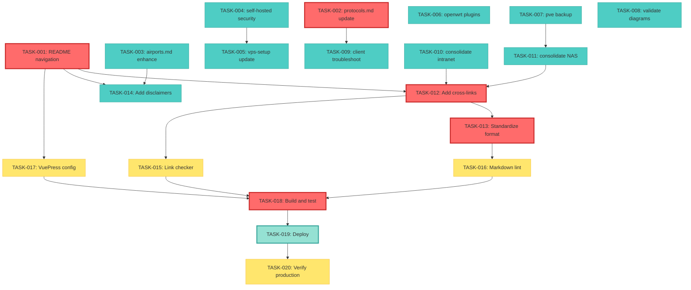

# Tasks for Story: Network Circumvention Guide - Phase 1 Reorganization

**Story ID**: story-2026-001
**PRD**: [prd-2026-001.md](./prd.md)
**Design**: [design.md](./design.md)
**Total Tasks**: 20
**Total Estimate**: 28.5 hours (~3.5 days)
**Critical Path**: 20 hours

---

## Story Summary

**Goal**: Reorganize 13 existing markdown files in `docs/proxy/` into 9 clear topic chapters, update with 2026 technical information, enhance navigation, and improve overall documentation quality.

**Scope**:
- Content reorganization and consolidation
- Technical updates (Hysteria2, VLESS+Reality)
- Navigation enhancement (README.md, cross-links)
- Network topology diagram validation
- Formatting standardization
- Legal disclaimers and safety warnings

---

## Task Summary

| Task ID | Task Name | Type | Estimate | Status | Blocked By | Owner |
|---------|-----------|------|----------|--------|------------|-------|
| TASK-001 | Create README.md navigation hub | Content | 2.5h | todo | - | developer |
| TASK-002 | Update protocols.md with 2026 specs | Content | 3.5h | todo | - | developer |
| TASK-003 | Enhance airports.md comparison matrix | Content | 1.5h | todo | - | developer |
| TASK-004 | Update self-hosted.md with security warnings | Content | 1h | todo | - | developer |
| TASK-005 | Update vps-setup.md with latest examples | Content | 1h | todo | TASK-004 | developer |
| TASK-006 | Add plugin management to openwrt-build.md | Content | 1h | todo | - | developer |
| TASK-007 | Add backup procedures to pve-setup.md | Content | 1h | todo | - | developer |
| TASK-008 | Validate network-topology.md diagrams | Content | 1.5h | todo | - | developer |
| TASK-009 | Add troubleshooting to clients.md | Content | 1.5h | todo | TASK-002 | developer |
| TASK-010 | Consolidate intranet.md (merge nat-traversal.md) | Content | 1.5h | todo | - | developer |
| TASK-011 | Consolidate nas.md (merge nas-guide.md) | Content | 2h | todo | TASK-007 | developer |
| TASK-012 | Add cross-links to all documents | Content | 2h | todo | TASK-001 | developer |
| TASK-013 | Standardize formatting across all files | QA | 2h | todo | TASK-012 | developer |
| TASK-014 | Add legal disclaimers and safety warnings | Content | 1h | todo | TASK-001 | developer |
| TASK-015 | Run link checker and fix broken links | QA | 1h | todo | TASK-012 | developer |
| TASK-016 | Validate markdown linting | QA | 0.5h | todo | TASK-013 | developer |
| TASK-017 | Update VuePress config.js | Config | 0.5h | todo | TASK-001 | developer |
| TASK-018 | Build and test locally | QA | 1h | todo | TASK-016 | developer |
| TASK-019 | Deploy to GitHub Pages | Deploy | 0.5h | todo | TASK-018 | devops |
| TASK-020 | Post-deployment verification | QA | 1h | todo | TASK-019 | reviewer |

---

## Phase 1: Content Update Tasks

### TASK-001: Create README.md navigation hub ⭐ CRITICAL PATH

**Estimate**: 2.5 hours
**Type**: Content Development
**Module**: docs/proxy/README.md
**Owner**: developer
**Priority**: P0

**Description**:
Transform README.md from a minimal index into a comprehensive navigation hub. Add hero section, 9-topic navigation grid with descriptions, reading pathways for different user types, and legal disclaimers.

**Implementation Details**:
1. Add hero section (150-200 words introduction)
2. Create visual navigation grid for 9 topics:
   - 协议对比 (Protocol Comparison)
   - 机场推荐 (Proxy Services)
   - 自建服务器 (Self-Hosted)
   - OpenWRT编译配置
   - PVE虚拟化配置
   - 家庭网络拓扑 (Network Topology)
   - 客户端设置 (Clients)
   - 内网穿透 (Intranet)
   - 家庭NAS方案 (Home NAS)
3. Add reading pathways:
   - Beginner path: protocols → airports → clients
   - Advanced path: topology → PVE → OpenWRT → clients
   - Self-hosting path: protocols → self-hosted → VPS → clients
4. Add last updated date
5. Add legal disclaimer section

**Acceptance Criteria**:
- [ ] Hero section is clear and welcoming (150-200 words)
- [ ] All 9 topics listed with brief descriptions
- [ ] Links to all topic files work correctly
- [ ] 3 reading pathways defined
- [ ] Last updated date present
- [ ] Legal disclaimer covers educational use and user responsibility

**Dependencies**:
- Blocked by: None (can start immediately)
- Blocks: TASK-012 (cross-links), TASK-014 (disclaimers), TASK-017 (config)

**Files Modified**: `docs/proxy/README.md`

---

### TASK-002: Update protocols.md with 2026 specs ⭐ CRITICAL PATH

**Estimate**: 3.5 hours
**Type**: Content Development + Research
**Module**: docs/proxy/protocols.md
**Owner**: developer
**Priority**: P0

**Description**:
Add Hysteria2 protocol section, update VLESS+Reality with Vision flow control details, update comparison tables with 2026 benchmarks, and add OSI layer comparison diagram.

**Implementation Details**:
1. Research and add Hysteria2 section:
   - Technical overview (UDP-based protocol)
   - Use cases (gaming, 4K streaming, real-time apps)
   - Configuration examples
   - Performance characteristics (110-150ms latency)
   - Reference: https://v2.hysteria.network/
2. Update VLESS+Reality section:
   - Add Vision flow control explanation
   - Update configuration examples
   - Update anti-blocking rating to 9/10
3. Update protocol comparison table with 2026 data:
   - Add Hysteria2 row
   - Update benchmark metrics
4. Add OSI layer comparison table:
   - Map protocols to OSI layers
   - Detection difficulty ratings
5. Add protocol selection decision tree (ASCII or Mermaid)
6. Update VPN vs Proxy comparison section
7. Add deprecation warnings for Shadowsocks-legacy

**Acceptance Criteria**:
- [ ] Hysteria2 section complete with technical overview, use cases, config examples
- [ ] VLESS+Reality updated with Vision flow control details
- [ ] Protocol comparison table includes 2026 benchmarks for all protocols
- [ ] OSI layer comparison table present
- [ ] Protocol selection decision tree added
- [ ] VPN vs Proxy comparison updated
- [ ] Deprecation warnings for outdated protocols added

**Dependencies**:
- Blocked by: None (can start immediately)
- Blocks: TASK-009 (client troubleshooting needs protocol context)

**Files Modified**: `docs/proxy/protocols.md`

**External References**:
- Hysteria: https://v2.hysteria.network/
- V2Ray/Xray: https://www.v2fly.org/, https://github.com/XTLS/Xray-core

---

### TASK-003: Enhance airports.md comparison matrix

**Estimate**: 1.5 hours
**Type**: Content Development
**Module**: docs/proxy/airports.md
**Owner**: developer
**Priority**: P1

**Description**:
Add evaluation criteria matrix, "How to Choose" decision guide, and red flags section to help users evaluate proxy services safely.

**Implementation Details**:
1. Add evaluation criteria matrix:
   - Price range
   - Protocol support
   - Server locations
   - Bandwidth/speed tier
   - Reliability/uptime
   - User reviews (if available)
2. Add "How to Choose" decision guide (flowchart or bullet list)
3. Add "Red Flags to Watch For" section:
   - No privacy policy
   - Too-good-to-be-true pricing
   - No customer support
   - Data logging concerns
   - Suspicious payment methods
4. Enhance existing disclaimer (make more prominent)
5. Update service list with 2026 landscape (keep generic/educational)

**Acceptance Criteria**:
- [ ] Evaluation criteria matrix present with 6+ criteria
- [ ] "How to Choose" guide helps users make informed decisions
- [ ] Red flags section lists 5+ warning signs
- [ ] Disclaimer is prominent and clear
- [ ] Content remains neutral and educational (no endorsements)

**Dependencies**:
- Blocked by: None
- Blocks: TASK-012 (cross-links)

**Files Modified**: `docs/proxy/airports.md`

---

### TASK-004: Update self-hosted.md with security warnings

**Estimate**: 1 hour
**Type**: Content Development
**Module**: docs/proxy/self-hosted.md
**Owner**: developer
**Priority**: P0

**Description**:
Add prominent security warnings about server hardening, firewall configuration, and key management to the self-hosted overview guide.

**Implementation Details**:
1. Add "Security Considerations" section with warnings:
   - ⚠️ Server hardening is critical
   - ⚠️ Firewall configuration importance
   - ⚠️ SSH key management best practices
   - ⚠️ Regular updates and patching
2. Add callout boxes for warnings (using markdown blockquotes with emoji)
3. Enhance existing content with security emphasis
4. Add link to security best practices (for Phase 2)

**Acceptance Criteria**:
- [ ] "Security Considerations" section added
- [ ] 4+ security warnings present
- [ ] Warnings use prominent formatting (callout blocks)
- [ ] Content emphasizes security without being alarmist

**Dependencies**:
- Blocked by: None
- Blocks: TASK-005 (VPS setup builds on this overview)

**Files Modified**: `docs/proxy/self-hosted.md`

---

### TASK-005: Update vps-setup.md with latest examples

**Estimate**: 1 hour
**Type**: Content Development
**Module**: docs/proxy/vps-setup.md
**Owner**: developer
**Priority**: P0

**Description**:
Update VPS setup guide with latest configuration examples for VLESS+Reality and Hysteria2, ensuring step-by-step instructions are current for 2026.

**Implementation Details**:
1. Review and update VPS provider recommendations (if any)
2. Update Shadowsocks installation section (mark as legacy if appropriate)
3. Update V2Ray/VLESS installation with Reality configuration
4. Add Hysteria2 installation section (new)
5. Update firewall configuration examples
6. Verify all bash commands are current and working
7. Add inline comments to complex commands

**Acceptance Criteria**:
- [ ] VLESS+Reality installation steps updated
- [ ] Hysteria2 installation section added
- [ ] All bash commands verified for correctness
- [ ] Inline comments added to complex commands
- [ ] Configuration examples reflect 2026 best practices

**Dependencies**:
- Blocked by: TASK-004 (security context needed), TASK-002 (protocol specs)
- Blocks: TASK-012 (cross-links)

**Files Modified**: `docs/proxy/vps-setup.md`

---

### TASK-006: Add plugin management to openwrt-build.md

**Estimate**: 1 hour
**Type**: Content Development
**Module**: docs/proxy/openwrt-build.md
**Owner**: developer
**Priority**: P0

**Description**:
Add section on plugin management for OpenWRT, covering installation and configuration of proxy-related plugins (e.g., passwall, openclash).

**Implementation Details**:
1. Add "Plugin Management" section (new)
2. List commonly used proxy plugins:
   - Passwall
   - OpenClash
   - V2Ray plugin
3. Installation instructions for each plugin
4. Basic configuration guidance
5. Plugin comparison table (features, ease of use)

**Acceptance Criteria**:
- [ ] "Plugin Management" section added
- [ ] 3+ common plugins documented
- [ ] Installation instructions for each plugin
- [ ] Basic configuration guidance provided
- [ ] Plugin comparison table helps users choose

**Dependencies**:
- Blocked by: None
- Blocks: TASK-012 (cross-links)

**Files Modified**: `docs/proxy/openwrt-build.md`

---

### TASK-007: Add backup procedures to pve-setup.md

**Estimate**: 1 hour
**Type**: Content Development
**Module**: docs/proxy/pve-setup.md
**Owner**: developer
**Priority**: P0

**Description**:
Add "Backup and Restore Procedures" section to PVE setup guide, covering VM backups, snapshots, and disaster recovery strategies.

**Implementation Details**:
1. Add "Backup and Restore Procedures" section (new)
2. Document VM backup procedures:
   - Vzdump command usage
   - Backup storage locations
   - Automated backup scheduling
3. Document VM snapshot usage
4. Document restore procedures
5. Add disaster recovery best practices

**Acceptance Criteria**:
- [ ] "Backup and Restore" section added
- [ ] VM backup procedures documented
- [ ] Snapshot usage explained
- [ ] Restore procedures clear and actionable
- [ ] Disaster recovery guidance provided

**Dependencies**:
- Blocked by: None
- Blocks: TASK-011 (NAS might reference PVE backups)

**Files Modified**: `docs/proxy/pve-setup.md`

---

### TASK-008: Validate network-topology.md diagrams

**Estimate**: 1.5 hours
**Type**: Content Validation + Update
**Module**: docs/proxy/network-topology.md
**Owner**: developer
**Priority**: P0

**Description**:
Review all network topology diagrams for technical accuracy, ensure consistent formatting, add legends for symbols, and validate IP addressing schemes.

**Implementation Details**:
1. Review existing ASCII diagrams for accuracy:
   - Bypass router topology
   - Main router topology
   - Hardware router topology
2. Validate IP addressing schemes (ensure consistency)
3. Add legends/notation explanations if missing
4. Ensure box drawing characters are consistent
5. Add missing diagrams if identified:
   - Multi-VLAN setup (if applicable)
   - Alternative topologies
6. Add brief descriptions below each diagram

**Acceptance Criteria**:
- [ ] All existing diagrams reviewed for technical accuracy
- [ ] Minimum 3 diagrams present (bypass, main, hardware)
- [ ] All diagrams include IP addressing schemes
- [ ] Legends/notation explanations present
- [ ] Diagrams use consistent formatting
- [ ] No technical inaccuracies in network configurations

**Dependencies**:
- Blocked by: None (can run in parallel)
- Blocks: TASK-012 (cross-links reference diagrams)

**Files Modified**: `docs/proxy/network-topology.md`

**Validation**: Technical review by network SME recommended

---

### TASK-009: Add troubleshooting to clients.md

**Estimate**: 1.5 hours
**Type**: Content Development
**Module**: docs/proxy/clients.md
**Owner**: developer
**Priority**: P1

**Description**:
Add "Common Issues" troubleshooting section for each client platform (Windows, macOS, iOS, Android) with diagnostic commands and fix procedures.

**Implementation Details**:
1. Add "Common Issues" section
2. For each platform (Windows, macOS, iOS, Android):
   - Connection failures (causes and fixes)
   - DNS leaks (how to detect and prevent)
   - Performance degradation (troubleshooting steps)
3. Include diagnostic commands:
   - Windows: `netstat`, `ipconfig`, `nslookup`
   - macOS: `ifconfig`, `dig`, `networksetup`
   - iOS/Android: App-specific diagnostics
4. Provide links to official client documentation

**Acceptance Criteria**:
- [ ] "Common Issues" section added
- [ ] 3+ common issues documented per platform
- [ ] Diagnostic commands provided for each platform
- [ ] Fix procedures are actionable
- [ ] Links to official documentation included

**Dependencies**:
- Blocked by: TASK-002 (protocol context helps troubleshooting)
- Blocks: TASK-012 (cross-links)

**Files Modified**: `docs/proxy/clients.md`

---

### TASK-010: Consolidate intranet.md (merge nat-traversal.md)

**Estimate**: 1.5 hours
**Type**: Content Consolidation
**Module**: docs/proxy/intranet.md
**Owner**: developer
**Priority**: P0

**Description**:
Merge nat-traversal.md content into intranet.md to create a unified intranet penetration guide. Evaluate for redundancy and consolidate without data loss.

**Implementation Details**:
1. Read nat-traversal.md to understand content
2. Read intranet.md to understand current structure
3. Identify overlapping content
4. Merge unique content from nat-traversal.md into intranet.md:
   - Preserve all valuable information
   - Eliminate redundancies
   - Reorganize for coherence
5. Ensure comparison matrix remains comprehensive
6. Archive or delete nat-traversal.md after merge
7. Update any internal links pointing to nat-traversal.md

**Acceptance Criteria**:
- [ ] All content from nat-traversal.md preserved (no data loss)
- [ ] Redundant content eliminated
- [ ] intranet.md has clear, unified structure
- [ ] No contradictory information
- [ ] nat-traversal.md removed from docs/proxy/
- [ ] Internal links updated to point to intranet.md

**Dependencies**:
- Blocked by: None
- Blocks: TASK-012 (cross-links need final file structure)

**Files Modified**:
- `docs/proxy/intranet.md` (update)
- `docs/proxy/nat-traversal.md` (delete)

---

### TASK-011: Consolidate nas.md (merge nas-guide.md)

**Estimate**: 2 hours
**Type**: Content Consolidation
**Module**: docs/proxy/nas.md
**Owner**: developer
**Priority**: P0

**Description**:
Merge nas-guide.md content into nas.md to create a unified home NAS solutions guide. Add cross-references to PVE setup for integration guidance.

**Implementation Details**:
1. Read nas-guide.md to understand detailed content
2. Read nas.md to understand overview content
3. Create unified structure:
   - Overview and system comparison (from nas.md)
   - Detailed setup guides (from nas-guide.md)
   - Integration with PVE (new section)
4. Merge content without data loss
5. Eliminate redundancies
6. Add cross-references to pve-setup.md
7. Archive or delete nas-guide.md after merge
8. Update any internal links pointing to nas-guide.md

**Acceptance Criteria**:
- [ ] All content from both files preserved (no data loss)
- [ ] Single unified nas.md guide
- [ ] Clear structure: overview → system comparison → setup → integration
- [ ] Cross-references to PVE setup added
- [ ] nas-guide.md removed from docs/proxy/
- [ ] Internal links updated

**Dependencies**:
- Blocked by: TASK-007 (PVE backup context)
- Blocks: TASK-012 (cross-links)

**Files Modified**:
- `docs/proxy/nas.md` (update)
- `docs/proxy/nas-guide.md` (delete)

---

## Phase 2: Cross-Cutting Tasks

### TASK-012: Add cross-links to all documents ⭐ CRITICAL PATH

**Estimate**: 2 hours
**Type**: Content Enhancement
**Module**: All docs/proxy/*.md files
**Owner**: developer
**Priority**: P0

**Description**:
Add "Prerequisites", "Related Topics", and "Next Steps" sections to all documentation files to create a well-connected information architecture.

**Implementation Details**:
1. For each of 10 files, add three sections:

   **Prerequisites** (what user should know/read first):
   - List prerequisite topics with links
   - Example: protocols.md → basic networking knowledge

   **Related Topics** (lateral connections):
   - List 2-4 related topics with links
   - Example: pve-setup.md ↔ openwrt-build.md

   **Next Steps** (suggested progression):
   - List logical next steps with links
   - Example: vps-setup.md → clients.md

2. Use relative path links (e.g., `[Protocol Comparison](./protocols.md)`)
3. Follow cross-reference matrix from design document (Appendix A)
4. Ensure bidirectional linking (if A links to B, B should link back to A)

**Acceptance Criteria**:
- [ ] All 10 files have "Prerequisites" section (if applicable)
- [ ] All 10 files have "Related Topics" section
- [ ] All 10 files have "Next Steps" section
- [ ] Minimum 3 cross-links per file (on average)
- [ ] All links use relative paths
- [ ] Bidirectional linking where appropriate

**Dependencies**:
- Blocked by: TASK-001 (README must exist), TASK-010, TASK-011 (final file structure)
- Blocks: TASK-013 (formatting), TASK-015 (link checking)

**Files Modified**: All 10 files in `docs/proxy/`

---

### TASK-013: Standardize formatting across all files ⭐ CRITICAL PATH

**Estimate**: 2 hours
**Type**: Quality Assurance
**Module**: All docs/proxy/*.md files
**Owner**: developer
**Priority**: P0

**Description**:
Apply consistent markdown formatting standards across all documentation files, including heading hierarchy, code blocks, tables, and callout formatting.

**Implementation Details**:
1. **Heading Hierarchy**:
   - Ensure H1 for title only (one per file)
   - No heading level skips (H2 → H4)
   - Logical section structure

2. **Code Blocks**:
   - Add language tags to all code blocks:
     ```bash
     # Shell commands
     ```
     ```yaml
     # Config files
     ```
     ```json
     # JSON data
     ```
   - No bare triple-backtick blocks

3. **Tables**:
   - Consistent column alignment
   - Headers present
   - Markdown table syntax correct

4. **Callouts**:
   - Standardize warning/tip/note format:
     ```markdown
     > **⚠️ Warning**: Important safety information
     > **💡 Tip**: Helpful hint
     > **📝 Note**: Additional information
     ```

5. **Chinese Punctuation**:
   - Use proper Chinese punctuation (，。！？)
   - English technical terms in backticks

6. **List Formatting**:
   - Consistent bullet style
   - Proper indentation

**Acceptance Criteria**:
- [ ] All files use H1 for title only
- [ ] No heading level skips detected
- [ ] All code blocks have language tags
- [ ] Tables are properly formatted
- [ ] Callout blocks use consistent emoji format
- [ ] Chinese punctuation correct
- [ ] Files pass markdownlint validation

**Dependencies**:
- Blocked by: TASK-012 (cross-links add content)
- Blocks: TASK-016 (linting validation)

**Files Modified**: All 10 files in `docs/proxy/`

**Tools**: markdownlint (optional but recommended)

---

### TASK-014: Add legal disclaimers and safety warnings

**Estimate**: 1 hour
**Type**: Content Development
**Module**: Multiple files
**Owner**: developer
**Priority**: P0

**Description**:
Add appropriate legal disclaimers and safety warnings to README.md, airports.md, and self-hosted.md to ensure users understand educational purpose and legal responsibilities.

**Implementation Details**:
1. **README.md**: Add legal disclaimer section
   - Educational purpose statement
   - User responsibility for legal compliance
   - No endorsement of illegal activities
   - Jurisdiction considerations

2. **airports.md**: Add safety warnings
   - Privacy risk assessment
   - Service evaluation guidance
   - No specific endorsements statement

3. **self-hosted.md**: Security warnings
   - Already added in TASK-004, verify completeness

4. Use prominent formatting (callout blocks, bold text)

**Acceptance Criteria**:
- [ ] README.md has comprehensive legal disclaimer
- [ ] airports.md has privacy and safety warnings
- [ ] self-hosted.md security warnings verified
- [ ] All disclaimers use prominent formatting
- [ ] Language is clear and non-alarmist

**Dependencies**:
- Blocked by: TASK-001 (README structure), TASK-003 (airports content), TASK-004 (self-hosted security)
- Blocks: None

**Files Modified**:
- `docs/proxy/README.md`
- `docs/proxy/airports.md`
- `docs/proxy/self-hosted.md` (verification only)

---

## Phase 3: Quality Assurance Tasks

### TASK-015: Run link checker and fix broken links

**Estimate**: 1 hour
**Type**: Quality Assurance
**Module**: All docs/proxy/*.md files
**Owner**: developer
**Priority**: P0

**Description**:
Run markdown link checker tool to identify and fix all broken internal and external links in the proxy documentation.

**Implementation Details**:
1. Install or configure markdown-link-check tool
2. Run link checker on all files in docs/proxy/:
   ```bash
   npx markdown-link-check docs/proxy/*.md
   ```
3. Review report of broken links
4. Fix internal broken links (update paths)
5. Fix or remove external broken links:
   - Update if moved
   - Use archive.org if dead
   - Remove if permanently unavailable
6. Re-run link checker to verify all fixed
7. Document any intentionally unfixed links (with reasons)

**Acceptance Criteria**:
- [ ] Link checker run on all 10 files
- [ ] Zero broken internal links
- [ ] External links verified or documented as known issues
- [ ] Link checker report shows 0 errors
- [ ] Any exceptions documented

**Dependencies**:
- Blocked by: TASK-012 (cross-links completed)
- Blocks: TASK-018 (build testing)

**Files Modified**: Any files with broken links

**Tools**: markdown-link-check or similar

---

### TASK-016: Validate markdown linting

**Estimate**: 0.5 hours
**Type**: Quality Assurance
**Module**: All docs/proxy/*.md files
**Owner**: developer
**Priority**: P0

**Description**:
Run markdownlint to validate all markdown files against style rules, ensuring consistency and correctness.

**Implementation Details**:
1. Install or configure markdownlint
2. Create `.markdownlint.json` config if needed (or use defaults)
3. Run markdownlint on all files:
   ```bash
   npx markdownlint docs/proxy/*.md
   ```
4. Review violations report
5. Fix any critical violations:
   - Heading hierarchy issues
   - Inconsistent list formatting
   - Trailing spaces
6. Re-run to verify clean
7. Consider adding markdownlint to pre-commit hook (optional)

**Acceptance Criteria**:
- [ ] Markdownlint run on all 10 files
- [ ] No critical violations
- [ ] Any remaining warnings documented as acceptable
- [ ] Linting report shows clean or acceptable state

**Dependencies**:
- Blocked by: TASK-013 (formatting standardization)
- Blocks: TASK-018 (build testing)

**Files Modified**: Any files with linting violations

**Tools**: markdownlint-cli

---

### TASK-017: Update VuePress config.js

**Estimate**: 0.5 hours
**Type**: Configuration
**Module**: docs/.vuepress/config.js
**Owner**: developer
**Priority**: P2

**Description**:
Update VuePress configuration to ensure proxy documentation is prominently featured in navigation and routing works correctly.

**Implementation Details**:
1. Open `docs/.vuepress/config.js`
2. Verify `nav` array includes proxy section:
   ```javascript
   nav: [
     { text: 'Home', link: '/' },
     { text: 'Guide', link: '/guide/' },
     { text: '科学上网', link: '/proxy/' },
     // ...
   ]
   ```
3. Consider adding sidebar configuration for proxy section (optional):
   ```javascript
   sidebar: {
     '/proxy/': [
       '',  // README.md
       'protocols',
       'airports',
       // ...
     ]
   }
   ```
4. Verify `base: '/blog2021/'` is unchanged (GitHub Pages base path)
5. Test configuration by running local dev server

**Acceptance Criteria**:
- [ ] VuePress config updated if needed
- [ ] Proxy section in nav verified
- [ ] No breaking changes to existing routes
- [ ] Local dev server runs without errors
- [ ] Sidebar config added if beneficial

**Dependencies**:
- Blocked by: TASK-001 (README structure known)
- Blocks: TASK-018 (build testing)

**Files Modified**: `docs/.vuepress/config.js`

---

### TASK-018: Build and test locally ⭐ CRITICAL PATH

**Estimate**: 1 hour
**Type**: Quality Assurance
**Module**: Full VuePress build
**Owner**: developer
**Priority**: P0

**Description**:
Build VuePress site locally and perform comprehensive testing to ensure all changes render correctly and no build errors occur.

**Implementation Details**:
1. Run development build:
   ```bash
   npm run docs:dev
   ```
2. Manually test in browser (localhost:8080):
   - Navigate to /proxy/ section
   - Click through all 10 documentation files
   - Verify all cross-links work
   - Check formatting rendering
   - Test code block syntax highlighting
   - Verify tables render correctly
   - Check ASCII diagrams display properly

3. Run production build:
   ```bash
   npm run docs:build
   ```
4. Check build output for errors/warnings
5. Verify `docs/.vuepress/dist/` generated successfully
6. Test production build locally (using serve or similar)
7. Document any issues found

**Acceptance Criteria**:
- [ ] Dev build runs without errors
- [ ] All 10 proxy docs accessible and render correctly
- [ ] All internal links work in browser
- [ ] Formatting displays as expected
- [ ] Production build succeeds without errors
- [ ] dist/ directory generated
- [ ] No console errors in browser

**Dependencies**:
- Blocked by: TASK-015 (link checking), TASK-016 (linting), TASK-017 (config)
- Blocks: TASK-019 (deployment)

**Files Modified**: None (testing only)

**Verification**: Manual testing + build success

---

## Phase 4: Deployment Tasks

### TASK-019: Deploy to GitHub Pages ⭐ CRITICAL PATH

**Estimate**: 0.5 hours
**Type**: Deployment
**Module**: GitHub Pages deployment
**Owner**: devops
**Priority**: P0

**Description**:
Deploy updated documentation to GitHub Pages using the existing deploy.sh script.

**Implementation Details**:
1. Ensure all changes committed to main branch:
   ```bash
   git status
   git add docs/proxy/*
   git commit -m "docs: Reorganize network circumvention guide (Phase 1)"
   ```
2. Run deployment script:
   ```bash
   ./deploy.sh
   ```
3. Monitor deployment process:
   - VuePress build
   - Git operations to gh-pages branch
   - Force push to remote
4. Verify GitHub Actions (if configured)
5. Wait for GitHub Pages to update (usually 1-5 minutes)

**Acceptance Criteria**:
- [ ] deploy.sh executes successfully
- [ ] No errors during build or push
- [ ] gh-pages branch updated on GitHub
- [ ] GitHub Pages shows "Active" status
- [ ] Site accessible at quboqin.github.io/blog2021/proxy/

**Dependencies**:
- Blocked by: TASK-018 (local build successful)
- Blocks: TASK-020 (verification)

**Files Modified**: None (deployment only)

**Note**: Force push to gh-pages overwrites history (expected behavior)

---

### TASK-020: Post-deployment verification

**Estimate**: 1 hour
**Type**: Quality Assurance
**Module**: Production site
**Owner**: reviewer
**Priority**: P0

**Description**:
Perform comprehensive post-deployment verification on the live GitHub Pages site to ensure all changes are live and working correctly in production.

**Implementation Details**:
1. Access production site: https://quboqin.github.io/blog2021/proxy/
2. Verify README.md navigation hub:
   - Hero section displays
   - 9-topic grid present
   - All links work
3. Spot check 3-5 documentation files:
   - protocols.md (verify Hysteria2 section)
   - network-topology.md (diagrams render)
   - clients.md (troubleshooting section)
4. Test cross-links (click through several "Related Topics" links)
5. Verify formatting:
   - Code blocks render with syntax highlighting
   - Tables display correctly
   - Callout blocks formatted properly
6. Test on multiple browsers:
   - Chrome
   - Firefox
   - Safari (if available)
7. Test on mobile device (if possible)
8. Check browser console for errors
9. Verify disclaimers are visible
10. Document any issues found

**Acceptance Criteria**:
- [ ] README.md navigation hub works correctly
- [ ] All 10 documentation files accessible
- [ ] Cross-links function properly
- [ ] Formatting displays correctly
- [ ] Code blocks have syntax highlighting
- [ ] No broken links encountered
- [ ] No console errors
- [ ] Site works in Chrome and Firefox
- [ ] Mobile responsiveness acceptable
- [ ] Disclaimers visible and clear

**Dependencies**:
- Blocked by: TASK-019 (deployment)
- Blocks: None (final task)

**Verification**: Manual testing checklist

**Sign-off**: Reviewer approval required before Story completion

---

## Dependency Graph



---

## Critical Path Analysis

**Critical Path Duration**: ~20 hours

**Critical Path Sequence**:
1. TASK-001: README navigation (2.5h)
2. TASK-002: protocols.md update (3.5h)
3. TASK-012: Add cross-links (2h) [blocked by TASK-001, TASK-010, TASK-011]
4. TASK-013: Standardize formatting (2h)
5. TASK-016: Markdown lint (0.5h)
6. TASK-015: Link checker (1h) [can run parallel with TASK-016]
7. TASK-018: Build and test (1h)
8. TASK-019: Deploy (0.5h)
9. TASK-020: Verify (1h)

**Parallelizable Work** (~8.5 hours):
- TASK-003 through TASK-011 can run in parallel (except dependencies)
- TASK-014 (disclaimers) can run in parallel
- TASK-017 (config) can run in parallel

**Total Calendar Time**: With good parallelization: **~2-2.5 days**

---

## Risk Assessment

### Task-Level Risks

| Task | Risk | Impact | Mitigation |
|------|------|--------|------------|
| TASK-002 | Protocol specs change during implementation | Medium | Reference official docs, verify before final commit |
| TASK-010, TASK-011 | Data loss during consolidation | High | Use git branches, careful review before deletion |
| TASK-015 | Many broken external links | Medium | Use archive.org, document exceptions |
| TASK-018 | VuePress build fails | High | Test incrementally, maintain VuePress v1 compatibility |
| TASK-019 | Deployment issues | Medium | Verify deploy.sh script, test on staging first (if available) |

---

## Hourly Tracking Template

| Date | Task ID | Hours | Status | Notes |
|------|---------|-------|--------|-------|
| 2026-02-17 | TASK-001 | 2.5 | done | README hub complete |
| 2026-02-17 | TASK-002 | 3.5 | done | Hysteria2 added, VLESS updated |
| 2026-02-17 | TASK-004 | 1.0 | done | Security warnings added |
| 2026-02-18 | TASK-005 | 1.0 | doing | VPS setup in progress |
| ... | ... | ... | ... | ... |

**Total Hours Logged**: [TBD]
**Total Hours Estimated**: 28.5
**Variance**: [TBD]

---

## Checklist for Story Completion

- [ ] All P0 tasks (TASK-001 through TASK-020) completed
- [ ] All acceptance criteria met (verified in each task)
- [ ] VuePress build succeeds without errors
- [ ] Zero broken internal links
- [ ] All network diagrams validated
- [ ] Production site verified and functional
- [ ] Peer review sign-off obtained
- [ ] Story marked as complete in tasks.md
- [ ] Sync status updated to provider (if applicable)

---

## Next Steps After Story Completion

1. **Update Story Status**:
   ```bash
   # Update tasks.md
   Phase: build → ship → complete
   Status: active → done
   ```

2. **Sync to Provider** (if using Feishu/notion):
   ```bash
   /sak-sync --direction push --entity all
   ```

3. **Retrospective** (optional):
   - What went well?
   - What could be improved?
   - Lessons learned for Phase 2

4. **Plan Phase 2** (future):
   - Troubleshooting deep dives
   - Security hardening guides
   - Performance optimization tips

---

## Document Control

| Version | Date | Author | Changes |
|---------|------|--------|---------|
| 1.0 | 2026-02-16 | architect | Initial task breakdown |

**Status**: ✅ Complete - Ready for Implementation
**Next Action**: Begin TASK-001 (README navigation hub)
**Owner**: developer
**Reviewer**: architect (design alignment)

---

**End of Task Breakdown Document**
